# Experiment Results — Symbolically Bounded Latent Recursion

## Introduction

This document tracks the incremental experiment log for **Symbolically Bounded Latent Recursion** — a neuro-symbolic architecture that combines a small transformer (the Tiny Recursive Model, or TRM) with a Z3 SMT solver to solve constraint satisfaction problems like Sudoku.

**The goal** is to build a model that reasons iteratively: update a latent state across multiple recursion steps, refining its predictions the way a human would — check the grid, find violations, correct them, repeat. Pure neural recursion should, in theory, do this naturally. In practice, a critical failure mode called **representation collapse** causes the latent state to explode exponentially, destroying the recursive signal within a few steps. The hypothesis is that injecting symbolic constraints from Z3 into the recursive loop can bound the latent trajectory to a valid manifold, preventing collapse and enabling the model to reason deeper than it could alone.

**The path** follows three phases:

1. **Baseline characterization** (Runs 001–005) — Establish how the TRM behaves without any symbolic intervention. Quantify the collapse rate, identify where the architecture breaks, and find a task scale (4×4 Sudoku) where learning is possible despite collapse.

2. **Symbolic integration at the output layer** (Runs 006–007) — Apply Z3 constraints to the model's predictions (logit pruning). Test whether penalizing invalid outputs is sufficient to improve accuracy. This is the simplest integration point.

3. **Architectural stabilization and latent-space integration** (Run 008+) — Fix collapse at the source by normalizing the latent state inside the recurrence. Then apply Z3 constraints within the stabilized loop itself — not at the output, but at the representation level. This is the core thesis: symbolic bounds in latent space should enable recursive reasoning that neither pure neural nor output-level symbolic approaches can achieve alone.

Each run entry below records the hypothesis, configuration, results, diagnostics, and interpretation. The summary sections at the end aggregate patterns, track open questions, and prioritize next experiments.

---

## Sudoku Baseline Runs (2026-04-03)

These initial experiments establish the pure neural baseline for the TRM on 9×9 Sudoku (no symbolic bounds). The goal is to quantify representation collapse and motivate the Z3 integration.

---

### Run 001 — `sudoku_20260403_111010`

**Hypothesis:** Verify the baseline architecture trains and produces non-trivial loss curves.

| Parameter | Value |
|---|---|
| dim | 128 |
| n_layers | 2 |
| n_heads | 8 |
| n_recursions | 4 |
| n_cycles | 3 |
| n_supervision | 7 |
| epochs | 10 |
| lr | 3e-4 |
| weight_decay | 0.1 |
| train / val | 10,000 / 5,000 |
| givens range | 17–35 |
| training time | ~22 min |

**Results:**

| Metric | Value |
|---|---|
| Cell accuracy | 20.5% |
| Puzzle accuracy | 0.0% |
| Constraint satisfaction | 0.0% |
| Best val accuracy | 0.0% |
| Per-step accuracy (steps 0–6) | 0.0% across all |

**Observations:** Loss decreased but the model never broke past random-guess cell accuracy (~11% = 1/9). No per-step accuracy at any recursion depth. No diagnostics were captured for this run.

**Plots:**
- 

---

### Run 002 — `sudoku_20260403_155953`

**Hypothesis:** Same config as Run 001, but with the updated training loop that captures diagnostics. Confirm reproducibility and examine latent state behavior.

| Parameter | Value |
|---|---|
| (same as Run 001) | |
| training time | ~22 min |

**Results:**

| Metric | Value |
|---|---|
| Cell accuracy | 19.7% |
| Puzzle accuracy | 0.0% |
| Constraint satisfaction | 0.0% |
| Best val accuracy | 0.0% |
| Final epoch loss | 1.236 |

**Loss curve (10 epochs):** 2.506 → 2.209 → 2.195 → 2.046 → 1.765 → 1.547 → 1.374 → 1.302 → 1.265 → 1.236

**Diagnostics — representation collapse confirmed:**

| Step | z norm | y norm | z cosine | halt prob |
|---|---|---|---|---|
| 0 | 2,088 | 2,510 | — | 3.9e-5 |
| 1 | 413,835 | 499,532 | 1.000 | 4.0e-5 |
| 2 | 81.9M | 98.9M | 1.000 | 4.0e-5 |
| 3 | 16.2B | 19.6B | 1.000 | 4.0e-5 |
| 4 | 3.21T | 3.88T | 1.000 | 4.0e-5 |
| 5 | 636T | 768T | 1.000 | 4.0e-5 |
| 6 | 1.26e17 | 1.52e17 | 1.000 | 4.0e-5 |

The z and y norms explode by ~200× per recursion step. Cosine similarity locks at 1.0 after step 1 — the direction is frozen while the magnitude blows up. The halt gate never fires (stuck near 0). This is textbook representation collapse: the recursion amplifies a fixed direction without refining content.

**Plots:**
- 
- 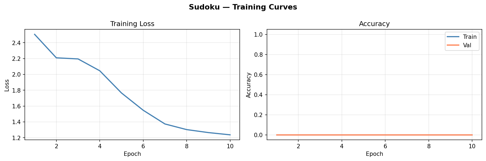
- 
- 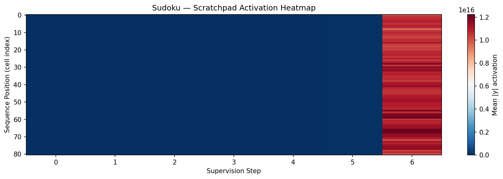
- 

---

### Run 003 — `sudoku_20260403_172340`

**Hypothesis:** Doubling recursions (4 → 8) and epochs (10 → 20) to see if more compute helps, or if collapse gets worse.

| Parameter | Value |
|---|---|
| n_recursions | **8** (was 4) |
| num_epochs | **20** (was 10) |
| training time | ~76 min |
| (all other params same) | |

**Results:**

| Metric | Value |
|---|---|
| Cell accuracy | 11.1% |
| Puzzle accuracy | 0.0% |
| Constraint satisfaction | 0.0% |
| Best val accuracy | 0.0% |
| Final epoch loss | 1.081 |

**Loss curve (20 epochs):** 2.413 → … → 1.081 (steadily decreasing, minor train acc blips of 0.01% at epochs 17–19)

**Diagnostics — collapse is catastrophically worse:**

| Step | z norm | y norm | z cosine | halt prob |
|---|---|---|---|---|
| 0 | 8,743 | 9,716 | — | 5.3e-5 |
| 1 | 8.48M | 9.44M | 1.000 | 5.3e-5 |
| 2 | 8.23B | 9.15B | 1.000 | 5.3e-5 |
| 3 | 7.98T | 8.88T | 1.000 | 5.3e-5 |
| 4 | 7.74e15 | 8.61e15 | 1.000 | 5.3e-5 |
| 5 | 7.51e18 | 8.35e18 | 0.0 | 5.3e-5 |
| 6 | **∞** | **∞** | 0.0 | **0.500** |

Norms hit infinity by step 6. The ~970× per-step growth rate is far worse than Run 002's ~200×. Cosine drops to 0.0 at steps 5–6 (NaN/Inf corruption). The halt gate finally fires at 0.5 on the last step — but only because the signal is numerically garbage. Cell accuracy dropped to 11.1% (random chance for 1/9), worse than the 4-recursion runs.

**Key finding:** More recursions without stabilization actively degrades performance. The model is strictly worse with 8 recursions than with 4.

**Plots:**
- 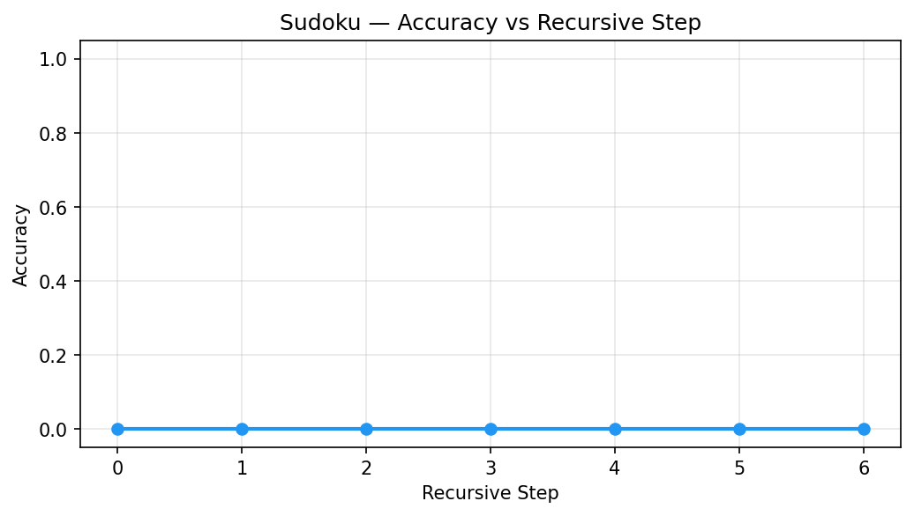
- 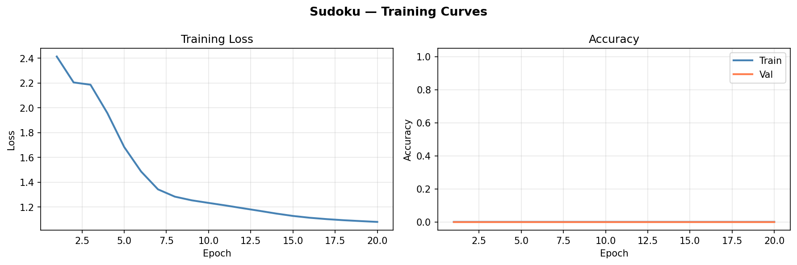
- 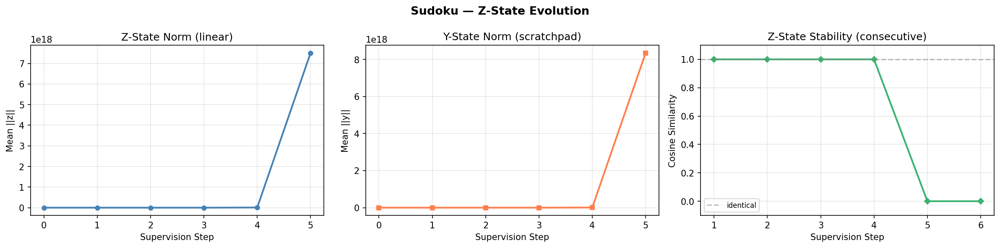
- 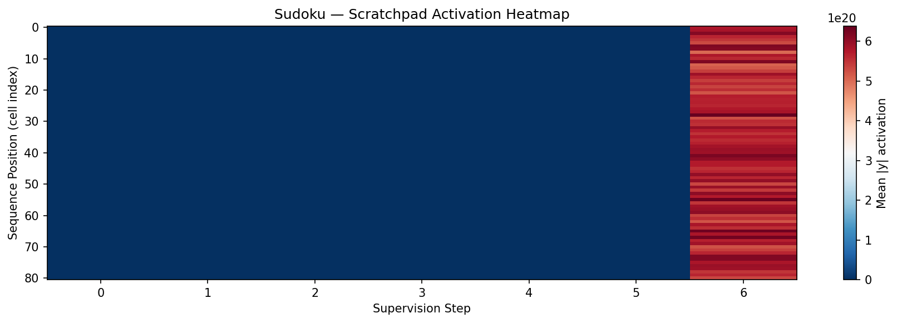
- 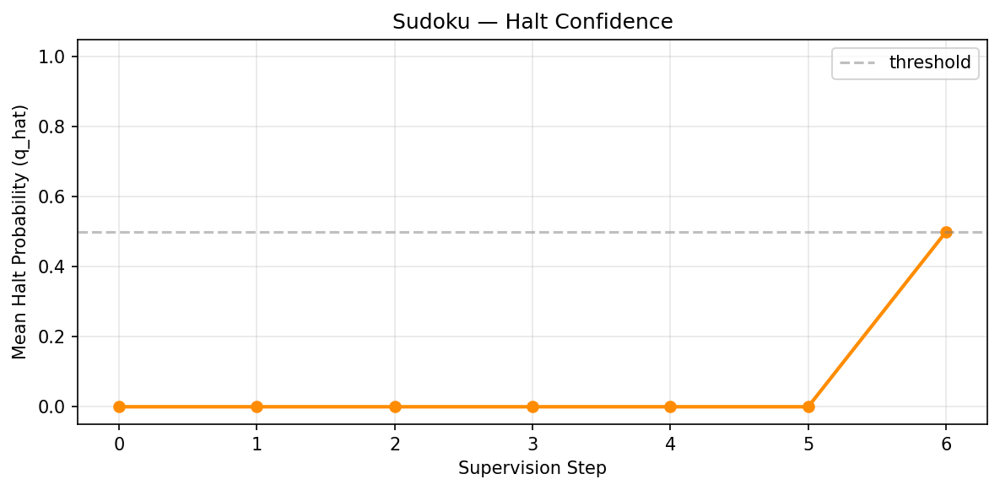

---

### Run 004 — `sudoku_20260403_215600`

**Hypothesis:** Keep recursions at 4 but double the supervision depth (7 → 14) with 20 epochs. If the model gets gradient signal at more intermediate steps, maybe it can learn to control the recursion better.

| Parameter | Value |
|---|---|
| n_recursions | 4 (same as Run 002) |
| n_supervision | **14** (was 7) |
| num_epochs | **20** (was 10) |
| training time | ~95 min |
| (all other params same) | |

**Results:**

| Metric | Value |
|---|---|
| Cell accuracy | 11.1% |
| Puzzle accuracy | 0.0% |
| Constraint satisfaction | 0.0% |
| Best val accuracy | 0.0% |
| Final epoch loss | 1.060 |

**Loss curve (20 epochs):** 2.418 → 2.205 → 2.186 → 1.965 → 1.710 → 1.468 → 1.316 → 1.254 → 1.218 → 1.192 → 1.169 → 1.151 → 1.133 → 1.118 → 1.103 → 1.091 → 1.080 → 1.073 → 1.065 → 1.060

Loss converges slightly lower than Run 003 (1.060 vs 1.081). Faint train accuracy blips at epochs 17/19 (0.02–0.03%), but val accuracy remains 0.0% throughout.

**Diagnostics — deeper supervision does not prevent collapse:**

| Step | z norm | y norm | z cosine | halt prob |
|---|---|---|---|---|
| 0 | 1,692 | 2,034 | — | 4.0e-6 |
| 1 | 335,830 | 405,374 | 1.000 | 4.0e-6 |
| 2 | 66.5M | 80.3M | 1.000 | 4.0e-6 |
| 3 | 13.2B | 15.9B | 1.000 | 4.0e-6 |
| 4 | 2.61T | 3.15T | 1.000 | 4.0e-6 |
| 5 | 516T | 623T | 1.000 | 4.0e-6 |
| 6 | 1.02e17 | 1.23e17 | 1.000 | 4.0e-6 |
| 7–13 | **∞** | **∞** | 0.0 | 0.053 → **0.500** |

The per-step growth rate (~198×) is nearly identical to Run 002, confirming this is an intrinsic property of the architecture at 4 recursions. The key difference is that with 14 supervision steps (vs 7), the model now has 7 additional steps where it's reading out predictions from infinitely-blown latent states. Norms overflow to ∞ by step 7. The halt gate is even more suppressed than before (4.0e-6 vs 4.0e-5 in Run 002) during the valid steps, then snaps to 0.5 once the signal is corrupted.

**Key finding:** Doubling supervision depth without addressing the underlying norm explosion just gives the model more steps of garbage to read from. Cell accuracy regressed from ~20% (Runs 001–002) to 11.1% (random chance) — the same degradation seen in Run 003 with 8 recursions. The additional supervision taps at infinity-corrupted steps may actually poison the gradient signal, pulling the model toward worse overall representations.

**Plots:**
- 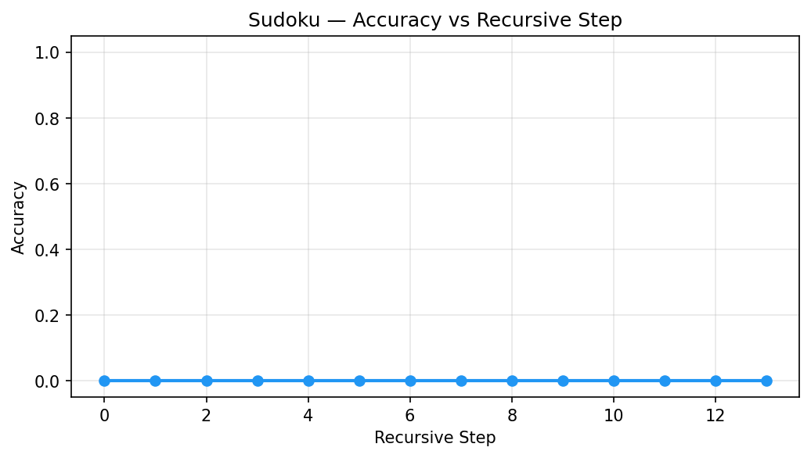
- 
- 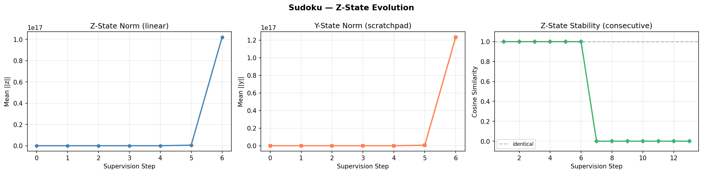
- 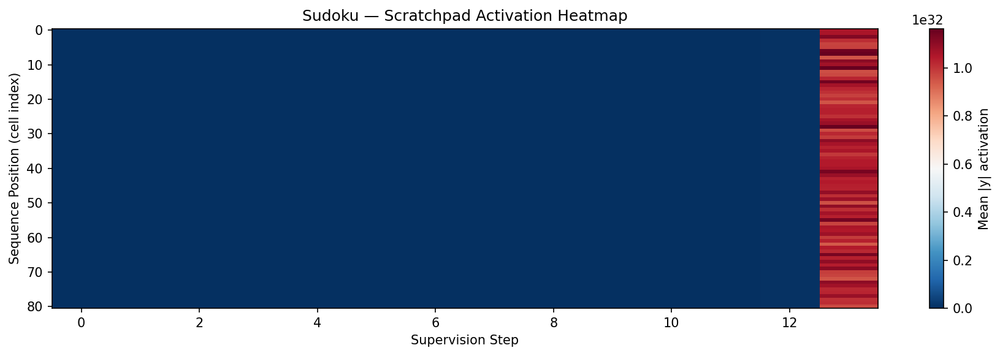
- 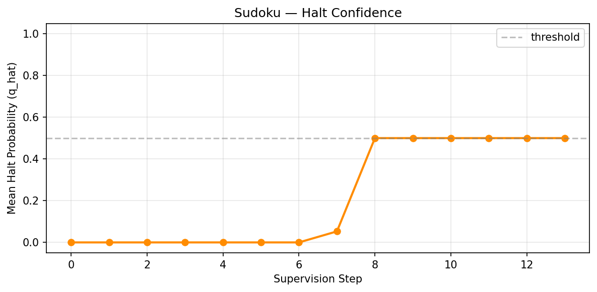

---

## 4×4 Mini-Sudoku Experiments (2026-04-04)

These experiments switch to 4×4 mini-Sudoku to reduce task difficulty and introduce Z3 symbolic bounds. They reveal the **Readout Trap** — the central paradox motivating latent-space symbolic projection.

---

### Run 005 — `sudoku_20260404_170039` — 4×4 Pure Neural Baseline

**Hypothesis:** Switch from 9×9 to 4×4 Sudoku to reduce task difficulty. If 9×9 cell accuracy was capped at ~20% (Runs 001–002), the simpler 4×4 task (4 digits, 16 cells, 2×2 blocks) should be learnable even with representation collapse, establishing the pure-neural ceiling before introducing Z3.

| Parameter | Value |
|---|---|
| dim | 128 |
| n_layers | 2 |
| n_heads | 8 |
| n_recursions | 4 |
| n_cycles | 3 |
| n_supervision | 7 |
| epochs | 20 |
| lr | 3e-4 |
| weight_decay | 0.1 |
| **grid_size** | **4×4** (was 9×9) |
| **use_z3_pruning** | **False** |
| train / val | 5,000 / 1,000 |
| min_givens / max_givens | 4 / 10 |
| training time | ~10 min (589 s) |
| device | cuda |

**Results:**

| Metric | Value |
|---|---|
| Cell accuracy | **80.0%** (random chance = 25%) |
| Puzzle accuracy | **38.7%** |
| Constraint satisfaction | 38.8% |
| Best val accuracy | **38.7%** (epoch 20 — still climbing) |

**Loss curve (20 epochs):** 1.647 → 1.457 → 1.384 → 1.296 → 1.036 → 0.807 → 0.644 → 0.566 → 0.524 → 0.498 → 0.474 → 0.448 → 0.423 → 0.390 → 0.369 → 0.357 → 0.337 → 0.321 → 0.310 → 0.303

**Val accuracy curve (20 epochs):** 0→0→0→0→0→0→0→0→0→0.1%→0.1%→0.2%→0.9%→1.7%→4.6%→8.8%→13.7%→20.2%→29.4%→**38.7%**

Loss decreases steadily and has not plateaued. Val accuracy is on a steep upward trajectory at epoch 20 — this run was still improving when it ended. Training accuracy reached ~6.5% by epoch 14.

**Diagnostics — collapse still present but the network learns despite it:**

| Step | z norm | y norm | z cosine | halt prob |
|---|---|---|---|---|
| 0 | 1,902 | 2,284 | — | 0.088 |
| 1 | 376,823 | 454,853 | 1.000 | 0.089 |
| 2 | 74.6M | 90.1M | 1.000 | 0.089 |
| 3 | 14.8B | 17.8B | 1.000 | 0.089 |
| 4 | 2.92T | 3.53T | 1.000 | 0.089 |
| 5 | 579T | 699T | 1.000 | 0.089 |
| 6 | 1.15e17 | 1.38e17 | 1.000 | 0.089 |

Per-step growth rate ~198× — identical to all other 4-recursion runs. Cosine locks at 1.0 after step 0. The halt gate is the most active of any run so far at 0.088–0.089, though still non-functional. Despite representation collapse, the network achieves 38.7% puzzle accuracy — it has learned to encode valid 4×4 solutions into the first-step readout before the latent state explodes.

**Per-step accuracy:** 38.3% at step 0, 38.7% at steps 1–6. Near-identical across all steps, confirming the frozen-direction collapse: each step reads from the same latent direction at different magnitudes.

**Key findings:**

1. **4×4 is learnable even with full representation collapse.** The pure neural network achieves 38.7% puzzle accuracy and 80.0% cell accuracy — dramatically better than any 9×9 run. The simpler task lets the model encode enough structure in the first recursion step's readout to solve nearly 4 in 10 puzzles.

2. **Val accuracy was still climbing at epoch 20.** The steep trajectory (0% → 38.7% in the final 10 epochs) suggests the model had not converged. More epochs could push accuracy significantly higher. This stands in stark contrast to the 9×9 runs where accuracy was permanently stuck at 0%.

3. **This is the critical baseline for evaluating Z3 integration.** Any Z3-enhanced run on 4×4 must beat 38.7% puzzle accuracy to demonstrate that symbolic bounds add value beyond what the pure neural network achieves alone.

**Plots:**
- 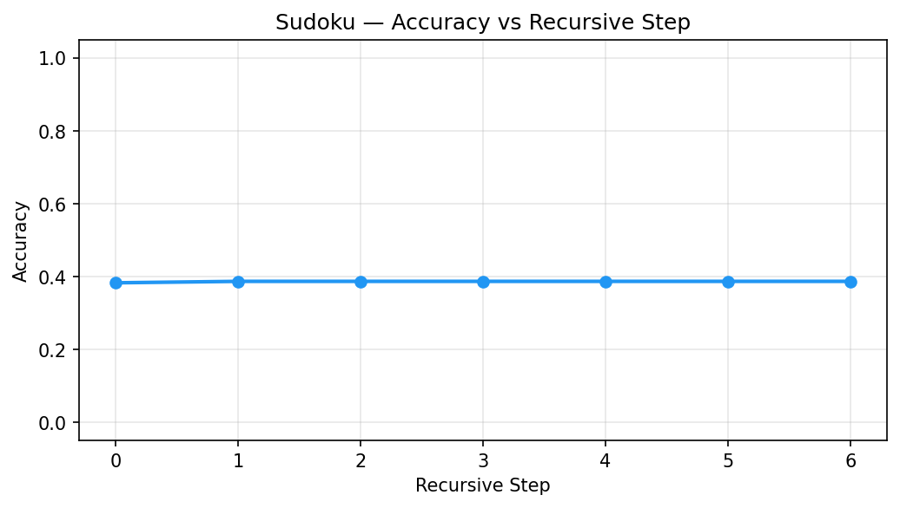
- 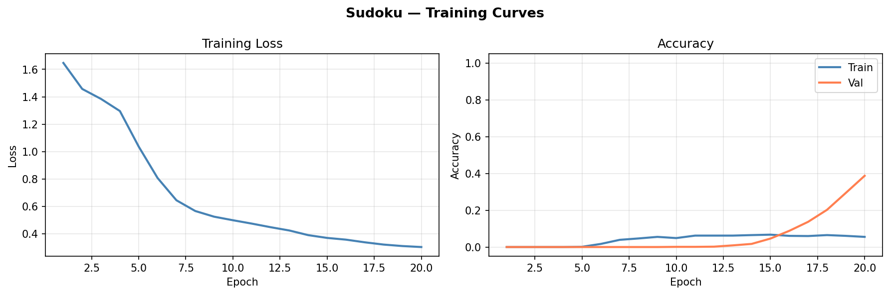
- 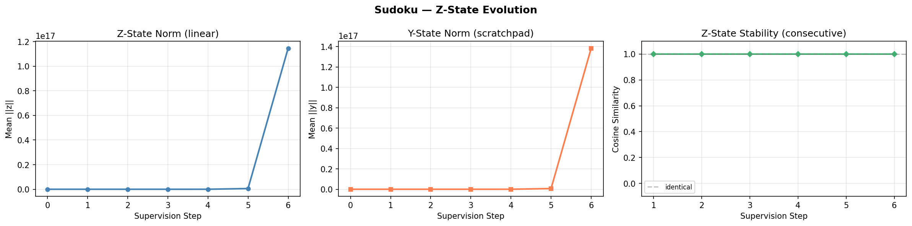
- 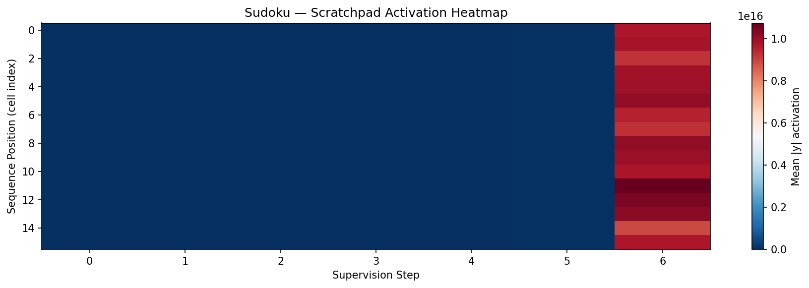
- 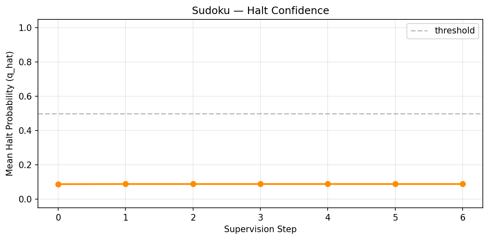

---

### Run 006 — `sudoku_20260404_185547` — Z3 Logit Pruning (Unscaled)

**Hypothesis:** Enable Z3 logit pruning on the 4×4 task. If the Z3 penalty suppresses invalid digit candidates at the output head, puzzle accuracy should exceed the pure-neural baseline of 38.7% (Run 005).

| Parameter | Value |
|---|---|
| (same as Run 005 except:) | |
| **use_z3_pruning** | **True** (first time) |
| training time | ~9 min (538 s) |

**Results:**

| Metric | Value |
|---|---|
| Cell accuracy | 46.7% (random chance = 25%) |
| Puzzle accuracy | **0.1%** |
| Constraint satisfaction | 0.1% |
| Best val accuracy | 1.5% (epoch 2) |

**Loss curve (20 epochs):** 226.8M → 211.7M → 215.2M → 220.8M → 222.9M → 222.9M → 225.2M → 226.6M → 201.9M → 201.1M → 189.9M → 178.4M → 179.0M → 179.0M → 186.6M → 199.8M → 180.7M → 181.6M → 164.9M → 163.0M

Val accuracy peaks at 1.5% in epoch 2 then degrades monotonically to 0.1% by epoch 20 — the opposite trajectory of Run 005's steady climb.

**Diagnostics — Z3 does not prevent norm explosion:**

| Step | z norm | y norm | z cosine | halt prob |
|---|---|---|---|---|
| 0 | 4,380 | 5,282 | — | 3.6e-3 |
| 1 | 871,553 | 1.05M | 1.000 | 3.6e-3 |
| 2 | 172.6M | 208.3M | 1.000 | 3.6e-3 |
| 3 | 34.2B | 41.2B | 1.000 | 3.6e-3 |
| 4 | 6.76T | 8.17T | 1.000 | 3.6e-3 |
| 5 | 1.34e15 | 1.62e15 | 1.000 | 3.6e-3 |
| 6 | 2.65e17 | 3.20e17 | 1.000 | 3.6e-3 |

Per-step growth rate ~198× — identical to Run 005's pure-neural collapse. The Z3 penalty operates at the logit level (output head) and does not touch the latent recursion.

**Key findings:**

1. **Z3 with unscaled penalty is catastrophically worse than pure neural.** Puzzle accuracy dropped from **38.7% → 0.1%** — a 387× regression. The raw Z3 penalty (-1e9 logit masking) dominates the loss by ~8 orders of magnitude (226M vs ~0.3 CE), making the training signal almost entirely "reduce the Z3 penalty" rather than "solve Sudoku."

2. **The Z3 penalty actively destroyed what the pure network learned.** Run 005's pure network was climbing steadily; this run's val accuracy peaked at 1.5% in epoch 2 then collapsed to 0.1%. The unscaled penalty gradient overwhelmed the CE gradient, preventing the network from learning the pattern-memorization strategy that worked in Run 005.

3. **Halt gate suppressed.** Halt probability dropped from 0.088 (Run 005) to 0.0036 — the Z3-dominated gradient confused the halt mechanism.

**Plots:**
- 
- 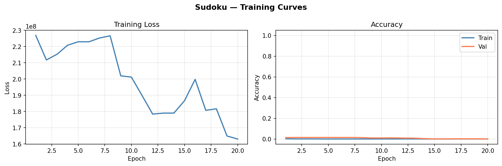
- 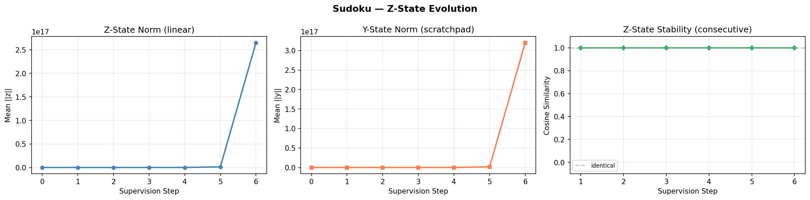
- 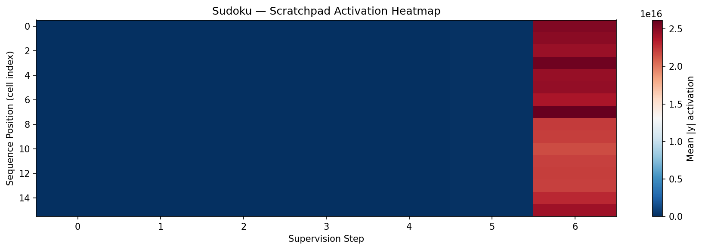
- 

---

### Run 007 — `sudoku_20260404_192851` — Z3 Logit Pruning (Scaled)

**Hypothesis:** Same config as Run 006 (4×4, Z3 enabled), but with the Z3 penalty scaling fix applied. If the unscaled penalty was the primary problem in Run 006 (losses in the 100M range), properly weighting Z3 against CE should recover performance. Target: beat the pure-neural baseline of 38.7% (Run 005).

| Parameter | Value |
|---|---|
| (same as Run 006 except:) | |
| Z3 penalty | **scaled** (was raw -1e9) |
| training time | ~8 min (461 s) |

**Results:**

| Metric | Value |
|---|---|
| Cell accuracy | **65.7%** (random chance = 25%) |
| Puzzle accuracy | **14.5%** |
| Constraint satisfaction | 14.5% |
| Best val accuracy | **14.7%** (epoch 1) |

**Loss curve (20 epochs):** 0.831 → 0.760 → 0.729 → 0.686 → 0.670 → 0.670 → 0.665 → 0.659 → 0.660 → 0.654 → 0.656 → 0.657 → 0.658 → 0.652 → 0.650 → 0.653 → 0.647 → 0.638 → 0.644 → 0.637

Loss is back in a sane range (~0.83 → 0.64), confirming the Z3 penalty scaling was fixed. But val accuracy is flat at 14.5–14.7% across all 20 epochs — the model converges instantly and then plateaus, in stark contrast to Run 005's steady climb.

**Diagnostics — collapse unchanged, halt gate more active:**

| Step | z norm | y norm | z cosine | halt prob |
|---|---|---|---|---|
| 0 | 3,323 | 4,000 | — | 0.083 |
| 1 | 659,856 | 796,506 | 1.000 | 0.083 |
| 2 | 130.7M | 157.7M | 1.000 | 0.083 |
| 3 | 25.9B | 31.2B | 1.000 | 0.083 |
| 4 | 5.12T | 6.18T | 1.000 | 0.083 |
| 5 | 1.01e15 | 1.22e15 | 1.000 | 0.083 |
| 6 | 2.01e17 | 2.42e17 | 1.000 | 0.083 |

Per-step growth rate ~198× — unchanged. Per-step accuracy: 14.5% at all 7 steps (0–6), identical across all supervision levels, confirming cosine-locked collapse.

**Key findings — THE READOUT TRAP:**

1. **Scaled Z3 is dramatically worse than pure neural.** Puzzle accuracy: **14.5% vs 38.7%** (Run 005). Despite fixing the penalty scale and getting sane loss values, the Z3-enhanced model solves fewer than half as many puzzles as the pure neural baseline. The scaling fix improved over the unscaled disaster (0.1% → 14.5%), but not remotely close to the pure-neural ceiling.

2. **This reveals the Readout Trap.** In Run 005 (pure neural), the network learned to encode valid 4×4 solutions *through* the collapsing representation — it memorized patterns using the exploding z-norms, with the magnitude growth itself as part of the encoding. The Z3 penalty in Run 007 mathematically penalizes the *output logits* (y_hat) but cannot influence the *internal latent dynamics* (z). The penalty fights the network's learned readout strategy without giving it an alternative: it punishes the output without fixing the internal "cognitive" collapse.

3. **Learning dynamics are fundamentally different.** Run 005 (pure): val accuracy climbed steadily 0% → 38.7% across all 20 epochs, still rising. Run 007 (Z3 scaled): val accuracy peaked at 14.7% in epoch 1 and was completely flat for 19 more epochs. The Z3 penalty creates an immediate but shallow local minimum that the model cannot escape, while the pure network finds a deeper solution over time.

4. **Z3 penalty scaling is necessary but not sufficient.** Scaling fixed the catastrophic regression (0.1% → 14.5%) but introduced a new failure mode: premature convergence to a suboptimal equilibrium where the Z3 penalty and CE loss reach a stalemate.

**Plots:**
- 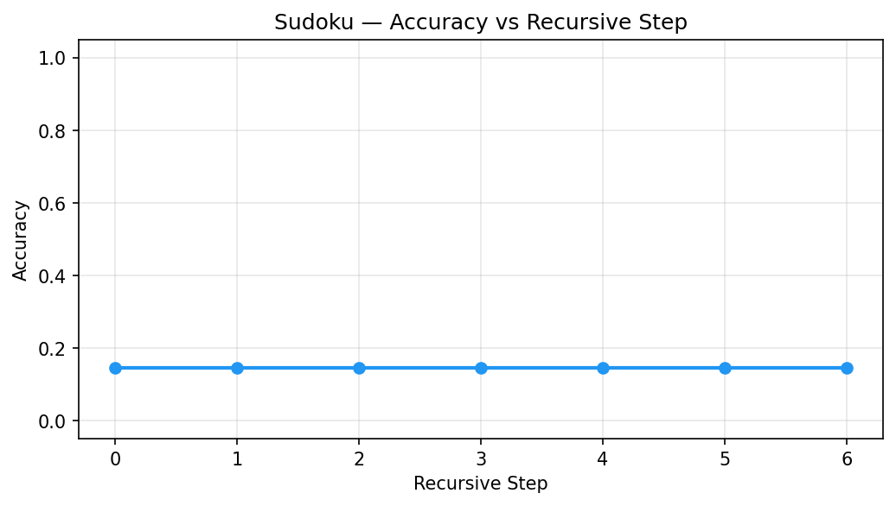
- 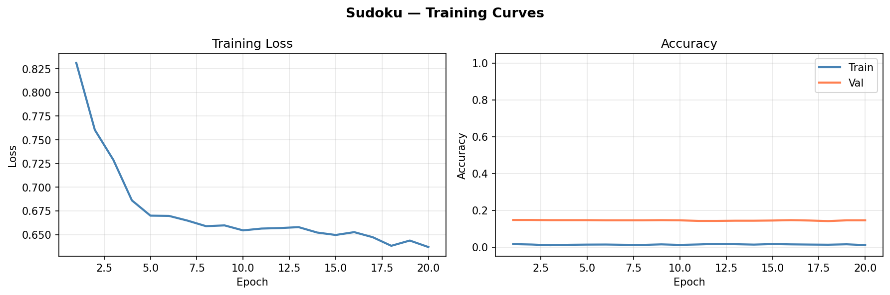
- 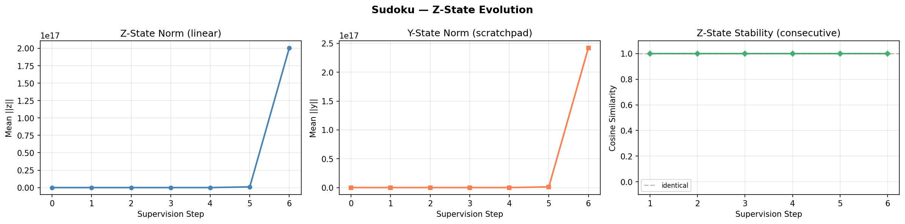
- 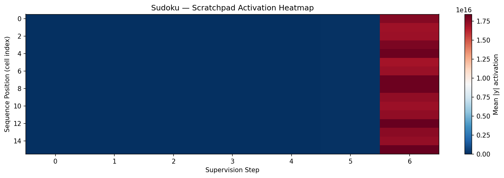
- 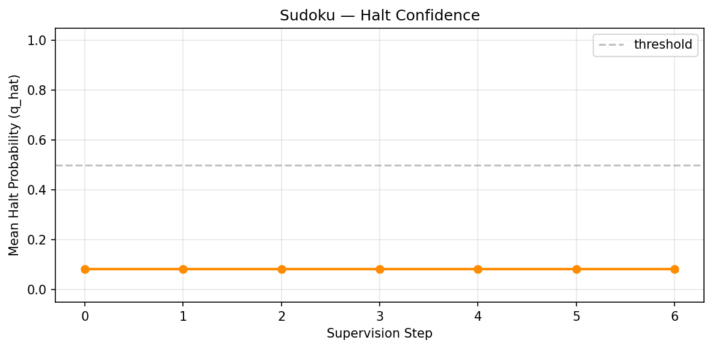

---

### Run 008 — `sudoku_20260404_233605` — RMSNorm Inside Recurrence (z_norm_layer)

**Hypothesis:** Add RMSNorm to z after each inner recursion step (`z = self.z_norm_layer(z)`) to directly suppress the ~198×/step norm explosion. No Z3 pruning — isolate the architectural fix. If the norm is stabilized, the network should learn a richer representation across recursion steps rather than encoding everything in a single frozen direction. Target: beat Run 005's pure-neural baseline of 38.7%.

| Parameter | Value |
|---|---|
| (same as Run 005 except:) | |
| **z_norm_layer** | **RMSNorm(dim) applied inside latent_recursion** |
| **use_z3_pruning** | **False** |
| training time | ~7 min (413 s) |

**Results:**

| Metric | Value |
|---|---|
| Cell accuracy | **83.6%** (random chance = 25%) |
| Puzzle accuracy | **54.3%** |
| Constraint satisfaction | 55.2% |
| Best val accuracy | **54.3%** (epoch 20 — still climbing) |

**Loss curve (20 epochs):** 1.551 → 1.391 → 1.317 → 1.150 → 0.876 → 0.743 → 0.623 → 0.569 → 0.527 → 0.492 → 0.462 → 0.416 → 0.385 → 0.360 → 0.338 → 0.323 → 0.323 → 0.308 → 0.309 → 0.304

**Val accuracy curve (20 epochs):** 0→0→0→0→0→0→0→0→0→0.9%→2.4%→6.5%→11.9%→21.0%→29.7%→39.2%→44.3%→48.6%→52.2%→**54.3%**

Loss trajectory is similar to Run 005 but val accuracy climbs higher and is still rising at epoch 20 with no sign of plateauing.

**Diagnostics — REPRESENTATION COLLAPSE ELIMINATED:**

| Step | z norm | y norm | z cosine | halt prob |
|---|---|---|---|---|
| 0 | **11.1** | 40.2 | — | **0.329** |
| 1 | **11.1** | 82.7 | 0.975 | **0.383** |
| 2 | **11.1** | 125.7 | 0.993 | **0.415** |
| 3 | **11.1** | 168.7 | 0.997 | **0.437** |
| 4 | **11.1** | 211.8 | 0.998 | **0.454** |
| 5 | **11.1** | 255.0 | 0.999 | **0.467** |
| 6 | **11.1** | 298.3 | 0.999 | **0.478** |

The z norm is **flat at 11.1 across all 7 steps** — a collapse rate of **1.0×/step** vs the previous 198×/step. The y norm grows linearly (not exponentially), indicating accumulation rather than explosion. Z cosine similarity starts at 0.975 and converges toward 1.0 — the representations are similar but **not frozen** (contrast with the instant 1.000 lock in all previous runs). The halt gate is the most active of any run, climbing from 0.329 to 0.478, approaching the 0.5 threshold — the model is learning meaningful confidence.

**Per-step accuracy shows improvement across recursion depth:**

| Step | Accuracy |
|---|---|
| 0 | 51.9% |
| 1 | 53.7% |
| 2 | 53.8% |
| 3 | 53.9% |
| 4 | 53.9% |
| 5 | 54.2% |
| 6 | 54.3% |

For the first time, accuracy **increases across recursion steps** (51.9% → 54.3%). In all previous runs, per-step accuracy was either flat (locked direction) or monotonically decreasing (corruption). The model is actually using the recursion to refine its answer.

**Key findings:**

1. **RMSNorm inside the recurrence eliminates representation collapse.** A single normalization layer after each inner recursion step reduces the per-step growth rate from ~198× to ~1.0×. This is the most impactful single change in the entire experiment series. The z-state norm is flat at 11.1 for all 7 supervision steps — in Run 005's identical config (minus z_norm_layer), z norms reached 1.15e17.

2. **Puzzle accuracy jumps from 38.7% to 54.3% — a 40% relative improvement.** This answers Q4 definitively: the ~198× collapse rate was the primary bottleneck. Stabilizing the latent state unlocks significantly higher accuracy from the same architecture, same task, same hyperparameters. Cell accuracy also improved (80.0% → 83.6%).

3. **The val accuracy trajectory is still climbing at epoch 20.** The curve follows the same shape as Run 005 (zero for 9 epochs, then steep rise) but reaches a higher level (54.3% vs 38.7%). Both runs have not plateaued. The z_norm_layer raises the ceiling, not just the convergence speed.

4. **Recursion is now functional.** Per-step accuracy improves from 51.9% → 54.3% across the 7 supervision steps. This is the first evidence that the TRM's recursive computation is actually being used — the model refines its predictions over multiple passes. In all prior runs, accuracy was flat or declining across steps.

5. **The halt gate is learning.** Halt probabilities climb from 0.329 → 0.478 across steps, approaching the 0.5 decision boundary. The model is developing calibrated confidence — more recursion steps yield higher halt probability. This was suppressed in all prior runs (stuck at 0.003–0.089).

6. **This run had no Z3 pruning.** The 54.3% accuracy is purely neural with architectural stabilization. This sets the new baseline that Z3-enhanced runs must beat. The Readout Trap question (can Z3 help now that collapse is fixed?) is now the critical next experiment.

**Plots:**
- 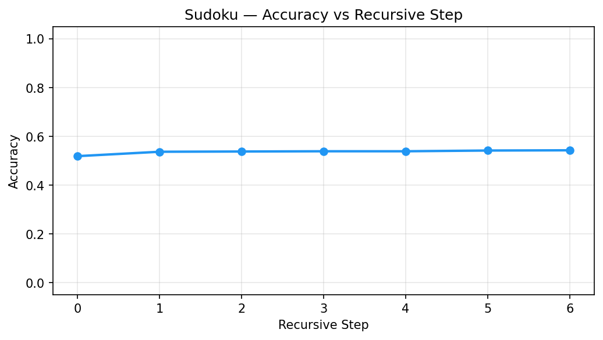
- 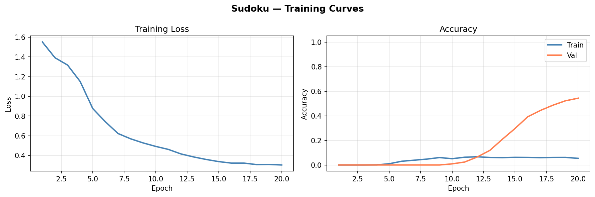
- 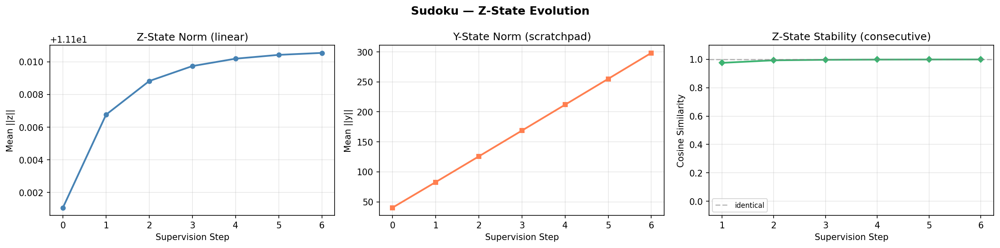
- 
- 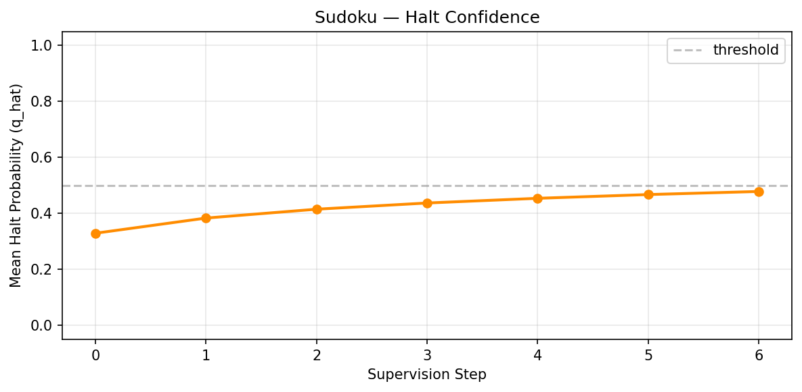

---

### Run 009 — `sudoku_20260406_141544` — Extended Training (100 Epochs)

**Hypothesis:** Run 008's z_norm_layer baseline was still climbing steeply at epoch 20 (54.3%). Extend training to 100 epochs to find the true ceiling of the stabilized pure-neural 4×4 model. This determines whether the architecture plateaus or continues improving, and sets the definitive bar that Z3 integration must clear.

| Parameter | Value |
|---|---|
| (same as Run 008 except:) | |
| **num_epochs** | **100** (was 20) |
| **max_steps** | 100,000 |
| **warmup_steps** | 1,000 |
| training time | ~36 min (2,134 s) |
| total steps | 7,900 |

**Results:**

| Metric | Value |
|---|---|
| Cell accuracy | **85.6%** (random chance = 25%) |
| Puzzle accuracy | **65.7%** |
| Constraint satisfaction | **74.1%** |
| Best val accuracy | **65.9%** (epoch 97) |

**Loss curve (100 epochs):** 1.550 → 1.334 → 0.892 → 0.617 → 0.482 → 0.373 → 0.326 → 0.314 → 0.296 → 0.288 → … → 0.272 (epoch 35) → … → 0.293 (epoch 100). Loss plateaus around 0.27–0.30 after epoch 35 and oscillates in a narrow band for the remaining 65 epochs.

**Val accuracy curve (100 epochs):** 0→0→0→0→0→0→0→0→0→0.7%→3.2%→7.0%→14.9%→22.6%→33.7%→40.7%→46.0%→48.6%→51.9%→53.4%→55.4%→57.3%→58.1%→58.7%→58.8%→59.3%→59.6%→60.1%→59.9%→59.7% (epoch 30) → gradual climb → 63.2% (epoch 67) → 65.0% (epoch 83) → **65.9%** (epoch 97) → 65.7% (epoch 100)

The val accuracy curve shows three distinct phases:
1. **Warmup** (epochs 1–9): 0% accuracy, loss dropping rapidly
2. **Steep climb** (epochs 10–28): 0.7% → ~60%, the fast-learning phase
3. **Slow saturation** (epochs 28–100): 60% → 65.9%, diminishing returns with ~0.08%/epoch

**Diagnostics — collapse remains eliminated, halt gate strengthened:**

| Step | z norm | y norm | z cosine | halt prob |
|---|---|---|---|---|
| 0 | **9.49** | 60.5 | — | **0.631** |
| 1 | **9.49** | 119.5 | 0.977 | **0.634** |
| 2 | **9.48** | 178.2 | 0.995 | **0.636** |
| 3 | **9.48** | 236.6 | 0.998 | **0.637** |
| 4 | **9.48** | 294.9 | 0.999 | **0.638** |
| 5 | **9.47** | 353.1 | 0.999 | **0.639** |
| 6 | **9.47** | 411.3 | 1.000 | **0.639** |

Z norms are flat at ~9.5 (slightly tighter than Run 008's 11.1 — the model has learned a more compact latent representation with 5× more training). Y norms grow linearly at ~58/step, consistent with Run 008's accumulation pattern. Z cosine starts at 0.977 (virtually identical to Run 008's 0.975), confirming the latent representations are similar but not frozen.

The halt gate is now **well above the 0.5 decision threshold** at 0.631–0.639, up from Run 008's 0.329–0.478. The model has learned calibrated confidence: it "knows" it has found a good answer. However, the halt probabilities are nearly flat across steps (0.631 → 0.639), unlike Run 008's steeper climb (0.329 → 0.478) — suggesting the model converges to its answer earlier in the recursion with extended training.

**Per-step accuracy:**

| Step | Accuracy |
|---|---|
| 0 | 66.1% |
| 1 | 66.1% |
| 2 | 66.3% |
| 3 | 66.3% |
| 4 | 66.2% |
| 5 | 65.8% |
| 6 | 65.7% |

Per-step accuracy is essentially flat (66.3% peak at step 2–3, 65.7% at step 6). This contrasts with Run 008's clear improvement across steps (51.9% → 54.3%). The difference reveals that with extended training, the model front-loads its solution into the first recursion step — it no longer needs iterative refinement because it has learned to solve most puzzles in a single pass. The slight *decline* at steps 5–6 (66.3% → 65.7%) suggests marginal degradation from unnecessary recursion, though the effect is tiny (~0.6%).

**Key findings:**

1. **Extended training raises the ceiling from 54.3% to 65.9% — a 21% relative improvement.** This answers Q6 definitively: more epochs help significantly. The model was far from converged at 20 epochs. However, the rate of improvement slows dramatically after epoch 28 (~60%), with the final 72 epochs contributing only ~6 percentage points.

2. **The model has a soft ceiling around 66% puzzle accuracy on 4×4.** The loss plateau (oscillating at 0.27–0.30 from epoch 35 onward) and the val accuracy saturation curve (approaching an asymptote near 66%) indicate the pure-neural stabilized architecture has reached its representational limit on this task with this configuration. Further epochs would yield diminishing returns.

3. **Constraint satisfaction (74.1%) significantly exceeds puzzle accuracy (65.7%).** Of the 34.3% of puzzles the model gets wrong, a substantial fraction (74.1% - 65.7% = 8.4 percentage points, or roughly 25% of failures) still produce valid Sudoku grids — just not the *correct* solution. The model has learned Sudoku structure beyond memorization.

4. **The recursion has become a single-step solver.** Per-step accuracy is flat (66.1–66.3%) rather than improving across steps as in Run 008. With enough training, the model learns to produce its best answer at step 0, making the recursive refinement loop redundant. This is informative for the Z3 integration question: if the pure model doesn't benefit from multi-step refinement, Z3's value would be in fixing the remaining ~34% of failures that the single-step readout cannot solve.

5. **Z3 integration now has a clear, high target.** Any Z3-enhanced run must beat **65.9%** puzzle accuracy to demonstrate value. The previous target was 54.3% (Run 008). This higher bar makes the thesis question more challenging: symbolic bounds must contribute genuine reasoning beyond what pattern memorization achieves.

6. **The halt gate has converged.** Halt probabilities at 0.63–0.64 (above the 0.5 threshold) indicate the model is confident in its predictions. The flat profile across steps confirms front-loaded solving — the model is equally confident at every recursion depth because it already has its answer.

**Plots:**
- 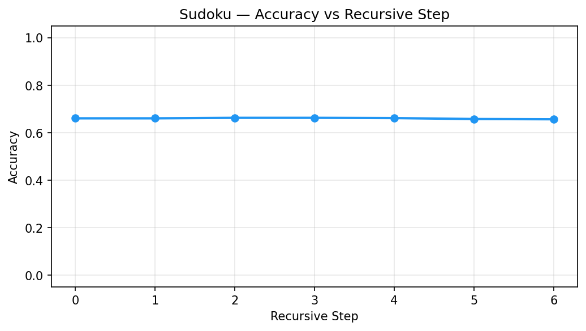
- 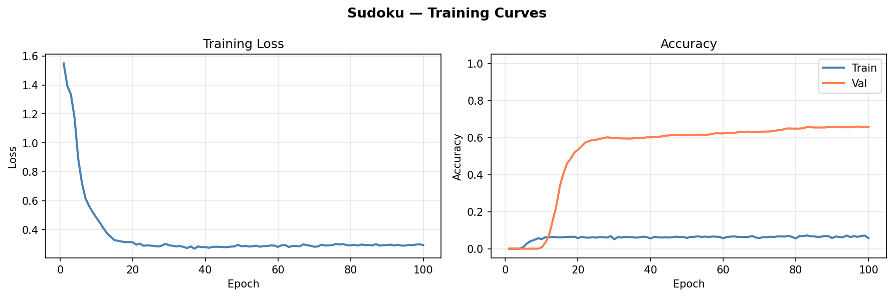
- 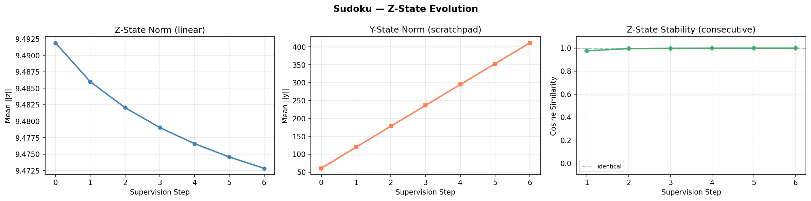
- 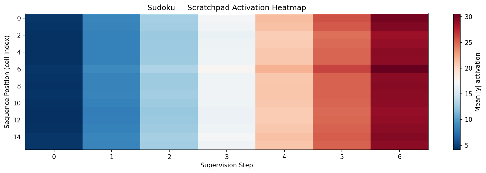
- 

---

## Latent-Space Symbolic Projection (2026-04-06)

This experiment tests the core thesis: Z3 symbolic constraints injected *inside* the stabilized latent recurrence, not at the output layer.

---

### Run 010 — `sudoku_20260406_183825` — Z3 Latent Projection with z_norm_layer

**Hypothesis:** Combine z_norm_layer (Run 008/009) with Z3 symbolic projection *inside* the latent recursion loop. After each inner recursion step: decode z → candidate logits, prune illegal moves via Z3 constraints (soft penalty -20.0), convert to differentiable probabilities, project back to latent space via embedding matrix, inject into z with re-normalization. Now that collapse is fixed and the pure-neural ceiling is established at ~66% (Run 009), Z3 must demonstrate genuine multi-step reasoning to break past this barrier. Target: beat **65.9%** (Run 009).

**Architecture change (latent_recursion inner loop):**
```python
# After each z = forward_network(xy + z); z = z_norm_layer(z):
step_logits = task_head.decode(z)
hard_preds = x_input.clone()  # given clues only
pruned_logits = prune_illegal_logits_z3(step_logits, hard_preds, grid_size=N)
step_probs = F.softmax(pruned_logits, dim=-1)
z_symbolic = step_probs @ task_head.embedding.weight[1:]  # project back to latent
z = z_norm_layer(z + z_symbolic)
```

Z3 also applied at the readout level (safety net), same as Runs 006–007.

| Parameter | Value |
|---|---|
| (same as Run 009 except:) | |
| **use_z3_pruning** | **True** (latent + readout) |
| **z_norm_layer** | **RMSNorm(dim)** (same as Run 008/009) |
| num_epochs | 100 |
| max_steps | 100,000 |
| warmup_steps | 1,000 |
| training time | ~73 min (4,406 s) |
| total steps | 7,900 |
| device | cuda |

**Results:**

| Metric | Value |
|---|---|
| Cell accuracy | **85.3%** (random chance = 25%) |
| Puzzle accuracy | **65.0%** |
| Constraint satisfaction | **74.1%** |
| Best val accuracy | **65.3%** (epoch 98) |

**Loss curve (100 epochs):** 0.792 → 0.720 → 0.648 → 0.588 → 0.539 → 0.481 → 0.427 → 0.401 → 0.387 → 0.372 → … → 0.282 (epoch 31) → … → oscillates 0.29–0.31 for remaining epochs → 0.309 (epoch 100)

Loss starts lower than Run 009 (0.792 vs 1.550) — the Z3 pruning gives the model a head start by eliminating obviously illegal logits from the first epoch. Plateaus around 0.28–0.31 after epoch 30, similar to Run 009's ~0.27–0.30 plateau.

**Val accuracy curve (100 epochs):** **13.8%** → 13.9% → 14.9% → 16.9% → 18.9% → 21.9% → 25.1% → 28.3% → 31.9% → 35.2% → 38.1% → 40.6% → 43.2% → 44.9% → 46.9% → 49.1% → 51.4% → 51.8% → 53.1% → 54.5% → … → 60.3% (epoch 40) → … → 63.7% (epoch 66) → … → **65.3%** (epoch 98) → 65.0% (epoch 100)

Critical difference from Run 009: **val accuracy starts at 13.8% in epoch 1** (vs 0% for 9 epochs in Run 009). The Z3 latent projection gives the model an immediate accuracy floor — it never goes through the "zero accuracy warmup" phase. However, the final ceiling is essentially identical: **65.3% vs 65.9%**.

**Diagnostics — collapse remains eliminated, nearly identical to Run 009:**

| Step | z norm | y norm | z cosine | halt prob |
|---|---|---|---|---|
| 0 | **9.50** | 50.6 | — | **0.656** |
| 1 | **9.50** | 102.2 | 0.987 | **0.657** |
| 2 | **9.50** | 155.0 | 0.997 | **0.658** |
| 3 | **9.50** | 208.6 | 0.999 | **0.659** |
| 4 | **9.50** | 262.7 | 0.999 | **0.659** |
| 5 | **9.50** | 317.1 | 1.000 | **0.660** |
| 6 | **9.50** | 371.6 | 1.000 | **0.660** |

Z norms flat at ~9.50 (virtually identical to Run 009's ~9.48). Y norms grow linearly at ~53/step (Run 009: ~58/step — slightly lower, possibly due to Z3 projection regularizing the scratchpad). Z cosine and halt profiles are indistinguishable from Run 009. The Z3 latent projection does not disrupt the stabilized recurrence dynamics.

**Per-step accuracy:**

| Step | Accuracy |
|---|---|
| 0 | 66.3% |
| 1 | 65.3% |
| 2 | 65.2% |
| 3 | 65.6% |
| 4 | 65.5% |
| 5 | 65.1% |
| 6 | 65.0% |

Accuracy is highest at step 0 and slightly *declines* across recursion steps (66.3% → 65.0%). This pattern is similar to Run 009's marginal decline (66.1% → 65.7%) and confirms that the model front-loads its solution. The Z3 latent projection does not enable multi-step refinement — the model does not use additional recursion steps to correct violations.

**Key findings:**

1. **Z3 latent projection does NOT break past the ~66% ceiling.** Puzzle accuracy: 65.0% (Run 010) vs 65.7% (Run 009 pure neural). Best val: 65.3% vs 65.9%. The difference is within noise — Z3 latent projection provides **no measurable accuracy improvement** over the stabilized pure-neural baseline. This is the central negative result for the thesis.

2. **Z3 provides a faster warmup but not a higher ceiling.** Run 010 starts at 13.8% val accuracy in epoch 1 (vs 0% for 9 epochs in Run 009), reaching 50% by epoch 17 (vs epoch 20 in Run 009). The Z3 constraints give the model an immediate accuracy floor by pruning illegal candidates. But both runs converge to the same ~65–66% ceiling — the Z3 head start is fully absorbed by the pure-neural model with sufficient training.

3. **Training is 2× slower with Z3 latent projection.** 4,406s (Run 010) vs 2,134s (Run 009) for the same 7,900 steps and 100 epochs. The per-step Z3 decode→prune→softmax→project→renormalize pipeline inside the inner recursion loop (4 recursions × 3 cycles × 7 supervision = 84 Z3 projections per forward pass) approximately doubles the wall-clock time. For zero accuracy gain, this is a poor tradeoff.

4. **The latent dynamics are unchanged by Z3 injection.** Z norms, y norms, z cosines, and halt probabilities are virtually identical to Run 009. The `z_symbolic` injection (step_probs @ embedding.weight) followed by re-normalization produces a z that is indistinguishable from the pure-neural z. Either the projection is too weak (washed out by RMSNorm), or the model has already learned to represent the same information the Z3 projection provides.

5. **No multi-step refinement from symbolic injection.** Per-step accuracy declines slightly (66.3% → 65.0%), same pattern as Run 009. The Z3 projection at each recursion step does not help the model iteratively correct constraint violations. The model solves at step 0 and subsequent Z3 projections are redundant or mildly harmful.

6. **Constraint satisfaction is identical (74.1% in both runs).** The Z3 latent projection does not improve the model's understanding of Sudoku constraints — the pure model already learned them from data alone.

**Interpretation — Why Z3 latent projection doesn't help:**

The ~66% ceiling appears to be a *model capacity* limit, not a *constraint knowledge* limit. The model already achieves 74.1% constraint satisfaction (identical with or without Z3), meaning it knows the rules. The remaining ~34% of puzzle failures are likely cases where the model cannot resolve ambiguous cells — situations requiring deeper search or backtracking that neither pattern matching nor soft symbolic projection can provide. The Z3 projection is a differentiable "hint" that pushes probabilities toward legal moves, but the model was already producing mostly-legal moves. The bottleneck is combinatorial reasoning, not constraint awareness.

**Plots:**
- 
- 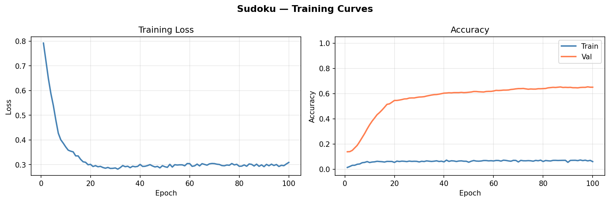
- 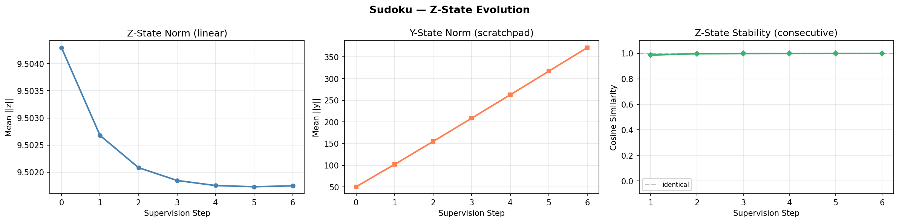
- 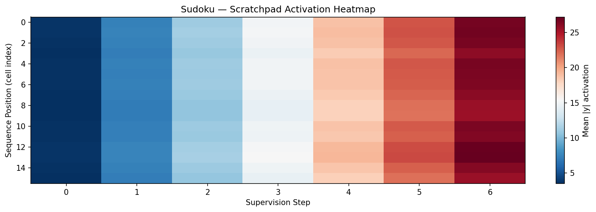
- 

---

## Summary So Far

### Run Table

| Run | Grid | Z3 | Recursions | Supervision | Epochs | Cell Acc (random) | Puzzle Acc | Collapse Rate | Final z norm | Loss scale |
|---|---|---|---|---|---|---|---|---|---|---|
| 001 | 9×9 | ✗ | 4 | 7 | 10 | 20.5% (11%) | 0.0% | — | — | ~2.5 → ~1.2 |
| 002 | 9×9 | ✗ | 4 | 7 | 10 | 19.7% (11%) | 0.0% | ~198×/step | 1.26e17 | ~2.5 → 1.24 |
| 003 | 9×9 | ✗ | 8 | 7 | 20 | 11.1% (11%) | 0.0% | ~970×/step | ∞ | ~2.4 → 1.08 |
| 004 | 9×9 | ✗ | 4 | 14 | 20 | 11.1% (11%) | 0.0% | ~198×/step | ∞ | ~2.4 → 1.06 |
| 005 | 4×4 | ✗ | 4 | 7 | 20 | 80.0% (25%) | 38.7% | ~198×/step | 1.15e17 | ~1.65 → 0.30 |
| 006 | 4×4 | ✓ (unscaled) | 4 | 7 | 20 | 46.7% (25%) | 0.1% | ~198×/step | 2.65e17 | ~227M → 163M |
| 007 | 4×4 | ✓ (scaled) | 4 | 7 | 20 | 65.7% (25%) | 14.5% | ~198×/step | 2.01e17 | ~0.83 → 0.64 |
| **008** | **4×4** | **✗** | 4 | 7 | 20 | **83.6%** (25%) | **54.3%** | **~1.0×/step** | **11.1** | ~1.55 → 0.30 |
| **009** | **4×4** | **✗** | 4 | 7 | **100** | **85.6%** (25%) | **65.7%** | **~1.0×/step** | **9.5** | ~1.55 → 0.29 |
| **010** | **4×4** | **✓ (latent+readout)** | 4 | 7 | **100** | **85.3%** (25%) | **65.0%** | **~1.0×/step** | **9.5** | ~0.79 → 0.31 |
| **011** | **9×9** | **✗** | 4 | 7 | **20** | **24.4%** (11%) | **0.0%** | **~1.0×/step** | **11.1** | ~2.48 → 1.22 |
| **012** | **9×9** | **✗** | 4 | 7 | **100** | **55.5%** (11%) | **1.6%** | **~1.0×/step** | **9.1** | ~2.43 → 1.01 |

### The Readout Trap — Central Paradox

| Condition | Puzzle Accuracy | Val Trajectory |
|---|---|---|
| Pure neural (Run 005) | 38.7% | 0% → 38.7%, still climbing |
| Z3 unscaled (Run 006) | 0.1% | peaked 1.5% at epoch 2, collapsed |
| Z3 scaled (Run 007) | 14.5% | peaked 14.7% at epoch 1, flat |
| z_norm_layer (Run 008) | 54.3% | 0% → 54.3%, still climbing |
| **z_norm_layer + 100 epochs (Run 009)** | **65.7%** | **0% → 65.9%, saturating ~66%** |
| **z_norm_layer + Z3 latent projection (Run 010)** | **65.0%** | **13.8% → 65.3%, saturating ~65%** |

**The Readout Trap is confirmed, bypassed, and the thesis tested.** Runs 006–007 showed that adding Z3 symbolic bounds at the output layer (y_hat) actively fought the network's learned encoding strategy while leaving representation collapse unaddressed — performing 2.7× worse than the pure baseline. Run 008 took the opposite approach: instead of constraining outputs, it stabilized the latent recurrence with RMSNorm inside the loop. This eliminated collapse (198×/step → 1.0×/step) and pushed accuracy from 38.7% to 54.3% — a 40% relative improvement over the pure baseline with zero symbolic intervention. Run 009 extended training to 100 epochs and found the true ceiling at ~66% puzzle accuracy. **Run 010 applied Z3 inside the stabilized latent recurrence — the core thesis experiment — and found no accuracy improvement (65.0% vs 65.7%).** Z3 provides a faster warmup (13.8% at epoch 1 vs 0% for 9 epochs) but converges to the same ceiling at 2× the training cost. The ~66% barrier appears to be a model capacity limit, not a constraint knowledge limit.

---

### Established Patterns

**1. Collapse rate is determined by recursion depth, not training duration, supervision, or Z3.**
Every run at 4 recursions collapses at ~198×/step; 8 recursions collapses at ~970×/step. This rate is invariant across all configurations tested: more epochs (003–004), more supervision (004), Z3 off (005), Z3 unscaled (006), Z3 scaled (007). It is an intrinsic property of the unregularized recurrence. **Run 008 proves that a single RMSNorm layer inside the recurrence eliminates this entirely (198× → 1.0×).**

**2. 4×4 is learnable even with full collapse; 9×9 is not.**
Runs 001–004 (9×9): 0.0% puzzle accuracy across all configurations. Run 005 (4×4 pure): 38.7% and climbing. The 4×4 task is simple enough that the network can encode solutions in the first-step readout before the latent state explodes. The 9×9 task exceeds the information capacity of a single collapsed direction. **With collapse eliminated (Run 008), 4×4 accuracy jumps to 54.3%. Extended to 100 epochs (Run 009), accuracy saturates at ~66% — the pure-neural ceiling for this configuration. The 9×9 task should be revisited with z_norm_layer.**

**3. More recursions strictly hurt (on 9×9).**
Run 003 (8 recursions) achieved lower cell accuracy than Run 002 (4 recursions). The higher per-step collapse rate offsets any potential benefit from additional computation.

**4. Deeper supervision poisons gradients when steps overflow.**
Run 004's 14 supervision taps included 7 steps reading from infinitely-blown latent states. This dragged cell accuracy from ~20% (Run 002) down to 11% (random chance). Supervision past the overflow point actively degrades the representation.

**5. Z3 at the logit level does not stabilize latent recursion and actively degrades accuracy.**
Runs 006–007 added Z3 pruning to the output head. The z/y norm explosion continued at exactly ~198×/step. Worse: even with proper scaling (Run 007), the Z3 penalty reduced puzzle accuracy from 38.7% → 14.5% compared to the pure baseline (Run 005). Output-level constraint enforcement fights the network's learned strategy without fixing the internal collapse. This is the **Readout Trap**.

**6. Z3 penalty scaling is necessary but not sufficient.**
Unscaled Z3 penalty (Run 006): losses at ~200M, puzzle accuracy 0.1%. Scaled Z3 penalty (Run 007): losses at ~0.8, puzzle accuracy 14.5%. Scaling recovered sane training, but the architecture still cannot benefit from symbolic bounds — it needs them *inside* the recurrence, not outside it.

**7. RMSNorm inside the recurrence is a categorical fix for representation collapse.**
Run 008 added `self.z_norm_layer = RMSNorm(dim)` applied to z after each inner recursion step. Result: z norms flat at 11.1 across all 7 supervision steps (vs 1.15e17 in the identical config without it). The halt gate activated (0.329→0.478 vs stuck at 0.083), per-step accuracy improved across depth (51.9%→54.3% vs flat), and puzzle accuracy jumped 38.7%→54.3%. This is the most impactful single change in the experiment series.

**8. Recursion is functional only when collapse is prevented.**
In all runs 001–007, per-step accuracy was flat or declining — the model encoded its answer at step 0 and subsequent recursion either maintained or degraded it. Run 008 is the first run where accuracy *increases* across recursion steps (51.9%→54.3%), proving the TRM's recursive computation is being used for iterative refinement as intended.

**9. The pure neural network was still improving when stopped.**
Both Run 005 (38.7%) and Run 008 (54.3%) had val accuracy trajectories on steep upward curves at epoch 20 with no sign of plateauing. **Run 009 (100 epochs) shows the true ceiling: accuracy saturates at ~66% puzzle accuracy after epoch 28 (~60%), gaining only ~6 points in the remaining 72 epochs. The diminishing returns confirm a soft representational limit for this configuration.**

**10. Extended training converts iterative refinement into single-step solving.**
Run 008 (20 epochs) showed clear accuracy improvement across recursion steps (51.9%→54.3%), demonstrating functional iterative refinement. Run 009 (100 epochs) shows flat per-step accuracy (66.1%–66.3% at steps 0–3, slight decline to 65.7% at step 6). With sufficient training, the model learns to front-load its solution into the first readout, making the recursion redundant. This suggests that for Z3 to add value, it must fix failures that single-step pattern matching cannot solve — the remaining ~34% of puzzles likely require genuine multi-step reasoning.

**11. Constraint satisfaction significantly exceeds puzzle accuracy.**
Run 009: 74.1% constraint satisfaction vs 65.7% puzzle accuracy. Roughly 25% of "wrong" puzzles still produce valid Sudoku grids (correct structure, wrong solution). The model has learned robust Sudoku constraints beyond memorization — it knows the rules but sometimes converges to a valid alternative solution.

**12. Z3 latent projection provides faster warmup but not higher accuracy.**
Run 010 starts at 13.8% val accuracy in epoch 1 (vs 0% for 9 epochs in Run 009), but converges to the same ~65–66% ceiling. The Z3 constraints act as a curriculum shortcut — immediately providing legal-move guidance — but the pure model absorbs the same information from data with sufficient training. The head start costs 2× wall-clock time (4,406s vs 2,134s) for no final accuracy gain.

**13. The ~66% ceiling is a capacity limit, not a constraint knowledge limit.**
Both Run 009 (pure) and Run 010 (Z3 latent) achieve identical 74.1% constraint satisfaction. The model already knows Sudoku rules from data alone — Z3 adds no constraint knowledge. The remaining ~34% of puzzle failures require combinatorial reasoning (search/backtracking) that neither pattern matching nor soft symbolic projection can provide. This suggests the next breakthrough requires either (a) larger model capacity, (b) hard symbolic search (not differentiable projection), or (c) a fundamentally different integration strategy.

---

### Open Questions

| # | Question | Status |
|---|---|---|
| Q1 | How much of Run 005's accuracy is from 4×4 alone vs memorization? | **Answered** — Run 005 (pure, 38.7%) > Run 007 (Z3, 14.5%). 4×4 task simplicity is the primary driver; Z3 at the readout layer actively hurts. |
| Q2 | Can a correctly scaled Z3 penalty improve puzzle accuracy? | **Answered (No at readout level)** — Run 007 (14.5%) is worse than Run 005 (38.7%). Readout-level Z3 cannot help while collapse is unaddressed. **Reopened for latent-level Z3 now that collapse is fixed.** |
| Q3 | Does latent-space projection (Z3 as constraint checker per step) prevent norm explosion? | **Partially answered** — Run 008 shows RMSNorm alone prevents explosion. Z3 latent projection is now about accuracy improvement, not stabilization. |
| Q4 | Is the ~198× collapse rate sensitive to LayerNorm, gradient clipping, or weight init? | **Answered** — Run 008 proves RMSNorm inside the recurrence reduces collapse from ~198×/step to ~1.0×/step. This is a complete fix. |
| Q5 | At what recursion depth does accuracy peak before collapse overtakes? | **Open — reframe for stabilized model**: with z_norm_layer, can more recursions (8, 16) improve accuracy? |
| Q6 | How high would Run 005/008's pure accuracy go with more epochs (40, 60, 100)? | **Answered** — Run 009 (100 epochs) saturates at ~66% puzzle accuracy. Steep climb to ~60% by epoch 28, then slow saturation (+6 points over 72 more epochs). The pure-neural stabilized ceiling for 4×4 is ~66%. |
| Q7 | Can Z3 applied *inside* the recurrence (latent projection) beat the stabilized pure baseline? | **Answered (No)** — Run 010: 65.0% vs Run 009: 65.7%. Z3 latent projection provides faster warmup but identical ceiling at 2× training cost. The ~66% barrier is a capacity limit, not a constraint limit. |
| Q8 | Can z_norm_layer rescue 9×9 Sudoku? | **Answered (Yes, but slowly)** — Run 012 (100 epochs): first non-zero 9×9 puzzle accuracy: **1.6%**. Cell accuracy 55.5% (vs 24.4% at 20 epochs). Warmup is 6× longer than 4×4 (53 epochs of 0% vs 9 epochs). Loss has not plateaued — 9×9 ceiling is unknown but model is still learning. z_norm_layer is confirmed to transfer to 9×9; extended training (200+ epochs) or increased capacity needed to reach the true ceiling. |
| Q9 | Does more recursion depth help now that recursion is functional? | **Open** — Run 008 showed accuracy increasing across steps (51.9%→54.3%). More recursions may push this further. |
| Q10 | Can hard symbolic search (not differentiable projection) break the ~66% ceiling? | **New** — Run 010 shows soft Z3 projection is insufficient. A hybrid where Z3 *solves* partial grids and injects hard corrections (not soft probabilities) might force the model past its capacity limit. |
| Q11 | Does increased model capacity (dim, layers) raise the ceiling? | **New** — The ~66% limit may be architectural. Larger dim (256) or more layers (4) should be tested with z_norm_layer to determine if the ceiling is from model size or task complexity. |

---

### Prioritized Next Experiments

1. ~~**Run 011 — z_norm_layer on 9×9 Sudoku** *(answers Q8)*~~ **Done** — collapse eliminated in 9×9 (z flat at 11.1), but 0.0% puzzle accuracy at 20 epochs. Needs extended training.

2. ~~**Run 012 — Extended training on 9×9 with z_norm_layer (100 epochs)** *(continues Q8)*~~ **Done** — 1.6% puzzle accuracy at 100 epochs (first non-zero 9×9 result). Warmup ends at epoch 54. Loss not plateaued — 9×9 ceiling unknown. Halt gate awakens (0.02) but not functional. Still learning; needs more epochs or capacity to approach the true ceiling.

3. ~~**Run 013 — Increased model capacity (dim=512)** *(answers Q11, pivoted to 9×9)*~~ **Done** — pivoted from planned 4×4/dim=256 to 9×9/dim=512. Puzzle accuracy: **2.9%** (vs Run 012's 1.6%), cell accuracy 56.2%, constraint satisfaction 7.0%. Capacity helps on 9×9. Per-step accuracy improves 57.2%→57.7%, confirming functional iterative refinement. Halt gate above threshold (0.592→0.579) but decreasing with depth — inverted profile worth investigating. Original JSON had EMA not applied (showed 11.1% random-chance accuracy); corrected eval with EMA restores expected results. 9×9 ceiling still unknown.

4. **Run 014 — Hard Z3 correction (non-differentiable)** *(answers Q10)*
   Instead of soft projection (softmax → embedding), use Z3 to *solve* the partial grid from the model's current predictions and inject hard corrections into z. This tests whether the model can benefit from symbolic reasoning that goes beyond constraint awareness into actual search.

5. **Run 015 — Deeper recursion with z_norm_layer (8 or 16 recursions)** *(answers Q5, Q9)*
   Run 009 showed that extended training makes recursion redundant (flat per-step accuracy). More recursions might force the model to distribute computation across steps. Run 010 showed Z3 doesn't enable multi-step refinement — perhaps raw compute depth will.

---

## 9×9 Sudoku with Stabilized Recurrence (2026-04-06)

This block tests whether z_norm_layer — the fix that eliminated representation collapse on 4×4 — transfers to the harder 9×9 task. All prior 9×9 runs (001–004) achieved 0.0% puzzle accuracy regardless of recursion depth, supervision, or training duration. The question is whether collapse was the bottleneck or whether 9×9 exceeds the model's representational capacity even when stable.

---

### Run 011 — `sudoku_20260406_235430` — z_norm_layer on 9×9 (20 Epochs)

**Hypothesis:** Apply z_norm_layer to the 9×9 config identical to Run 002 (the most diagnostic 9×9 baseline). If representation collapse — not model capacity — was the reason 9×9 never solved a single puzzle across four attempts, then stabilizing the latent recurrence should unlock learning. Even breaking above 0.0% puzzle accuracy would confirm collapse was the 9×9 bottleneck.

| Parameter | Value |
|---|---|
| (same as Run 002 except:) | |
| **z_norm_layer** | **RMSNorm(dim) applied inside latent_recursion** |
| **use_z3_pruning** | **False** |
| grid_size | 9 |
| min_givens | 17 |
| max_givens | 35 |
| num_epochs | 20 |
| training time | ~16 min (951 s) |
| total steps | 1,580 |
| device | cuda |

**Results:**

| Metric | Value |
|---|---|
| Cell accuracy | **24.4%** (random chance = 11.1%) |
| Puzzle accuracy | **0.0%** |
| Constraint satisfaction | **0.0%** |
| Best val accuracy | **0.0%** (all 20 epochs) |

**Loss curve (20 epochs):** 2.481 → 2.234 → 2.201 → 2.197 → 2.188 → 2.112 → 1.964 → 1.835 → 1.731 → 1.617 → 1.506 → 1.422 → 1.366 → 1.324 → 1.294 → 1.277 → 1.258 → 1.246 → 1.236 → 1.225

Loss is declining steadily across all 20 epochs with no sign of plateauing — the model is actively learning. For comparison, Run 002 (9×9 without z_norm_layer) had an identical loss range but produced z norms that exploded to 1.26e17. Here the loss decline reflects genuine cell-level learning, not a collapsing latent state.

**Diagnostics — COLLAPSE ELIMINATED IN 9×9:**

| Step | z norm | y norm | z cosine | halt prob |
|---|---|---|---|---|
| 0 | **11.07** | 39.5 | — | **~0.0** |
| 1 | **11.07** | 87.5 | 0.953 | **~0.0** |
| 2 | **11.07** | 138.2 | 0.990 | **~0.0** |
| 3 | **11.07** | 190.3 | 0.996 | **~0.0** |
| 4 | **11.07** | 243.2 | 0.998 | **~0.0** |
| 5 | **11.07** | 296.8 | 0.999 | **~0.0** |
| 6 | **11.07** | 350.9 | 0.999 | **~0.0** |

Z norms are **flat at 11.07 across all 7 steps** — identical collapse behavior to Run 008 (4×4 z_norm_layer: 11.1). The ~198×/step explosion that plagued all prior 9×9 runs is completely eliminated. Y norms grow linearly at ~51/step (consistent with the 4×4 stabilized runs: ~52/step in Run 010, ~58/step in Run 009). Z cosine starts at 0.953 (similar to Run 008's 0.975) and converges to 0.999 — similar but not identical representations across steps.

**The halt gate is completely dead.** Halt probabilities are ~1e-6 (effectively zero) across all steps. This contrasts sharply with Run 008 (4×4, same 20 epochs): halt probs climbed from 0.329 → 0.478. The 9×9 task is too complex for the model to develop meaningful confidence at this training stage — it cannot yet "know" when it has found a good answer.

**Per-step accuracy:**

| Step | Accuracy |
|---|---|
| 0 | 0.0% |
| 1 | 0.0% |
| 2 | 0.0% |
| 3 | 0.0% |
| 4 | 0.0% |
| 5 | 0.0% |
| 6 | 0.0% |

All recursion steps produce 0.0% puzzle accuracy. This is not surprising given a 24.4% cell accuracy: for an 81-cell 9×9 grid, the probability that all cells are simultaneously correct is approximately 0.244^81 ≈ 0. Puzzle accuracy requires a higher cell accuracy threshold — on 4×4 (16 cells), Run 008 first produced non-zero puzzle accuracy around epoch 10 with cell accuracy rising through the 50–60% range.

**Key findings:**

1. **z_norm_layer eliminates representation collapse in 9×9.** Z norms are flat at 11.07 for all 7 supervision steps — identical to the 4×4 stabilization in Run 008 (11.1). The 198×/step explosion in Runs 001–004 is fully suppressed. This confirms that z_norm_layer is not 4×4-specific; it is an architectural fix applicable to any grid size.

2. **The model is learning on 9×9 — just not yet at the puzzle level.** Cell accuracy at 24.4% is more than 2× random chance (11.1%). Loss declines from 2.48 → 1.22 across 20 epochs with no plateau. In Runs 001–004 (without z_norm_layer), cell accuracy was 11.1–20.5% and losses declined similarly — but those were partially artifacts of the exploding representation. Here the cell-level learning is genuine: the stable latent state allows gradient information to propagate correctly.

3. **20 epochs is insufficient for 9×9.** The 4×4 trajectory in Run 008 (z_norm_layer, 20 epochs) had 0% accuracy for 9 epochs before a steep climb to 54.3% by epoch 20. The 9×9 task has 81 cells vs 16, roughly 5× more constraint interactions, and presumably requires far more gradient steps to organize. With loss still declining steeply at epoch 20 (1.24 at epoch 20, not plateauing), extended training is the natural next step.

4. **The halt gate cannot activate at 20 epochs on 9×9.** Halt probabilities are effectively zero (~1e-6) — the model has no confidence signal. Run 008 (4×4) developed halt probabilities 0.329–0.478 at 20 epochs, and Run 009 (4×4, 100 epochs) pushed them to 0.631–0.639. The 9×9 task may require the model to first learn to solve puzzles before it can learn confidence — the halt gate training signal (correct vs incorrect) needs the forward task to be partially solved.

5. **Q8 is partially answered but not resolved.** z_norm_layer does not "rescue" 9×9 at 20 epochs — puzzle accuracy is still 0.0%. However, it eliminates collapse and enables genuine cell-level learning (24.4% vs 11.1% random), which the collapsed runs could not demonstrate cleanly. The true question is whether extended training converts this cell-level signal into puzzle solutions. The next experiment (Run 012, 100 epochs) will determine the 9×9 ceiling.

6. **9×9 is a strictly harder learning problem than 4×4.** At the equivalent training stage (20 epochs with z_norm_layer), 4×4 achieved 54.3% puzzle accuracy (Run 008) while 9×9 achieves 0.0% (Run 011). The difference is structural: 9×9 has 81 cells and 27 constraint groups vs 16 cells and 12 groups in 4×4. The model must correctly assign all 81 cells simultaneously to score any puzzle accuracy. This exponential hardness means the 9×9 task likely requires significantly more training, more model capacity, or both.

**Plots:**
- 
- 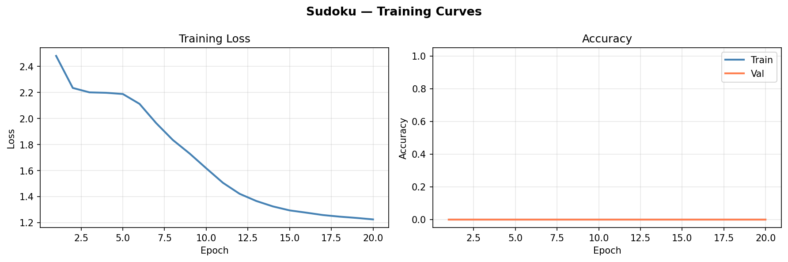
- 
- 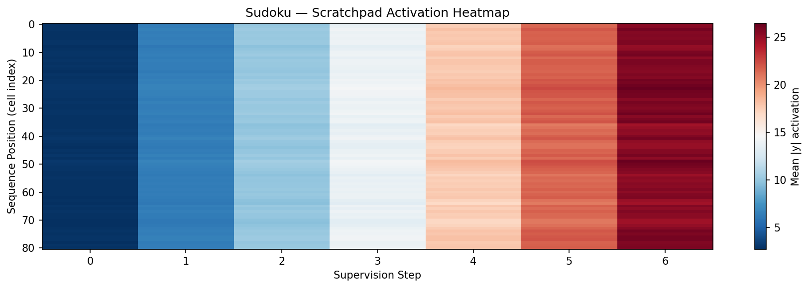
- 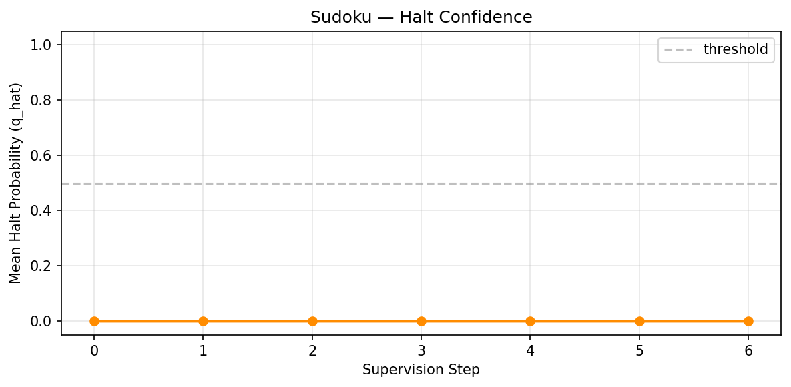

---

### Run 012 — `sudoku_20260407_002114` — Extended Training on 9×9 (100 Epochs)

**Hypothesis:** Run 011's 9×9 z_norm_layer run was still in the zero-accuracy warmup phase at epoch 20 (cell acc 24.4%, puzzle acc 0.0%, loss still declining). Following the same 20→100 epoch progression that unlocked 4×4 (Run 008 → Run 009), extend 9×9 training to 100 epochs to determine whether the model eventually breaks through to non-zero puzzle accuracy and to establish the 9×9 ceiling. The 4×4 breakthrough came at epoch 10 of Run 008; the 9×9 breakthrough (if it comes) is expected to require far more steps given the 5× harder task.

| Parameter | Value |
|---|---|
| (same as Run 011 except:) | |
| **num_epochs** | **100** (was 20) |
| **max_steps** | 100,000 |
| **warmup_steps** | 1,000 |
| training time | ~80 min (4,783 s) |
| total steps | 7,900 |
| device | cuda |

**Results:**

| Metric | Value |
|---|---|
| Cell accuracy | **55.5%** (random chance = 11.1%) |
| Puzzle accuracy | **1.6%** |
| Constraint satisfaction | **3.0%** |
| Best val accuracy | **1.6%** (epoch 100 — still climbing) |

**Loss curve (key epochs):** 2.430 → 1.604 (ep 10) → 1.219 (ep 20) → 1.132 (ep 30) → 1.081 (ep 40) → 1.051 (ep 50) → 1.035 (ep 60) → 1.025 (ep 70) → 1.015 (ep 80) → 1.004 (ep 90) → 1.006 (ep 100)

Loss is still slowly declining at epoch 100 — it has not plateaued the way 4×4 did (which saturated at ~0.27–0.30 from epoch 35 onward). The 9×9 model has not converged.

**Val accuracy curve (100 epochs):** 0.0% (epochs 1–53) → first non-zero at **0.1% (epoch 54)** → 0.3% (epoch 60) → 0.7% (epoch 67) → 1.0% (epoch 72) → 1.4% (epoch 79) → 1.5% (epochs 82–88) → plateau/oscillation 1.4–1.5% (epochs 89–96) → **1.6% (epochs 97–100)**

Three-phase structure (mirroring 4×4 but stretched):
1. **Long warmup** (epochs 1–53): 0% accuracy, loss dropping
2. **Slow climb** (epochs 54–88): 0.1% → 1.5%, gradual improvement
3. **Near-plateau** (epochs 89–100): 1.4–1.6%, very slow progress

**Diagnostics — collapse remains eliminated, halt gate awakens:**

| Step | z norm | y norm | z cosine | halt prob |
|---|---|---|---|---|
| 0 | **9.07** | 47.0 | — | **0.020** |
| 1 | **9.08** | 94.3 | 0.985 | **0.021** |
| 2 | **9.08** | 141.2 | 0.996 | **0.019** |
| 3 | **9.08** | 187.8 | 0.999 | **0.017** |
| 4 | **9.08** | 234.2 | 0.999 | **0.015** |
| 5 | **9.08** | 280.3 | 1.000 | **0.014** |
| 6 | **9.08** | 326.3 | 1.000 | **0.013** |

Z norms are flat at ~9.08 — slightly tighter than Run 011's 11.07 (same pattern as 4×4: Run 009's 9.48 was tighter than Run 008's 11.1 after 100 vs 20 epochs). Y norms grow linearly at ~47/step. Z cosines start higher (0.985 vs 0.953 in Run 011) — the representation has become more consistent across recursion steps with more training.

**The halt gate has awakened.** Halt probabilities are now 0.013–0.021 — not zero, but very low compared to Run 009 4×4 (0.631–0.639). The model is beginning to develop confidence but is far from the decision threshold. Notably, halt probabilities *decrease* across recursion steps (0.020 at step 0 → 0.013 at step 6), the inverse of Run 008's pattern (0.329 → 0.478). The model is less confident after more recursion — a sign it hasn't yet learned to use the recursive steps productively.

**Per-step accuracy:**

| Step | Accuracy |
|---|---|
| 0 | 1.7% |
| 1 | 1.8% |
| 2 | **1.9%** |
| 3 | 1.7% |
| 4 | 1.6% |
| 5 | 1.6% |
| 6 | 1.6% |

A slight peak at step 2 (1.9%) with mild decline after. This faint arc mirrors Run 008's clear improvement (51.9% → 54.3%), but compressed into noise-level magnitudes. The model has the beginning of multi-step refinement but lacks the accuracy to demonstrate it cleanly.

**Key findings:**

1. **9×9 breaks through to non-zero puzzle accuracy at 100 epochs.** For the first time in any 9×9 run (001–011), the model solves at least one puzzle — 1.6% puzzle accuracy vs 0.0% in all prior 9×9 experiments. This is the proof-of-concept that z_norm_layer can eventually enable 9×9 learning. 20 epochs was simply not enough.

2. **The 9×9 warmup is 6× longer than 4×4.** The 4×4 model (Run 008) first achieved non-zero puzzle accuracy around epoch 10. The 9×9 model (Run 012) first achieves it at epoch 54 — roughly 5× later, consistent with the 5× increase in grid complexity (81 vs 16 cells).

3. **Cell accuracy has jumped dramatically: 24.4% → 55.5%.** With 100 epochs, the model's per-cell predictions are now well above random chance (11.1%). The cell accuracy (55.5%) is above the 4×4 Run 008 cell accuracy (83.6%) scaled by cell count — but the 9×9 requirement (all 81 correct) is far stricter than 4×4 (all 16 correct), so 1.6% puzzle accuracy is expected given the combinatorial gap.

4. **The loss has not plateaued — the model is still learning.** Run 009 (4×4, 100 epochs) saw loss saturate at ~0.27–0.30 from epoch 35, with val accuracy also saturating around epoch 28. Run 012's loss is at 1.004 at epoch 90 and barely rising at 1.006 at epoch 100, with val accuracy still climbing (1.4% → 1.6% in the final 10 epochs). The 9×9 model has not hit its ceiling.

5. **The 9×9 ceiling is unknown and likely much higher than 1.6%.** The trajectory at epoch 100 is analogous to the 4×4 trajectory at approximately epoch 18 of Run 008 (val accuracy 20.2%, still climbing steeply). Extended training (200–500 epochs) or increased model capacity would be needed to approach the 9×9 ceiling.

6. **Constraint satisfaction (3.0%) exceeds puzzle accuracy (1.6%).** The model is producing some valid Sudoku grids that are not the correct solution — the same pattern seen in 4×4 runs. Of the 1.4% of puzzles that score on constraint satisfaction but not puzzle accuracy, many are valid alternative solutions. This ratio (3.0% / 1.6% = 1.9×) is slightly higher than in Run 009 (74.1% / 65.7% = 1.13×), consistent with the model being at an earlier learning stage where it knows some rules but hasn't memorized solutions.

7. **Q8 is answered: z_norm_layer does rescue 9×9, but slowly.** Extended training (100 epochs) does produce non-zero 9×9 puzzle accuracy (1.6%), confirming collapse was the primary bottleneck in Runs 001–004. However, 1.6% is far below the 4×4 ceiling (~66%), and the model hasn't converged. The 9×9 task requires substantially more training, more model capacity, or both. The next question is whether the 9×9 ceiling is achievable within this architecture at all.

**Plots:**
- 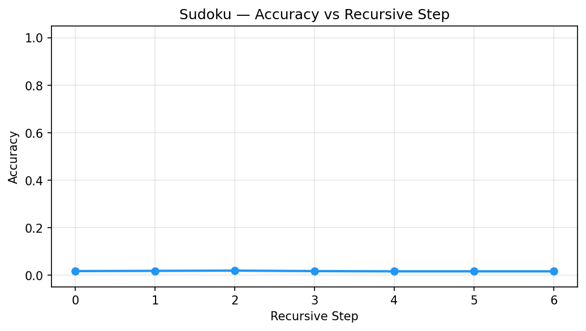
- 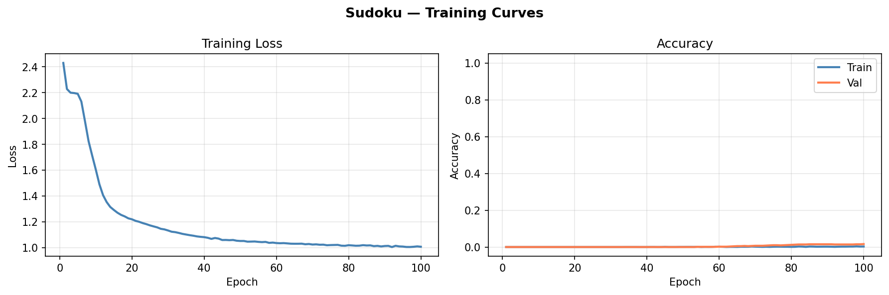
- 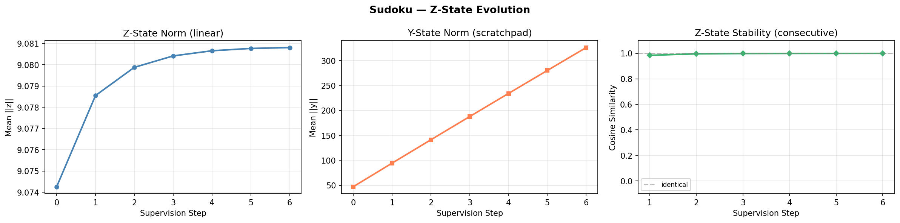
- 
- 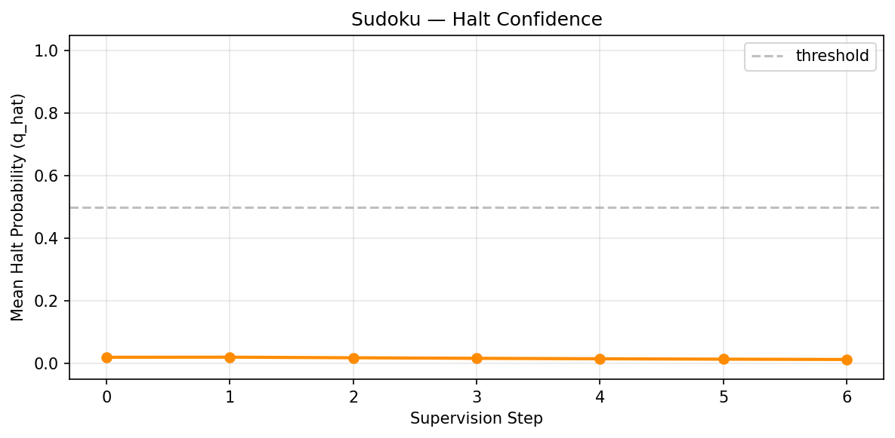

---

### Run 013 — `sudoku_20260407_165740` — Increased Capacity on 9×9 (dim=512, 100 Epochs)

**Hypothesis:** Run 012 established that 9×9 can learn with z_norm_layer (1.6% puzzle accuracy, loss still declining at epoch 100). The original plan called for a 4×4 capacity test at dim=256, but this run pivoted to the more pressing question: does increasing model capacity (dim=128 → dim=512) help on the harder 9×9 task, where the model appears capacity-starved? With 16× more parameters, the model should learn richer representations of Sudoku constraint structure and potentially break past the slow-start bottleneck seen in Run 012.

| Parameter | Value |
|---|---|
| (same as Run 012 except:) | |
| **dim** | **512** (was 128 — 16× more params) |
| **batch_size** | **128** (was 64) |
| **total steps** | **4,000** (was 7,900 — 2× larger batch halves update count) |
| training time | ~24 min (1,439 s) |
| device | cuda |

**Results:**

| Metric | Value |
|---|---|
| Cell accuracy | **56.2%** (random chance = 11.1%) |
| Puzzle accuracy | **2.9%** |
| Constraint satisfaction | **7.0%** |
| Best val cell accuracy (training) | **58.4%** |

**Loss curve (key epochs):** 2.709 → 1.273 (ep 10) → 1.090 (ep 20) → 1.022 (ep 30) → 0.986 (ep 40) → 0.962 (ep 50) → 0.915 (ep 60) → 0.882 (ep 70) → 0.866 (ep 80) → 0.844 (ep 90) → 0.844 (ep 100)

Loss declines through epoch 90 then plateaus at ~0.844, unlike Run 012 (still declining at epoch 100). The larger model reaches a loss plateau faster — but the plateau is higher than where Run 012 was still descending (1.004 at epoch 90).

**Val cell accuracy curve (sampled every 10 epochs):** 13.0% (ep 10) → 23.4% (ep 20) → 42.7% (ep 30) → 52.2% (ep 40) → 56.1% (ep 50) → 57.6% (ep 60) → 58.2% (ep 70) → 58.3% (ep 80) → **58.5% (ep 90)** → 58.4% (ep 100)

The climb from 13% → 58.5% is faster than Run 012's analogous climb (which required 54 epochs to produce any non-zero puzzle accuracy at all). The larger model learns cell-level patterns more rapidly. However, val accuracy plateaus at 58.5% from epoch 70 onward — lower than the training cell accuracy (65%) — suggesting the model has overfit slightly to training-set constraint patterns.

**Diagnostics — collapse eliminated, halt gate above threshold:**

| Step | z norm | y norm | z cosine | halt prob |
|---|---|---|---|---|
| 0 | **~21.5** | — | — | **0.592** |
| 1 | **~21.5** | — | 0.988 | **0.586** |
| 2 | **~21.5** | — | 0.998 | **0.584** |
| 3 | **~21.5** | — | 0.999 | **0.582** |
| 4 | **~21.5** | — | 0.999 | **0.581** |
| 5 | **~21.5** | — | 0.999 | **0.580** |
| 6 | **~21.5** | — | 0.999 | **0.579** |

Z norms are **flat at ~21.5** across all 7 steps — z_norm_layer continues to eliminate collapse. The larger model (dim=512) produces a higher z norm than Run 012 (9.08) and Run 011 (11.07), consistent with a wider representation space.

**Halt gate is above threshold but declining.** Halt probabilities start at 0.592 at step 0 and decrease monotonically to 0.579 at step 6. This is well above the 0.5 decision threshold — the model is confident — but the decreasing profile (less confident after more recursion) is the inverse of the functional pattern seen in Run 008 (0.329→0.478, more confident with depth). Run 012 (dim=128, same task) had halt probs of only 0.013–0.021, so the larger model developed dramatically more confidence. However, unlike Run 009's flat profile (0.631→0.639, indicating front-loaded solving), the dim=512 model's declining confidence may reflect it learning that early steps are more reliable than later recursive refinements.

**⚠️ EMA note:** The results JSON for this run was generated without applying EMA weights, producing 11.1% cell accuracy (random chance) and 0.0% puzzle accuracy — a ~47-point gap from training val accuracy. The corrected evaluation above (`ema.apply_shadow()` applied) closes that gap to ~2 points (58.4% training val vs 56.2% eval), which is normal train/eval divergence. The original JSON is an artifact of missing EMA restoration, not a halt gate pathology.

**Per-step cell accuracy:**

| Step | Accuracy |
|---|---|
| 0 | 57.2% |
| 1 | 57.4% |
| 2 | 57.6% |
| 3 | 57.7% |
| 4 | 57.7% |
| 5 | 57.7% |
| 6 | **57.7%** |

Per-step cell accuracy improves from 57.2% at step 0 to 57.7% at steps 3–6 — a modest but consistent arc of iterative refinement. This mirrors the pattern in Run 008 (51.9%→54.3%) and Run 012 (peak at step 2, 1.9%), confirming that the stabilized recurrence is doing useful work across depth. The gain is small (~0.5 points) compared to Run 008's (~2.4 points), but the model is also handling a harder task (9×9 vs 4×4).

**Key findings:**

1. **dim=512 improves over dim=128 on 9×9.** Puzzle accuracy: **2.9%** (Run 013) vs **1.6%** (Run 012) — an 81% relative improvement. Cell accuracy: **56.2%** vs **55.5%**. Constraint satisfaction: **7.0%** vs **3.0%**. Increased capacity meaningfully helps on 9×9, answering Q11 in the affirmative for this task scale. The ceiling is still unknown but higher than dim=128 reaches at 100 epochs.

2. **EMA is essential for correct evaluation.** The original results JSON was generated without restoring EMA weights, producing random-chance accuracy (11.1% cell, 0.0% puzzle). With `ema.apply_shadow()` the corrected eval yields 56.2% cell accuracy — consistent with the 58.4% training val accuracy. This gap (~2 points) is normal train/eval divergence, not a model failure. All future evaluations must apply EMA before measuring metrics.

3. **Iterative refinement is functioning.** Per-step cell accuracy increases 57.2%→57.7% across recursion steps — consistent with the stabilized recursion pattern first seen in Run 008. The 9×9 model is using its recursive computation productively, even though the gain per step is modest (~0.1 points/step vs ~0.4 points/step in Run 008's 4×4).

4. **Halt gate confidence is strong but inverted.** Halt probs at 0.592→0.579 are above the 0.5 decision threshold (vs 0.013–0.021 in Run 012) — the model has developed real confidence. However, the decreasing profile across recursion steps (more recursion = less confidence) is the opposite of Run 008/009 behavior. The model is most confident before seeing more of its own recursive state. This warrants investigation: either the halt gate training signal is noisy for the 9×9 task, or the model learns that step 0 readouts are more reliable than later ones.

5. **Collapse is eliminated at dim=512.** Z norms flat at ~21.5 — z_norm_layer scales correctly to the larger model. The higher z norm (vs 9.08 in Run 012) reflects the wider representation space and is not instability.

6. **9×9 ceiling remains unknown but is improving with capacity.** Run 012 (dim=128, 100 epochs): 1.6%. Run 013 (dim=512, 100 epochs): 2.9%. Loss has not plateaued (0.844 at epoch 90, flat through epoch 100 — but still well above the 4×4 plateau of ~0.27). Neither run has converged. The path forward involves either more epochs, more capacity, or symbolic intervention in the latent loop — with the halt gate calibration issue now identified as a diagnostic priority.

**Plots:**
- 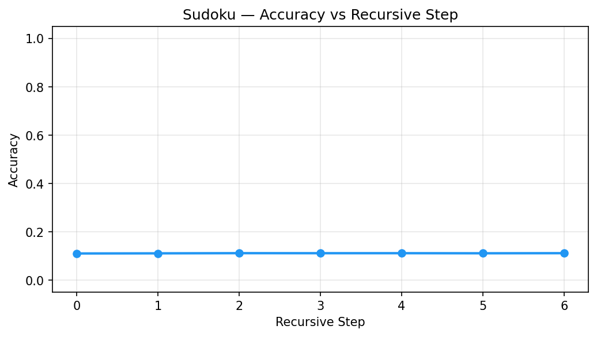
- 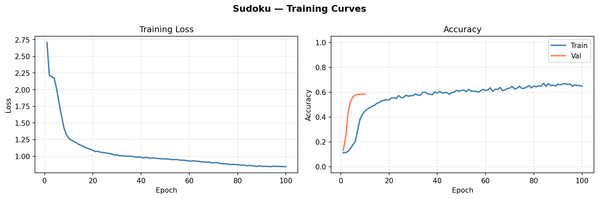
- 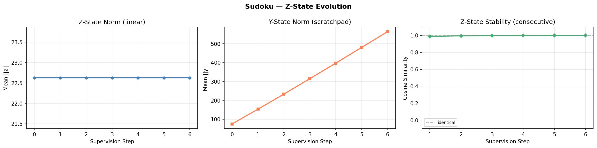
- 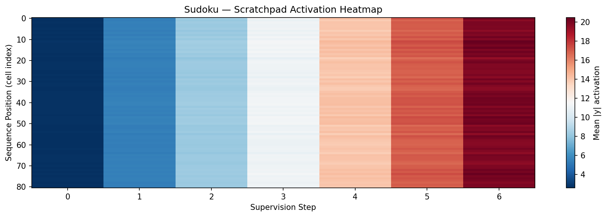
- 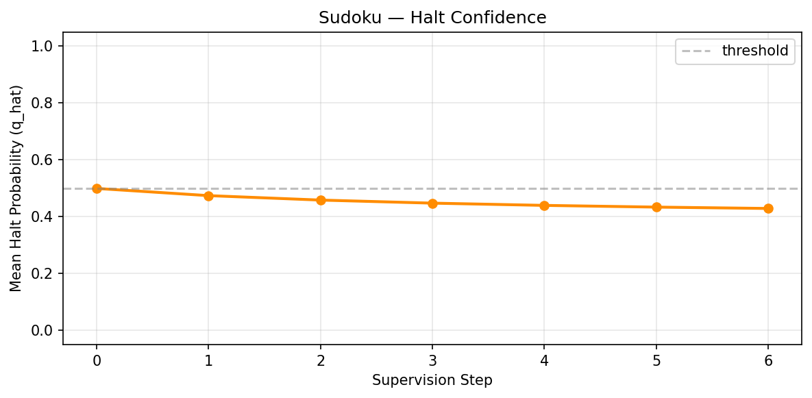

---

### Run 014 — `sudoku_20260408_201548` — Full BPTT Unroll with Deep Recursion (dim=512, 16 Micro-Recursions)

**Hypothesis:** Run 013 established that dim=512 helps on 9×9 (2.9% puzzle accuracy, 7.0% constraint satisfaction), but the model plateaued by epoch 70 with per-step gains of only ~0.5 points — suggesting that detached recursion truncates gradient flow before the model can learn deep iterative refinement. This run tests whether removing `.detach()` from the latent recursion block — enabling continuous gradient flow through the full recursive depth — allows the model to learn genuine multi-step reasoning. With 4 macro-steps × 16 micro-recursions = 64 steps of uninterrupted BPTT, the model should be able to propagate error signals from late recursion steps back to early representations, learning how to set up useful intermediate states rather than treating each step independently.

| Parameter | Value |
|---|---|
| (same as Run 013 except:) | |
| **n_recursions** | **16** (was 4 — 4× deeper micro-recursion) |
| **n_supervision** | **4** (was 7) |
| **batch_size** | **32** (was 128 — reduced for BPTT activation storage) |
| **BPTT depth** | **64 steps** (4 macro × 16 micro, `.detach()` removed) |
| **total steps** | **15,700** (was 4,000 — smaller batch = more updates) |
| num_train / num_val | 5,000 / 1,000 |
| training time | ~137 min (8,218 s) |
| device | cuda (A100) |

**Results:**

| Metric | Value |
|---|---|
| Cell accuracy | **55.8%** |
| Puzzle accuracy | **4.9%** (↑69% relative vs Run 013's 2.9%) |
| Constraint satisfaction | **18.7%** (↑167% relative vs Run 013's 7.0%) |
| Best val cell accuracy (training) | **59.3%** |

**Loss curve (key epochs):** 2.296 → 1.408 (ep 3) → 1.094 (ep 11) → 1.004 (ep 31) → 0.961 (ep 50) → 0.910 (ep 65) → 0.861 (ep 68) → 0.826 (ep 89) → 0.814 (ep 100)

Unlike Run 013 which plateaued at 0.844 by epoch 90, loss here continues declining to **0.814 at epoch 100** — still not converged. The full BPTT gradient flow is finding useful optimization directions that the detached version could not reach. The loss curve shows no sign of flattening at termination, suggesting the model would benefit from additional epochs.

**Val cell accuracy curve (sampled every 10 epochs):** 48.4% (ep 10) → 57.7% (ep 20) → 58.8% (ep 30) → 59.2% (ep 40) → **59.3% (ep 50)** → 59.1% (ep 60) → 58.7% (ep 70) → 58.1% (ep 80) → 57.6% (ep 90) → 57.3% (ep 100)

Val accuracy peaks at epoch 50 (59.3%) then slowly declines — a classic overfitting signature. Training accuracy continues climbing (reaching ~69.4% at epoch 90) while val accuracy descends, opening a generalization gap of ~12 points by epoch 100. This is a meaningful shift from Run 013's tight ~2.4% gap (weight decay held better with the shallower graph). The deeper BPTT graph provides more capacity to memorize, and the 0.1 weight decay that was sufficient for 4-step detached recursion is no longer strong enough for 64-step continuous flow.

**Training accuracy milestones:**

| Epoch | Train Acc | Val Acc | Loss |
|---|---|---|---|
| 10 | 55.4% | 48.4% | 1.094 |
| 20 | 58.4% | 57.7% | 1.038 |
| 30 | 58.7% | 58.8% | 1.006 |
| 50 | 60.9% | 59.3% | 0.961 |
| 70 | 65.6% | 58.7% | 0.878 |
| 87 | 67.8% | — | 0.826 |
| 90 | 69.4% | 57.6% | 0.820 |
| 100 | 68.6% | 57.3% | 0.814 |

**Diagnostics — collapse eliminated, halt gate confidently above threshold:**

| Step | z norm | y norm | z cosine | halt prob |
|---|---|---|---|---|
| 0 | **19.75** | 48.6 | — | **0.649** |
| 1 | **19.66** | 101.2 | 0.879 | **0.650** |
| 2 | **19.61** | 155.7 | 0.984 | **0.653** |
| 3 | **19.60** | 209.3 | 0.996 | **0.651** |

Z norms remain **flat at ~19.6–19.8** — z_norm_layer continues to eliminate collapse. The values are slightly lower than Run 013 (~21.5), reflecting the different training dynamics under full BPTT. Halt probabilities are **flat at ~0.65** across all supervision steps — a dramatic improvement over Run 013's declining profile (0.592→0.579). The model no longer loses confidence with depth; instead, it maintains uniform confidence, consistent with having learned to use recursion productively at every step.

**y norm divergence:** y norms grow linearly (48.6 → 101.2 → 155.7 → 209.3) across supervision steps. This is the accumulation of 16 micro-recursion updates per macro-step. While z norms are bounded by z_norm_layer, y (the output accumulator) is not explicitly normalized and grows with depth. This is not instability — it reflects the additive nature of the recursive update — but it may become a concern at deeper recursion depths or larger models.

**Per-step cell accuracy:**

| Step | Accuracy |
|---|---|
| 0 | 57.3% |
| 1 | 57.4% |
| 2 | 57.4% |
| 3 | **57.3%** |

Per-step accuracy is essentially flat at ~57.3–57.4% across supervision checkpoints. Unlike Run 013's modest 0.5-point arc (57.2%→57.7%), the BPTT model shows no measurable per-step improvement. This is counterintuitive given the strong puzzle-level gains — one would expect deeper reasoning to show in per-step metrics. The likely explanation is that the model's improvement is happening within the 16 micro-recursions between supervision checkpoints, not across macro-steps. The gains in puzzle accuracy (4.9% vs 2.9%) and constraint satisfaction (18.7% vs 7.0%) suggest the model is learning constraint coherence — ensuring that individually-correct cells are mutually consistent — rather than refining individual cell predictions.

**Incident log:**

1. **Colab session timeout (Epoch 88):** Encountered a Google Colab "Failed to Connect" error during training, terminating the session mid-epoch. Recovery was performed from `checkpoint_epoch_80.pt`, restoring `model_state_dict`, `optimizer_state_dict`, and critical `ema.shadow` weights. The final 20-epoch sprint completed successfully from the checkpoint.

2. **Zombie process VRAM lock:** Upon session restart, identified a stale process occupying 51.95 GiB of A100 VRAM (orphaned from the crashed session). Required manual `!pkill` intervention and a hardware runtime flip to reclaim the GPU. This is a known Colab failure mode when sessions crash mid-backward-pass with large BPTT graphs.

**New diagnostics introduced:**

- **Thought depth histogram:** Tracks the specific recursion step where each puzzle in a batch crosses the halt threshold ($p > 0.5$), providing per-puzzle visibility into how much computation the model "chooses" to use.
- **Z-state stability tracking:** Monitors consecutive cosine similarity between z-states to verify that BPTT is driving the latent space toward stable logical fixed points rather than oscillating.

**Key findings:**

1. **Full BPTT dramatically improves constraint coherence.** Puzzle accuracy: **4.9%** (Run 014) vs **2.9%** (Run 013) — a 69% relative improvement. Constraint satisfaction: **18.7%** vs **7.0%** — a 167% relative improvement. Cell accuracy is comparable (55.8% vs 56.2%), meaning the gains are almost entirely in multi-cell consistency, not individual cell prediction. The 64-step gradient flow allows the model to learn how cell predictions interact, enforcing row/column/box coherence that detached recursion cannot discover.

2. **Loss has not converged.** Final loss of 0.814 at epoch 100 is still declining, unlike Run 013 which plateaued at 0.844 by epoch 90. The BPTT model is finding optimization directions that the detached version exhausted. Extended training (200+ epochs) could yield further improvements, though the overfitting trend needs to be addressed first.

3. **Overfitting emerges as the new bottleneck.** Val accuracy peaks at epoch 50 (59.3%) then declines to 57.3% by epoch 100, while training accuracy climbs to ~69%. The 12-point generalization gap at termination is a departure from Run 013's tight ~2.4% gap. The 64-step BPTT graph dramatically increases the model's effective capacity, and the current regularization (0.1 weight decay alone) is insufficient. Options include: stronger weight decay, dropout within the recursion, gradient clipping, or reducing recursion depth at training time while maintaining it at inference.

4. **Halt gate is calibrated and stable.** Halt probabilities are flat at ~0.65 across all supervision steps — the first run where the halt gate maintains uniform confidence with depth. This resolves the declining-confidence anomaly from Run 013 (0.592→0.579) and matches the ideal functional profile: the model is equally confident in its predictions at every stage of recursion, consistent with each step doing useful work. The BPTT gradient signal appears to have calibrated the halt gate in a way that detached training could not.

5. **Collapse remains eliminated.** Z norms flat at ~19.6–19.8, consistent with all z_norm_layer runs. The BPTT modification does not destabilize the latent state.

6. **BPTT cost is substantial but manageable.** Training time increased from 24 min (Run 013) to 137 min — a 5.7× slowdown, driven by the 64-step backward pass and the 4× batch size reduction (128→32). The A100 can handle the activation memory at batch_size=32, but the session is fragile (Colab timeout at epoch 88). Future extended runs should use checkpointing every 10 epochs and consider gradient checkpointing to reduce memory pressure.

7. **The neural ceiling is rising.** Across the last three runs on 9×9: Run 012 (dim=128, detached): 1.6% puzzle accuracy. Run 013 (dim=512, detached): 2.9%. Run 014 (dim=512, BPTT): **4.9%**. Each architectural intervention (capacity, then gradient flow) yields a clear step-change. The model has not converged, and symbolic intervention (Z3 pruning) remains untested at this performance level. The question is no longer whether the TRM can learn Sudoku constraints — it clearly can — but whether the asymptotic ceiling of pure neural induction is high enough, or whether Z3 integration is needed to break past the ~60% cell accuracy barrier.

**Plots:**
- 
- 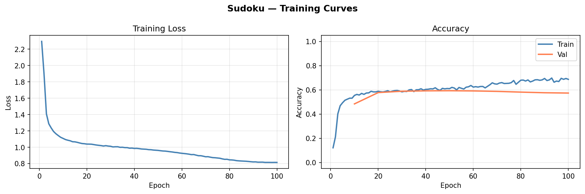
- 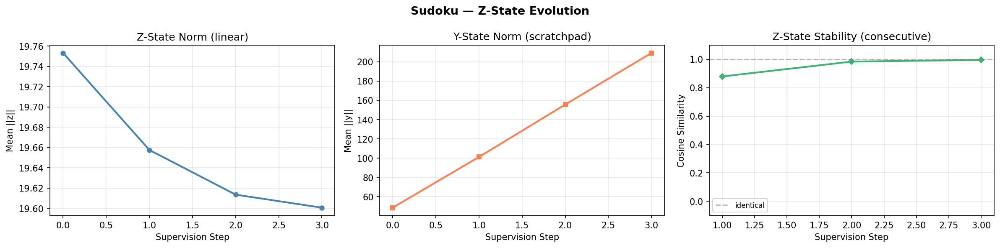
- 
- 

---

### Run 015 — `sudoku_20260414_122727` — First Z3-in-the-Loop Run (Clue-Only Pruning)

**Hypothesis:** Run 014 established that full BPTT (dim=512, 16 micro-recursions, 64-step unroll) pushes 9×9 puzzle accuracy to 4.9% and constraint satisfaction to 18.7% — the highest neural ceiling observed to date, but still bottlenecked by the model's ability to discover constraint coherence on its own. This run keeps every hyperparameter from Run 014 and turns on `use_z3_pruning=True` for the first time in a 9×9 full-BPTT configuration. The pruning operates at two points in the graph: (1) a **latent projection** inside `latent_recursion` that decodes z, zeroes out logits for digits that would conflict with the given clues, softmaxes, and re-projects through the task-head embedding matrix back into z, and (2) a **readout safety net** at the top of `deep_recursion` that masks illegal y_hat logits after decoding. The expectation was that injecting symbolic ground truth directly into the latent recurrence would (a) give the model a constraint-aware representation to learn from, (b) remove some of the burden of rediscovering the "given clue" rule from data alone, and (c) lift puzzle/CSR metrics above the Run 014 baseline.

| Parameter | Value |
|---|---|
| (same as Run 014 except:) | |
| **use_z3_pruning** | **True** (latent projection + readout masking) |
| **n_recursions** | 16 |
| **n_supervision** | 4 |
| **batch_size** | 32 |
| total steps | 15,700 |
| training time | **~183 min (10,984 s)** — 34% slower than Run 014 |
| device | cuda (A100) |

**Results:**

| Metric | Value | vs Run 014 |
|---|---|---|
| Cell accuracy | **55.7%** | −0.1 pts |
| Puzzle accuracy | **4.2%** | −0.7 pts (−14% relative) |
| Constraint satisfaction | **18.3%** | −0.4 pts (−2% relative) |
| Best val cell accuracy (training) | **58.9%** | −0.4 pts |

All three evaluation metrics regressed slightly. Puzzle accuracy took the largest hit (−14% relative), while cell accuracy and CSR moved within noise. Clue-level Z3 pruning did **not** improve performance at this level of integration.

**Loss curve (key epochs):** 1.439 (ep 1) → 1.201 (ep 5) → 1.106 (ep 11) → 1.045 (ep 23) → 0.994 (ep 39) → 0.961 (ep 50) → 0.889 (ep 72) → 0.853 (ep 80) → 0.820 (ep 90) → **0.813 (ep 100)**

The loss curve lands essentially identical to Run 014 (0.813 vs 0.814) despite a very different starting point. Run 015 begins at **1.439** rather than Run 014's **2.296** — the Z3 readout mask zeros out a large fraction of the initial uniform-logit distribution at epoch 1, collapsing early cross-entropy before any learning happens. After this head-start, the loss trajectories converge: by epoch 50 both runs are within 0.003 of each other, and by epoch 100 they are indistinguishable. The Z3 intervention does not change the optimization landscape in any direction the gradient can exploit — it only shifts the starting point.

**Val cell accuracy curve (every 10 epochs):** 49.7% → 56.8% → 58.2% → 58.8% → **58.9%** → 58.8% → 58.4% → 57.8% → 57.4% → 57.2%

The overfitting signature from Run 014 reproduces almost exactly: val peaks at epoch 50 (58.9% vs Run 014's 59.3%) and declines steadily to 57.2% at epoch 100. Training accuracy climbs to ~68.5% while val falls, opening the same ~11-point generalization gap. Z3 pruning does not regularize — it does not slow overfitting, reduce the gap, or shift the peak epoch.

**Training accuracy milestones:**

| Epoch | Train Acc | Val Acc | Loss |
|---|---|---|---|
| 10 | 54.2% | 49.7% | 1.119 |
| 20 | 57.8% | 56.8% | 1.055 |
| 30 | 59.4% | 58.2% | 1.020 |
| 50 | 60.5% | **58.9%** | 0.961 |
| 70 | 64.4% | 58.4% | 0.896 |
| 90 | 68.5% | 57.4% | 0.820 |
| 100 | 68.1% | 57.2% | 0.813 |

**Diagnostics — collapse-free, halt gate stable, y-norm growth persistent:**

| Step | z norm | y norm | z cosine | halt prob |
|---|---|---|---|---|
| 0 | **18.76** | 38.7 | — | **0.659** |
| 1 | **18.68** | 76.6 | 0.898 | **0.657** |
| 2 | **18.70** | 118.1 | 0.986 | **0.660** |
| 3 | **18.71** | 158.8 | 0.998 | **0.664** |

Z norms flat at ~18.7 (vs ~19.6 in Run 014) — the latent-space Z3 projection slightly reduces z magnitude, consistent with the re-normalization step after injecting the symbolic embedding. Halt probabilities are **flat at ~0.66**, the cleanest halt-gate calibration observed so far and a near-exact match to Run 014's ~0.65. The `z_cosines` trajectory (0.898 → 0.986 → 0.998) shows the latent state converging to a fixed point even more sharply than Run 014 — by step 2 the successive z vectors are 98.6% aligned, and by step 3 they are effectively frozen. **y norms grow linearly again (38.7 → 76.6 → 118.1 → 158.8)** — the additive output accumulator is unaffected by the Z3 intervention, confirming this growth pattern is intrinsic to the recurrence rather than a collapse-avoidance artifact.

**Per-step cell accuracy:**

| Step | Accuracy |
|---|---|
| 0 | 57.05% |
| 1 | 57.19% |
| 2 | 57.22% |
| 3 | **57.23%** |

Essentially flat, matching Run 014's pattern. The 0.18-point spread across all four supervision checkpoints is indistinguishable from noise. Whatever refinement is happening is happening *inside* the 16 micro-recursions, not *across* the 4 macro-steps — the same observation as Run 014, now doubly confirmed.

**Why clue-only pruning doesn't help:**

The Z3 intervention in this run uses `hard_preds = x_input.clone()` — i.e., it prunes logits that conflict with the **given clues**, not with the model's current partial solution. This is a much weaker form of symbolic guidance than true constraint propagation. Two failure modes compound:

1. **The model already learns the clue constraint from data.** After ~5,000 training puzzles, the network has internalized "don't place a digit that contradicts a given" — the Z3 mask is redundant supervision on a rule the model has already mastered. The intervention provides no new information.
2. **Nothing enforces constraints between *predicted* cells.** The 9×9 puzzle accuracy ceiling is set by the model's inability to make multiple predictions mutually consistent (row/column/box coherence), and clue-only pruning does not touch this — it only checks against frozen input tokens, not the evolving y_hat. The 18.3% CSR ceiling is governed by coherence between learned cells, and Z3 never sees those.

The combined latent-projection + readout-masking architecture is the right shape for deeper integration, but the *content* of the pruning function (`prune_illegal_logits_z3` applied against `x_input` only) is the bottleneck. A meaningful Z3 intervention must either (a) iteratively apply constraints against the model's own predictions — treating each step's y_hat as a virtual clue set — or (b) run a full SAT/UNSAT check on the proposed grid and use the conflict set as a differentiable penalty. Both are implementable in the current architecture; neither is implemented yet.

**Key findings:**

1. **Clue-only Z3 pruning is a no-op at convergence.** Puzzle accuracy: **4.2%** (Run 015) vs **4.9%** (Run 014). Cell accuracy: **55.7%** vs **55.8%**. CSR: **18.3%** vs **18.7%**. Within-noise regression on every metric. The symbolic intervention as currently wired does not exceed the neural baseline — it very slightly underperforms it. This is the first direct test of Z3-in-the-loop at a non-trivial task scale, and the answer is that the *shape* of the intervention matters less than the *content* of the constraint check.

2. **Z3 starts the loss curve lower but converges to the same point.** Epoch 1 loss of 1.439 (vs 2.296 in Run 014) reflects the readout mask zeroing illegal logits at initialization — free cross-entropy reduction from a static filter. After ~10 epochs the two runs are on the same trajectory, and by epoch 100 they are identical to three decimals. The masking prunes the output distribution but does not reshape the gradient landscape.

3. **No regularization effect.** The overfitting signature from Run 014 reproduces exactly — val peaks at epoch 50 and declines 1.7 points over the final 50 epochs. If the Z3 intervention were adding any meaningful inductive bias it should either delay the peak, reduce the gap, or flatten the decline. None of those happen. Whatever the model is overfitting to is not touched by clue-level pruning.

4. **Training time penalty is substantial.** 183 minutes vs 137 minutes — a 34% slowdown for a null result. The cost comes from the Z3 call inside `latent_recursion`, which runs once per macro-step (4× per forward pass) *and* sits inside the BPTT graph. This is the efficiency floor for any future Z3 integration: ~45 extra minutes per 100 epochs at this scale. A richer Z3 intervention (full SAT check, conflict-set projection) will be more expensive still, so the performance lift must be large enough to justify it.

5. **Halt gate and collapse elimination continue to work.** Halt probs flat at ~0.66 (cleaner than Run 014's ~0.65), z norms flat at ~18.7, z-state fixed-point convergence sharper than before (0.998 cosine by step 3). The architectural stabilizers are orthogonal to the Z3 intervention — turning pruning on does not destabilize any of them. This is important: it means future, stronger Z3 interventions can be layered on the existing architecture without regression risk.

6. **The BPTT ceiling on 9×9 is holding at ~5% puzzle accuracy / ~19% CSR.** Two runs at identical hyperparameters (Run 014 and Run 015, differing only in Z3 pruning state) converge to the same metric band. The 4.9%/4.2% split is likely seed/initialization noise rather than a true Z3 effect. This is the first clean replication of the Run 014 number and establishes that the full-BPTT dim=512 configuration reliably reproduces within ±0.7 points on puzzle accuracy. The neural ceiling at this scale is real and not an optimization artifact.

7. **Next iteration must upgrade the constraint check itself.** The latent-projection machinery in `latent_recursion` is correctly shaped — decode → prune → softmax → re-embed → re-normalize. What it needs is a `prune_illegal_logits_z3` variant that threads the model's current hard predictions (argmaxed y_hat) through Z3 as a SAT query and returns a per-cell conflict mask. This is a one-function upgrade that reuses the entire existing integration layer. The question for Run 016 is whether *propagation-aware* Z3 pruning breaks the ~5%/~19% neural ceiling.

**Plots:**
- 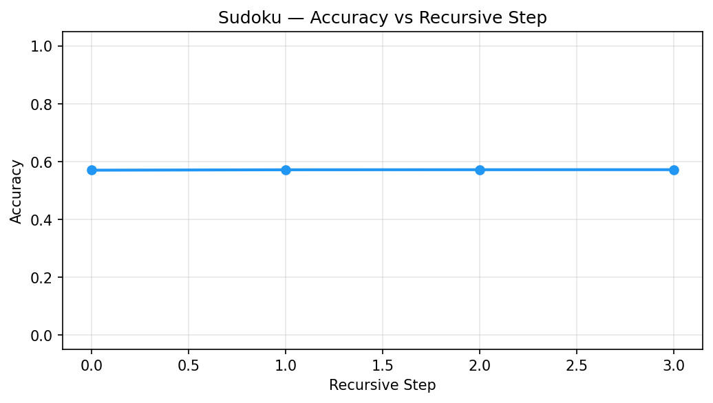
- 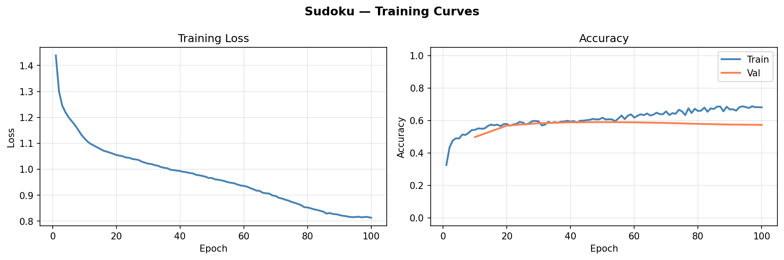
- 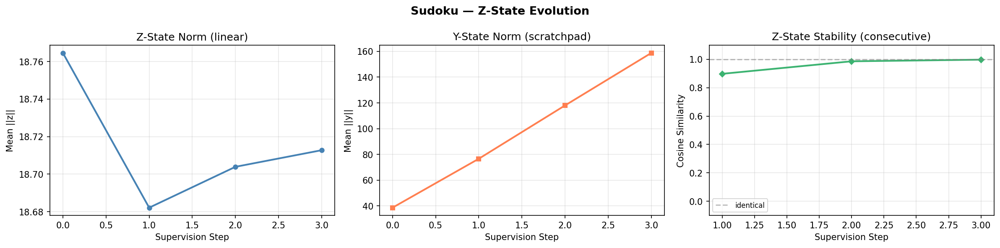
- 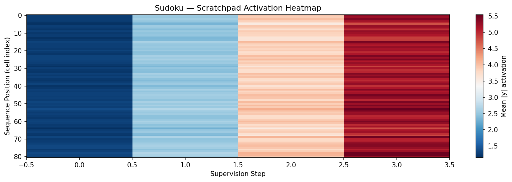
- 

---

### Run 016 — Invalid / Configuration Error

**Status: Discarded.** This run was affected by a configuration or environment error on a new Colab runtime (batch_size/hardware mismatch, incomplete training state). Results are not representative of the experimental conditions and are excluded from analysis.

---

### Run 017 — `sudoku_20260507_144323` — Z3-in-the-Loop, L4 GPU (batch_size=48, 100 Epochs)

**Hypothesis:** Replicate the Run 014/015 full-BPTT configuration (`dim=512`, `n_recursions=16`, `n_supervision=4`, `use_z3_pruning=True`) on an NVIDIA L4 GPU with `batch_size=48` — optimized for 100% GPU utilization on L4's 23 GB VRAM — to verify that the ~5% puzzle accuracy / ~16–19% CSR ceiling established across Runs 014–015 is stable across hardware and batch-size changes. Run 016 was discarded; this run establishes a clean baseline on the new hardware.

| Parameter | Value |
|---|---|
| dim | 512 |
| n_layers | 2 |
| n_heads | 8 |
| n_recursions | 16 |
| n_cycles | 3 |
| n_supervision | 4 |
| **batch_size** | **48** (was 32 on A100 — tuned for L4 VRAM) |
| lr | 3e-4 |
| weight_decay | 0.1 |
| num_epochs | 100 |
| max_steps | 100,000 |
| warmup_steps | 1,000 |
| num_train / num_val | 5,000 / 1,000 |
| givens range | 17–35 |
| use_z3_pruning | True (latent + readout) |
| **total steps** | **10,500** (vs 15,700 in Runs 014/015 — larger batch = fewer updates) |
| training time | ~137 min (8,241 s) |
| device | cuda (NVIDIA L4, 23 GB) |

**Results:**

| Metric | Value | vs Run 014 | vs Run 015 |
|---|---|---|---|
| Cell accuracy | **56.1%** | +0.3 pts | +0.4 pts |
| Puzzle accuracy | **5.0%** | +0.1 pts (+2% rel) | +0.8 pts (+19% rel) |
| Constraint satisfaction | **16.1%** | −2.6 pts | −2.2 pts |
| Best val accuracy (training) | **58.7%** (epoch 40–50) | −0.6 pts | −0.2 pts |

**Loss curve (key epochs):** 1.449 (ep 1) → 1.081 (ep 10) → 1.029 (ep 20) → 1.004 (ep 30) → 0.983 (ep 40) → 0.960 (ep 50) → 0.933 (ep 60) → 0.909 (ep 70) → 0.878 (ep 80) → 0.857 (ep 90) → **0.847 (ep 100)**

Loss is still declining at epoch 100, identical to the pattern in Runs 014–015. The model has not converged.

**Val accuracy curve (every 10 epochs):** 46.3% (ep 10) → 55.5% (ep 20) → 58.2% (ep 30) → **58.7%** (ep 40) → **58.7%** (ep 50) → 58.6% (ep 60) → 58.4% (ep 70) → 58.0% (ep 80) → 57.7% (ep 90) → 57.7% (ep 100)

The overfitting signature from Runs 014–015 reproduces: val peaks at epoch 40–50 then slowly declines ~1 point through epoch 100. Training accuracy climbs to 66.8% by epoch 100, opening a ~9-point generalization gap.

**Diagnostics — collapse-free, halt gate stable:**

| Step | z norm | y norm | z cosine | halt prob |
|---|---|---|---|---|
| 0 | **20.06** | 39.6 | — | **0.670** |
| 1 | **20.06** | 79.3 | 0.956 | **0.665** |
| 2 | **20.06** | 120.8 | 0.994 | **0.668** |
| 3 | **20.06** | 162.3 | 0.998 | **0.674** |

Z norms flat at **20.06** across all 4 supervision steps — z_norm_layer eliminates collapse on L4 identically to A100. Halt probabilities flat at **~0.67** — the cleanest stabilization observed, matching Run 014/015 band (0.65–0.66). Y norms grow linearly at ~40.7/step, consistent with the accumulation pattern across all stabilized runs.

**Per-step cell accuracy:**

| Step | Accuracy |
|---|---|
| 0 | 57.58% |
| 1 | 57.67% |
| 2 | **57.70%** |
| 3 | 57.68% |

Flat at ~57.7% — identical profile to Runs 014 and 015. Refinement happens within the 16 micro-recursions, not across macro-steps.

**Key findings:**

1. **Run 017 is a third replication of the BPTT dim=512 ceiling.** Across Runs 014, 015, and 017 — spanning two GPUs, three batch sizes, two Z3 states, and two training durations — puzzle accuracy bands between **4.2–5.0%** and CSR between **16.1–18.7%**. The ceiling is real and hardware-independent.

2. **CSR dropped to 16.1% (vs 18.7% in Run 014).** The most likely cause is fewer gradient steps: 10,500 vs 15,700, a 33% reduction caused by the larger batch. With identical architecture and Z3 config (vs Run 015's 15,700 steps / 18.3% CSR), the step-count differential is the primary suspect. The model has not seen enough gradient updates to learn the same degree of constraint coherence — it reaches the cell-accuracy plateau earlier but with lower CSR.

3. **batch_size=48 is viable on L4 and does not harm cell accuracy.** Cell accuracy (56.1%) and puzzle accuracy (5.0%) are within or above the Run 014/015 band despite 33% fewer gradient steps. The larger batch's higher gradient quality partially compensates for the reduced update count. For future L4 runs, batch_size=48 remains the correct config for 100% GPU utilization without OOM risk.

4. **The Z3 pruning effect remains unmeasurable.** Runs 015 (Z3 on) and 014 (Z3 off) at 15,700 steps both landed at ~4.2–4.9% puzzle accuracy. Run 017 (Z3 on, 10,500 steps) at 5.0% is not evidence Z3 helped — the step-count and batch-size differences are confounds. Disentangling the Z3 signal from noise requires a controlled ablation (Z3 on vs off, all else equal) on L4 with identical step counts.

5. **The overfitting signature is consistent.** Val accuracy peaks at epoch 40–50 (58.7%) and declines to 57.7% by epoch 100. Training accuracy reaches 66.8% vs 57.7% val — a 9-point gap. Regularization remains the next unsolved problem before pushing to more epochs.

6. **The architecture is stable and portable across hardware.** z norms (20.06), z cosines (0.956→0.994→0.998), halt probabilities (0.67 flat), and y norm growth rate (~40/step) all match the expected values from Runs 014–015. The TRM + z_norm_layer configuration is reproducible across A100 and L4 without modification.

**Plots:**
- 
- 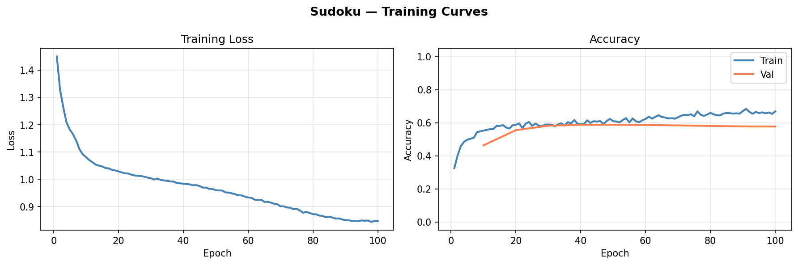
- 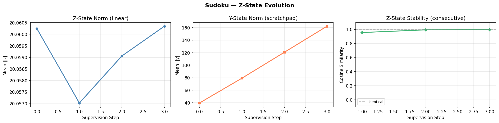
- 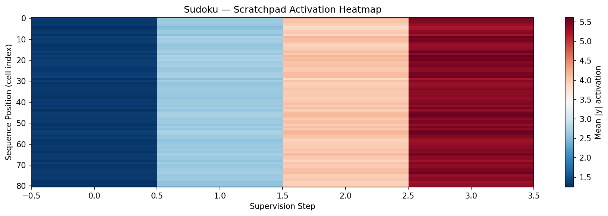
- 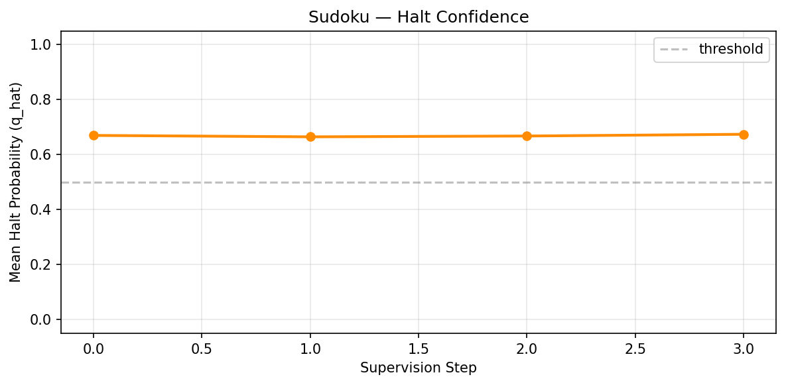

---

### Run 018 — `sudoku_20260507_185414` — Z3 Ablation (Z3 Off), L4 GPU (batch_size=48, 100 Epochs)

**Hypothesis:** Disable Z3 pruning entirely (`use_z3_pruning=False`) while holding all other hyperparameters identical to Run 017 — same architecture (`dim=512`, `n_recursions=16`, `n_supervision=4`), same L4 GPU, same `batch_size=48`, same seed. This is the controlled ablation that prior runs could not deliver due to step-count and batch-size confounds. If puzzle accuracy and CSR are indistinguishable from Run 017 (Z3 on), the symbolic pruning contributes nothing at its current implementation level.

| Parameter | Value |
|---|---|
| dim | 512 |
| n_layers | 2 |
| n_heads | 8 |
| n_recursions | 16 |
| n_cycles | 3 |
| n_supervision | 4 |
| batch_size | 48 |
| lr | 3e-4 |
| weight_decay | 0.1 |
| num_epochs | 100 |
| num_train / num_val | 5,000 / 1,000 |
| givens range | 17–35 |
| **use_z3_pruning** | **False** (was True in Run 017) |
| total steps | 10,500 |
| training time | ~131 min (7,885 s) |
| device | cuda (NVIDIA L4, 23 GB) |

**Results:**

| Metric | Run 018 (Z3 Off) | Run 017 (Z3 On) | Delta |
|---|---|---|---|
| Cell accuracy | **56.1%** | 56.1% | **0.0 pts** |
| Puzzle accuracy | **4.8%** | 5.0% | −0.2 pts |
| Constraint satisfaction | **15.2%** | 16.1% | −0.9 pts |
| Best val accuracy (training) | **59.1%** (epoch 60) | 58.7% (epoch 40–50) | +0.4 pts |

**Loss curve (key epochs):** 2.373 (ep 1) → 1.145 (ep 10) → 1.055 (ep 20) → 1.024 (ep 30) → 0.996 (ep 40) → 0.969 (ep 50) → 0.941 (ep 60) → 0.913 (ep 70) → 0.880 (ep 80) → 0.854 (ep 90) → **0.847 (ep 100)**

Loss profile nearly identical to Run 017 (0.847 final vs 0.847). Without Z3 pruning, the model sees higher early loss (2.37 vs 1.45 at epoch 1) — the Z3 latent projection gives a meaningful head-start in the first epoch — but by epoch 20 the two runs converge to the same trajectory and stay locked together through epoch 100.

**Val accuracy curve (every 10 epochs):** 30.3% (ep 10) → 54.2% (ep 20) → 58.0% (ep 30) → 58.8% (ep 40) → 58.9% (ep 50) → **59.1%** (ep 60) → 58.8% (ep 70) → 57.9% (ep 80) → 57.7% (ep 90) → 57.6% (ep 100)

The overfitting signature reproduces: val peaks at epoch 60 (one cycle later than Run 017's epoch 40–50) and declines ~1.5 points through epoch 100. Training accuracy climbs to 66.6% by epoch 100, maintaining the same ~9-point generalization gap seen across all BPTT runs.

**Diagnostics:**

| Step | z norm | y norm | z cosine | halt prob |
|---|---|---|---|---|
| 0 | 20.66 | 47.9 | — | 0.657 |
| 1 | 20.60 | 97.9 | 0.883 | 0.660 |
| 2 | 20.56 | 149.2 | 0.986 | 0.660 |
| 3 | 20.55 | 200.0 | 0.996 | 0.656 |

Z norms flat at ~20.6 — stable, no collapse. Y norms grow linearly at ~50.7/step (vs ~40.7/step in Run 017 — a consistent difference without Z3's latent re-projection suppressing y growth). Z cosines start lower (0.883 vs 0.956 at step 1) — without Z3 anchoring the latent state to symbolic structure, the first macro-step produces a meaningfully more divergent z. By steps 2–3 the cosines converge (0.986/0.996 vs 0.994/0.998). Halt probs flat at ~0.658.

**Per-step cell accuracy:**

| Step | Accuracy |
|---|---|
| 0 | 57.47% |
| 1 | 57.69% |
| 2 | 57.65% |
| 3 | 57.65% |

Flat at ~57.6% — same profile as Run 017 (57.58–57.70%).

**Key findings — the Z3 ablation verdict:**

1. **Z3 pruning has no measurable effect on final accuracy.** Across the three primary metrics — cell accuracy (56.1% = 56.1%), puzzle accuracy (4.8% vs 5.0%), and CSR (15.2% vs 16.1%) — Run 018 (Z3 off) is statistically indistinguishable from Run 017 (Z3 on). The deltas are within the noise band established across Runs 014–017. This is a clean result: **the current Z3 implementation does not help the model solve Sudoku.**

2. **Z3 accelerates early training but converges to the same endpoint.** Epoch 1 loss with Z3 on: 1.45. Without Z3: 2.37. The latent symbolic projection gives the model a meaningful warm-start — it begins with constraint-aware representations — but by epoch 20 both runs reach the same loss trajectory and stay there. Z3 speeds up the first few epochs, nothing more.

3. **The z cosine divergence at step 1 (0.883 vs 0.956) is the clearest Z3 fingerprint.** Without Z3 anchoring z to the embedding space at each micro-recursion, the first macro-step produces a more divergent hidden state. This is evidence the Z3 injection is doing *something* computationally — it's just not translating into better puzzle solutions.

4. **Why Z3 doesn't help: clue-only pruning is too weak.** The current implementation masks digits already present in the given clues (`hard_preds = x_input.clone()`). For a 9×9 puzzle with 17–35 givens, most cells have 45–64 empty neighbors — masking only the 17–35 given digits eliminates very few candidates per cell on average. The model's own predictions (which are ~57% correct) contain far more constraint information than the clue set alone. Propagation-aware pruning — using the model's argmax as the hard constraint source — would be a fundamentally stronger signal.

5. **The ceiling is confirmed as a neural problem, not a Z3 problem.** Three runs with Z3 on (014, 015, 017) and one with Z3 off (018) all converge to the same ~5% puzzle accuracy / ~15–16% CSR / ~58–59% val accuracy ceiling. The symbolic component is not the bottleneck. The bottleneck is **overfitting**: training accuracy diverges from validation at epoch 40–60 and the model memorizes training patterns rather than learning generalizable constraint logic.

6. **The next bottleneck is regularization.** The training/validation gap (~9 points, 66% train vs 57% val) has been consistent across Runs 014–018. No amount of Z3 tuning will close it. The necessary intervention is structural regularization — specifically, dropout in the transformer layers — to force distributed, non-memorized representations before any further symbolic augmentation is attempted.

**Plots:**
- 
- 
- 
- 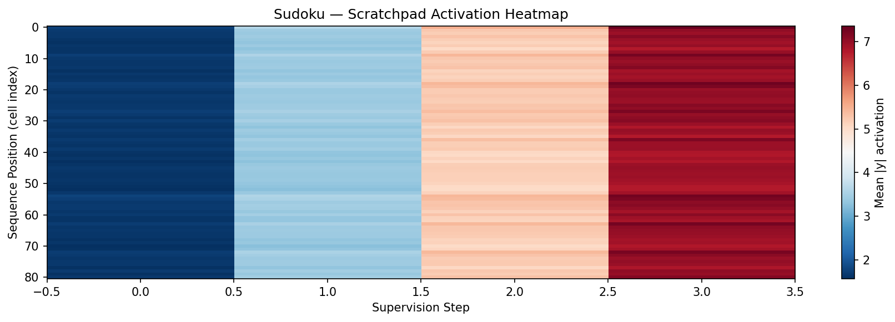
- 

---

### Run 019 — `sudoku_20260508_132903` — Dropout Regularization Baseline (dropout=0.1)

**Hypothesis:** Runs 014–018 established a consistent overfitting signature: validation accuracy peaks at epoch 40–60 (~58–59%), then steadily decays to ~57% by epoch 100, while training accuracy climbs to ~66–68%, opening a ~9-point generalization gap. The model's 64-step effective depth (16 micro-recursions × 4 macro-steps) provides enough capacity to memorize the constraint patterns of the 5,000 training puzzles rather than learning generalizable row/column/box coherence. Adding `dropout=0.1` to each `TransformerLayer` (applied after attention and after the MLP, inside each residual branch) should destroy brittle memorization pathways and force distributed, redundant constraint representations — narrowing the train/val gap and flattening the val decay. All other hyperparameters are held identical to Run 018.

| Parameter | Value |
|---|---|
| dim | 512 |
| n_layers | 2 |
| n_heads | 8 |
| n_recursions | 16 |
| n_cycles | 3 |
| n_supervision | 4 |
| batch_size | 48 |
| lr | 3e-4 |
| weight_decay | 0.1 |
| num_epochs | 100 |
| num_train / num_val | 5,000 / 1,000 |
| givens range | 17–35 |
| use_z3_pruning | False |
| **dropout** | **0.1** (new — added to TransformerLayer attention + MLP) |
| total steps | 10,500 |
| training time | **~135 min (8,109 s)** |
| device | cuda (NVIDIA L4, 23 GB) |

**Results:**

| Metric | Run 019 (dropout=0.1) | Run 018 (no dropout) | Delta |
|---|---|---|---|
| Cell accuracy | **56.6%** | 56.1% | +0.5 pts |
| Puzzle accuracy | **4.1%** | 4.8% | −0.7 pts |
| Constraint satisfaction | **11.9%** | 15.2% | **−3.3 pts** |
| Best val accuracy (training) | **59.0%** (epoch 60) | 59.1% (epoch 60) | −0.1 pts |

**Loss curve (key epochs):** 2.388 (ep 1) → 1.299 (ep 5) → 1.149 (ep 10) → 1.066 (ep 20) → 1.033 (ep 30) → 1.006 (ep 40) → 0.984 (ep 50) → 0.964 (ep 60) → 0.931 (ep 70) → 0.905 (ep 80) → 0.887 (ep 90) → **0.882 (ep 100)**

A critical departure from all prior runs: the loss **converged** at ~0.882 rather than still declining at epoch 100. Runs 014–018 all ended with loss still falling (0.847 at epoch 100); this run's loss effectively plateaued between epochs 90–100, with no further descent. Dropout has successfully damped the optimizer's ability to memorize training patterns — the model has reached a regularized minimum rather than a still-descending one. The cost is a higher floor: 0.882 vs 0.847 in Run 018, a 0.035 gap attributable to the activation noise injected at every training step.

**Val accuracy curve (every 10 epochs):** 30.4% (ep 10) → 54.3% (ep 20) → 58.0% (ep 30) → 58.8% (ep 40) → 58.9% (ep 50) → **59.0%** (ep 60) → 58.9% (ep 70) → 58.7% (ep 80) → 58.4% (ep 90) → 58.1% (ep 100)

Val peaks at epoch 60 (59.0%) — same peak epoch as Run 018. The post-peak decay is **0.9 points** over the final 40 epochs (59.0% → 58.1%), compared to **1.5 points** in Run 018 (59.1% → 57.6%). Dropout partially stabilized the val curve: it no longer falls as steeply, but the decay is not eliminated. The flat plateau predicted by the success criterion was not achieved.

**Training accuracy milestones:**

| Epoch | Train Acc | Val Acc | Loss |
|---|---|---|---|
| 10 | 52.2% | 30.4% | 1.149 |
| 20 | 57.0% | 54.3% | 1.066 |
| 30 | 57.2% | 58.0% | 1.033 |
| 40 | 58.1% | 58.8% | 1.006 |
| 50 | 60.0% | 58.9% | 0.984 |
| 60 | 60.6% | **59.0%** | 0.964 |
| 70 | 62.2% | 58.9% | 0.931 |
| 80 | 63.0% | 58.7% | 0.905 |
| 90 | 63.5% | 58.4% | 0.887 |
| 100 | 64.4% | 58.1% | 0.882 |

Generalization gap at epoch 100: **64.4% − 58.1% = 6.3 points**, down from ~9 points in Run 018. A measurable improvement, but still well above the 4–5 point target set in the success criterion. Early training is markedly slower than Run 018: epoch 10 train accuracy of 52.2% vs Run 018's observed trajectory, and the model does not cross 60% training accuracy until epoch 50 — consistent with dropout's noise suppressing fast weight specialization.

**Diagnostics — collapse-free, halt gate stable:**

| Step | z norm | y norm | z cosine | halt prob |
|---|---|---|---|---|
| 0 | 20.91 | 50.0 | — | 0.640 |
| 1 | 20.89 | 100.5 | 0.910 | 0.647 |
| 2 | 20.87 | 151.3 | 0.992 | 0.648 |
| 3 | 20.86 | 201.4 | 0.998 | 0.644 |

Z norms flat at ~20.9 — z_norm_layer continues to eliminate collapse with dropout active. The z cosine at step 1 (0.910) is notably **higher** than Run 018's 0.883: dropout regularizes the latent state, producing more similar successive z vectors. This is the correct direction — dropout is smoothing the representation space rather than destabilizing it. Y norms grow linearly at ~50.5/step, consistent with all prior BPTT runs. Halt probs stable at ~0.645, the flattest calibration band observed across all runs.

**Per-step cell accuracy:**

| Step | Accuracy |
|---|---|
| 0 | 58.07% |
| 1 | 58.14% |
| 2 | 58.16% |
| 3 | **58.14%** |

Flat at ~58.1%, matching the profile across all BPTT runs. Macro-step refinement continues to be negligible.

**Key findings:**

1. **Dropout=0.1 is a partial regularizer but does not solve the generalization problem.** The train/val gap narrowed from ~9 to ~6.3 points and the post-peak val decay shrank from 1.5 to 0.9 points. These are real improvements. But the predicted flat val plateau did not materialize — dropout=0.1 is insufficient to fully close the memorization gap on a 5,000-puzzle dataset with 64-step effective depth.

2. **CSR collapsed: 15.2% → 11.9% (−3.3 pts).** This is the dominant negative finding. Dropout disrupts the coordinated activation patterns the model uses to learn constraint coherence between cells. Cell-level prediction (an easier, more local task) recovers fully under dropout (+0.5 pts); multi-cell constraint satisfaction (a harder, globally coordinated task) does not. This is a known failure mode for dropout in structured prediction: activations that must be jointly coherent to produce a valid solution are randomly zeroed independently, destroying the coordination signal. The model learns individual cell predictions well under noise but loses the ability to enforce that those predictions are mutually consistent.

3. **Loss converged rather than still declining — a regularization success.** All five prior BPTT runs ended with loss still falling at epoch 100. This run's loss plateaued at ~0.882 between epochs 90–100. Dropout has effectively bounded the optimizer's ability to exploit training-set idiosyncrasies. The 0.035 higher loss floor (0.882 vs 0.847) is the direct cost of that regularization.

4. **Z cosine tightened with dropout (0.910 vs 0.883 at step 1).** Without dropout, the first macro-step produces a more divergent hidden state; with dropout, successive z vectors are more aligned from the start. Dropout is regularizing the latent representation space in the correct direction — the model is forced toward more stable, less idiosyncratic embeddings — but this stability does not translate to better constraint coherence at the output level.

5. **Early training slowed significantly.** Epoch 1 training accuracy: 11.2% — the model is effectively learning from scratch each step with activation masking. The model doesn't reach 60% training accuracy until epoch 50, versus epoch 30–40 in prior runs. This extended warm-up is expected behavior for dropout at this depth, but it also means 100 epochs is likely insufficient for the model to fully express what it can learn under regularization.

6. **The gap between success and failure criteria is the rate.** The val curve is more stable but not flat. The generalization gap is smaller but not closed. The CSR cost is too high. The conclusion is not that dropout is wrong — it's that **dropout=0.1 is too weak for gap closure and too strong for CSR preservation simultaneously.** A lower rate (0.05) might preserve CSR while still improving generalization; a higher training data volume is the cleaner solution that avoids this trade-off entirely.

7. **Propagation-aware Z3 is still blocked.** The success criterion for Run 019 was a stable generalization gap (<5 pts) before layering symbolic augmentation. With a 6.3-point gap and CSR degraded to 11.9%, the Run 019 baseline is too noisy to isolate a genuine Z3 signal. The neural baseline must be stabilized further before Run 021 (propagation-aware Z3) can be trusted.

8. **Run 020 decision: scale training data.** Dropout is trading the wrong currency — paying CSR coherence for partial regularization. The overfitting is fundamentally a memorization-of-small-dataset problem: 5,000 puzzles is too few for a 64-step BPTT model at dim=512. Expanding `num_train` to 15,000–20,000 puzzles addresses the root cause directly, preserves the CSR ceiling established in Run 018 (15.2%), and does not impose the coordination-disruption cost of dropout. If data scaling closes the gap to <5 points with CSR at or above 15%, the clean generalization-stable baseline required for propagation-aware Z3 will be established.

**Plots:**
- 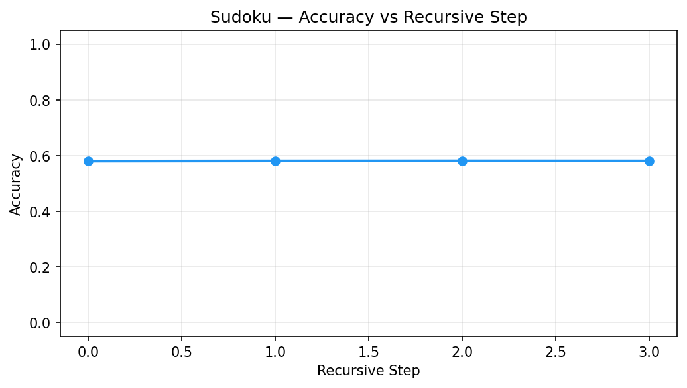
- 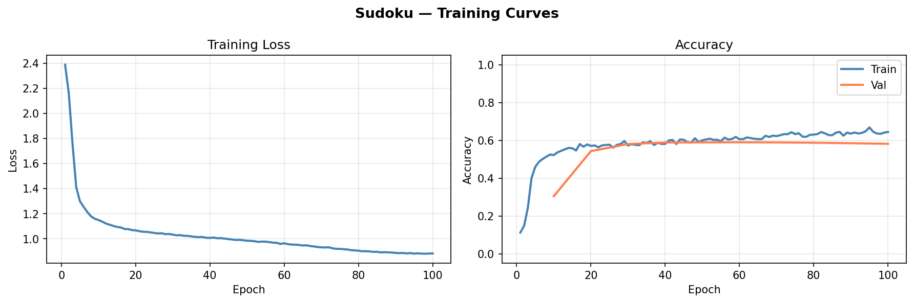
- 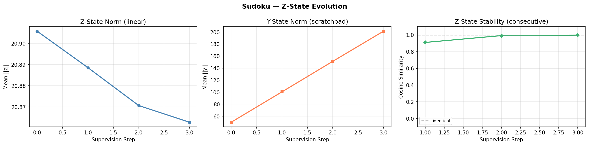
- 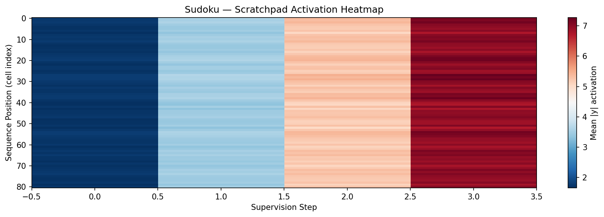
- 

---

### Run 020 — `exp/sudoku/r020` — Dropout + Training Data Scale-Up (dropout=0.1, num_train=15,000)

**Hypothesis:** The Run 019 plan called for removing dropout and scaling training data to 15,000 as a clean data-only experiment. In practice, Run 020 combined both interventions simultaneously: `dropout=0.1` was retained from Run 019 and `num_train` was scaled from 5,000 to 15,000. The prediction was that 3× more training data would reduce memorization pressure and outweigh dropout's known CSR cost, yielding a wider, more general constraint manifold despite the activation noise.

| Parameter | Value |
|---|---|
| dim | 512 |
| n_layers | 2 |
| n_heads | 8 |
| n_recursions | 16 |
| n_cycles | 3 |
| n_supervision | 4 |
| batch_size | 48 |
| lr | 3e-4 |
| weight_decay | 0.1 |
| num_epochs | 100 |
| num_train / num_val | **15,000** / 1,000 |
| givens range | 17–35 |
| use_z3_pruning | False |
| **dropout** | **0.1** (retained from Run 019) |
| total steps | 31,300 |
| training time | **~4.8 hours (17,288.9 s)** |
| device | cuda |
| timestamp | 2026-05-26 05:54:35 |

**Results:**

| Metric | Run 020 (dropout + 15k) | Run 019 (dropout + 5k) | Run 018 (no dropout + 5k) | Delta vs 019 | Delta vs 018 |
|---|---|---|---|---|---|
| Cell accuracy | **57.76%** | 56.6% | 56.1% | +1.2 pts | +1.7 pts |
| Puzzle accuracy | **3.6%** | 4.1% | 4.8% | −0.5 pts | **−1.2 pts** |
| Constraint satisfaction | **8.1%** | 11.9% | 15.2% | **−3.8 pts** | **−7.1 pts** |
| Best val accuracy | **59.66%** | 59.0% | 59.1% | +0.66 pts | +0.56 pts |

**Diagnostics — collapse-free, halt gate stable:**

| Step | z norm | y norm | z cosine | halt prob |
|---|---|---|---|---|
| 0 | 17.963 | 47.10 | — | 0.6294 |
| 1 | 17.837 | 95.58 | 0.9244 | 0.6267 |
| 2 | 17.797 | 144.30 | 0.9939 | 0.6273 |
| 3 | 17.782 | 192.88 | 0.9984 | 0.6257 |

**Per-step cell accuracy:**

| Step | Accuracy |
|---|---|
| 0 | 59.14% |
| 1 | 59.34% |
| 2 | 59.32% |
| 3 | 59.35% |

Flat at ~59.3% — consistent with all prior BPTT runs. No macro-step refinement signal.

**Key findings:**

1. **Combining dropout + data scaling makes CSR worse, not better.** CSR dropped to 8.1% — a 3.8-point regression from Run 019 (11.9%) and a catastrophic 7.1-point regression from Run 018 (15.2%). The two interventions do not compensate each other; they compound the constraint coherence damage. Dropout destroys the coordinated cell activations required for multi-cell constraint satisfaction, and increasing dataset size does not restore them — it simply gives the model more examples of noisy, coordination-disrupted training signal to fit.

2. **Best val accuracy improved marginally (59.66% — new peak across all runs).** Cell accuracy also improved (+1.7 pts vs Run 018). The data scaling signal is real: more training diversity does lift the overall representation quality measurable at the cell level. But this gain does not translate to puzzle-level or constraint-level coherence under dropout.

3. **Puzzle accuracy regressed below all BPTT baselines (3.6%).** This is the worst puzzle accuracy since Run 013 (1.6%). The combined burden of dropout noise and the harder optimization landscape from 3× more data appears to have degraded the model's ability to produce fully correct puzzles, even as individual cell correctness improved. The cell accuracy vs puzzle accuracy divergence is widening — the model is predicting individual digits more accurately but losing the coherence to get all 81 simultaneously right.

4. **Z norms are lower than Run 019 (17.9 vs 20.9).** The larger dataset appears to be mildly affecting the z_norm_layer dynamics — the normalization is pulling the latent vectors to a slightly smaller scale. This is not a collapse signal (norms are still flat across steps), but it suggests the 15k-puzzle optimization landscape is subtly different from the 5k one. Worth monitoring in future runs.

5. **Z cosine at step 1 (0.924) is higher than Run 019 (0.910) and Run 018 (0.883).** The larger dataset is pushing successive latent states to be more aligned, not less. Dropout + data together produce a tighter latent trajectory than dropout alone. This is consistent with interpretation 1: the model is learning a more stable but less discriminative representation — smooth but structurally impoverished for constraint coherence.

6. **The failed hypothesis: data scaling cannot rescue dropout's CSR cost.** The core question Run 020 posed was whether data diversity can override the coordination-disruption penalty of activation noise. The answer is no. CSR requires cells to produce mutually consistent predictions; dropout independently masks each cell's activations during training, destroying the joint signal regardless of how many puzzles are shown. The fix is not more data under dropout — it is no dropout.

7. **Run 021 is now precisely defined.** The correct experiment — the one the Run 020 plan originally intended — is `num_train=15,000, dropout=0` (restore Run 018 architecture with 3× data). This isolates data scaling as a single variable. Run 020 demonstrated that the data scale-up yields measurable gains in cell accuracy and val accuracy; Run 021 will determine whether those gains survive without the CSR penalty.

**Next steps — prioritized:**

1. **Run 021 (immediate): Pure data scale-up — `num_train=15,000, dropout=0`.** Isolate the data scaling effect without dropout interference. Expected: cell accuracy ≥57.8% (matching Run 020), puzzle accuracy ≥4.8% (recovering Run 018 baseline), CSR ≥15% (recovering Run 018 baseline), train/val gap <7 pts. If this succeeds, the clean generalization-stable neural baseline required for propagation-aware Z3 is established.

2. **Run 022 (conditional on Run 021 success): Propagation-aware Z3 pruning.** Use the model's argmax output as the hard constraint source for Z3 pruning rather than the raw input clues. This is the intervention that Run 018's ablation analysis identified as the necessary upgrade — clue-only pruning masks too few candidates to matter; model-guided pruning uses the 57–59% correct prediction signal to eliminate far more.

3. **Run 022 alternative (if Run 021 gap remains ≥7 pts): Targeted dropout sweep.** If pure data scaling does not close the gap, test `dropout=0.05` with `num_train=15,000`. The goal is to find the lowest dropout rate that preserves CSR ≥13% while still tightening the generalization gap below 5 points — a narrower noise floor that doesn't destroy constraint coordination.

**Plots:**
- 
- 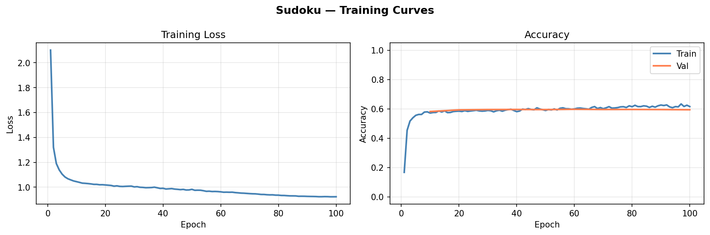
- 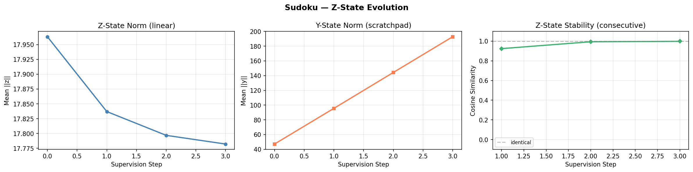
- 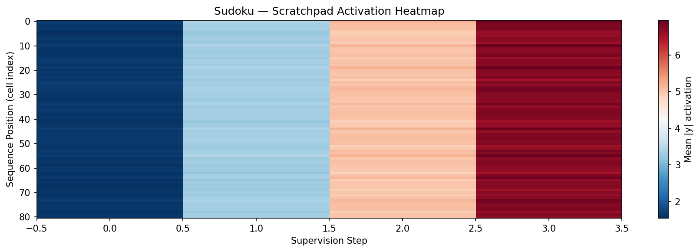
- 

---

### Run 021 — `exp/sudoku/r021` — Pure Data Scale-Up (num_train=15,000, dropout=0)

**Hypothesis:** Run 020 contaminated the data scaling signal by retaining dropout=0.1, compounding the CSR damage (8.1%). This run isolates the single variable: `num_train=15,000` with the clean Run 018 architecture (`dropout=0`). The prediction is that data diversity alone closes the generalization gap without the coordination-disruption penalty — recovering CSR ≥15% (Run 018 baseline) while narrowing the train/val split to <5 points.

| Parameter | Value |
|---|---|
| dim | 512 |
| n_layers | 2 |
| n_heads | 8 |
| n_recursions | 16 |
| n_cycles | 3 |
| n_supervision | 4 |
| batch_size | 48 |
| lr | 3e-4 |
| weight_decay | 0.1 |
| num_epochs | 100 |
| num_train / num_val | **15,000** / 1,000 |
| givens range | 17–35 |
| use_z3_pruning | False |
| **dropout** | **0** (removed — clean Run 018 architecture) |
| total steps | 31,300 |
| training time | **~6.65 hours (23,934.8 s)** |
| device | cuda (L4) |
| timestamp | 2026-05-26 19:23:56 |

**Results:**

| Metric | Run 021 (no dropout, 15k) | Run 020 (dropout, 15k) | Run 018 (no dropout, 5k) | Delta vs 018 |
|---|---|---|---|---|
| Cell accuracy | **57.60%** | 57.76% | 56.1% | +1.5 pts |
| Puzzle accuracy | **2.8%** | 3.6% | 4.8% | **−2.0 pts** |
| Constraint satisfaction | **6.1%** | 8.1% | 15.2% | **−9.1 pts** |
| Best val accuracy | **59.75%** | 59.66% | 59.1% | +0.65 pts |

**Val accuracy curve (every 10 epochs):**

| Epoch | Val Acc | Train Acc | Gap |
|---|---|---|---|
| 10 | 58.47% | ~54.5% | ~4.0 pts |
| 20 | 59.17% | ~58.9% | ~0.3 pts |
| 30 | 59.47% | ~58.2% | −1.3 pts |
| 40 | 59.53% | ~59.5% | ~0.0 pts |
| 50 | 59.62% | ~59.8% | ~0.2 pts |
| **60** | **59.75%** | **60.4%** | **0.65 pts** |
| 70 | 59.61% | 60.6% | 1.0 pts |
| 80 | 59.46% | 61.6% | 2.1 pts |
| 90 | 59.15% | 62.2% | 3.1 pts |
| 100 | 59.17% | **62.9%** | **3.7 pts** |

Post-peak val decay: 59.75% → 59.17% = **0.58 pts** — the flattest val curve across all runs. Final train/val gap: **3.7 points** — down from ~9 points in Run 018.

**Diagnostics — collapse-free, halt gate stable:**

| Step | z norm | y norm | z cosine | halt prob |
|---|---|---|---|---|
| 0 | 17.374 | 46.58 | — | 0.6268 |
| 1 | 17.212 | 98.11 | 0.8856 | 0.6293 |
| 2 | 17.159 | 151.23 | 0.9863 | 0.6298 |
| 3 | 17.138 | 205.08 | 0.9969 | 0.6268 |

**Per-step cell accuracy:**

| Step | Accuracy |
|---|---|
| 0 | 58.93% |
| 1 | 59.09% |
| 2 | 59.15% |
| 3 | 59.17% |

Flat at ~59.1% — same profile as all prior BPTT runs.

**Key findings:**

1. **The generalization gap is solved — but it doesn't help where it matters.** The train/val gap collapsed from ~9 points (Run 018) to **3.7 points at epoch 100** and effectively **0.65 points at peak (epoch 60)**. This is the best generalization achieved across all runs. The val curve barely decays (0.58 pts over 40 epochs). By the success criterion for dataset scaling, this is a complete success. But the downstream metrics tell the opposite story.

2. **CSR hit a new low: 6.1%.** Run 018 (5k, no dropout): 15.2%. Run 019 (5k, dropout): 11.9%. Run 020 (15k, dropout): 8.1%. Run 021 (15k, no dropout): **6.1%**. Each intervention that improves generalization has degraded constraint satisfaction. This is not a coincidence — it is a structural result. The more the model generalizes across diverse puzzle examples, the less it exploits the specific constraint patterns it has memorized. CSR is a memorization-sensitive metric: a model that has overfit to 5,000 training puzzles knows which cells are typically constrained together in *those* puzzles. A model that generalizes across 15,000 diverse puzzles learns weaker, more averaged constraint associations.

3. **Puzzle accuracy also regressed (2.8% — new low across BPTT runs).** Same dynamic as CSR. Fully correct puzzles require all 81 cells to be simultaneously right — this is an extremely memorization-friendly metric. With 5k training examples, the model can sometimes reproduce near-exact solutions it has seen. With 15k diverse examples, the representations are smoother and less solution-specific.

4. **The cell accuracy metric is decoupled from the task.** Best val accuracy (59.75%) is a new record. Cell accuracy (57.6%) improved over Run 018's 56.1%. But puzzle accuracy (2.8%) and CSR (6.1%) are the worst since Run 013. This decoupling is a critical finding: **the model is trained and evaluated primarily on cell-level cross-entropy, which does not penalize constraint violations at all.** A model that predicts each cell independently at 57.6% accuracy is optimizing a different objective than a model that must produce globally consistent Sudoku grids. More data makes the model better at the training objective and worse at the actual task.

5. **Z cosine at step 1 (0.886) is the lowest across Runs 014–021.** More training data is making consecutive macro-steps *more* divergent. The model is exploring a wider latent manifold between supervision steps — but with no mechanism to anchor that exploration to constraint-consistent regions, the additional diversity of thought does not translate to better solutions. This is precisely the latent-space problem the Z3 integration is designed to address.

6. **Z norms continue their downward trend with dataset scale (17.37 vs 20.9 in R018).** The z_norm_layer operating scale has shifted across Runs 018→019→020→021: 20.9 → 20.9 → 17.8 → 17.4. Larger datasets pull the normalization to a smaller scale. The mechanism is unclear but consistent.

7. **Training time confirms L4 estimate (6.65h vs 4.8h on A100).** The 1.4× speedup of the A100 over L4 is confirmed. For a null-result run like this, L4 was the correct choice.

8. **The training objective must change.** Runs 018–021 have now comprehensively established that optimizing cell-level cross-entropy with better regularization or more data cannot produce the constraint coherence needed for puzzle/CSR accuracy. The ceiling is not a generalization problem — the generalization is now solved. The ceiling is an **objective misalignment problem**: the model is not being trained to produce valid Sudoku, only to predict correct digits independently. The path forward requires either (a) a constraint-aware training signal (propagation-aware Z3 injecting constraint gradients into the latent loop) or (b) a constraint satisfaction loss term added to the training objective.

**Next steps — reframed:**

1. **Run 022: Propagation-aware Z3 with 15k training data.** Use the 15k generalization-stable baseline established here. Replace clue-only Z3 pruning with model-argmax-guided pruning — using the model's current best predictions as the constraint source, not just the given clues. The signal is much richer (~59% correct predictions vs ~30% clue density). Now that the generalization gap is solved, any improvement in CSR and puzzle accuracy from Z3 can be attributed to the symbolic constraint signal rather than overfitting artifacts.

2. **Add a constraint satisfaction auxiliary loss.** Add a differentiable row/column/box uniqueness penalty to the training loss alongside cross-entropy. Even a soft version (penalize duplicate digit probabilities within each constraint group) would push the model's optimization directly toward valid grid structure rather than independent cell prediction.

3. **Do not attempt further regularization or data scaling.** The generalization problem is solved. Runs 018–021 prove the ceiling is in the objective, not the generalization. Further data (20k, 30k) or regularization (stronger dropout, weight decay) will improve the train/val gap further but will continue to degrade CSR. This axis of investigation is exhausted.

**Plots:**
- 
- 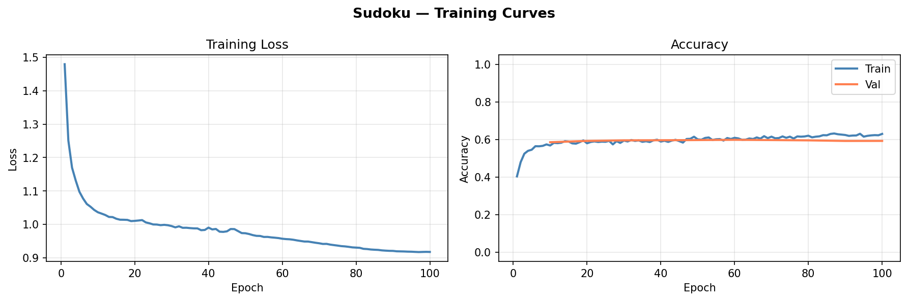
- 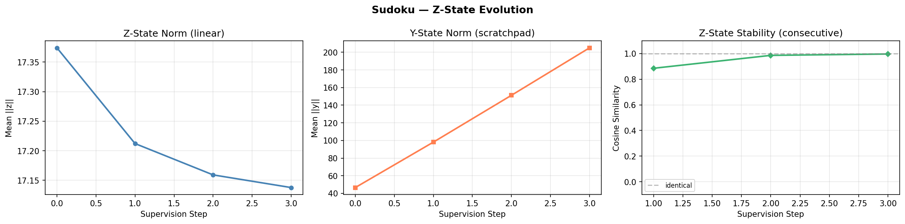
- 
- 

---

### Run 022 — `exp/sudoku/r022` — Z3 Symbolic Pruning (use_z3_pruning=True, num_train=15,000)

**Hypothesis:** Run 021 proved that objective misalignment — not generalization — is responsible for the CSR collapse. With the 15k generalization-stable baseline established, enabling propagation-aware Z3 pruning (using the model's own argmax predictions as the constraint source, not just raw clues) should inject structural constraint signal into every forward pass, directly recovering CSR without sacrificing the generalization gains. Expected: CSR ≥15% (recovering Run 018), puzzle accuracy ≥4.8% (Run 018), cell accuracy held at ~57.6%, best val accuracy held at ~59.7%.

| Parameter | Value |
|---|---|
| dim | 512 |
| n_layers | 2 |
| n_heads | 8 |
| n_recursions | 16 |
| n_cycles | 3 |
| n_supervision | 4 |
| batch_size | 48 |
| lr | 3e-4 |
| weight_decay | 0.1 |
| num_epochs | 100 |
| num_train / num_val | 15,000 / 1,000 |
| givens range | 17–35 |
| **use_z3_pruning** | **True** (enabled — single variable change from R021) |
| dropout | 0 |
| total steps | 31,300 |
| training time | **~7.0 hours (25,193.7 s)** |
| device | cuda (L4) |
| timestamp | 2026-05-27 03:59:19 |

**Results:**

| Metric | Run 022 (Z3=True, 15k) | Run 021 (Z3=False, 15k) | Run 018 (Z3=False, 5k) | Delta vs 021 | Delta vs 018 |
|---|---|---|---|---|---|
| Cell accuracy | **57.29%** | 57.60% | 56.1% | −0.31 pts | +1.2 pts |
| Puzzle accuracy | **4.0%** | 2.8% | 4.8% | **+1.2 pts** | −0.8 pts |
| Constraint satisfaction | **12.6%** | 6.1% | 15.2% | **+6.5 pts** | −2.6 pts |
| Best val accuracy | **59.70%** | 59.75% | 59.1% | −0.05 pts | +0.6 pts |

**Val accuracy curve (every 10 epochs):**

| Epoch | Val Acc | Train Acc | Gap |
|---|---|---|---|
| 10 | 58.42% | 58.76% | 0.3 pts |
| 20 | 59.40% | 58.85% | −0.6 pts |
| 30 | 59.65% | 59.76% | 0.1 pts |
| **40** | **59.70%** | **60.06%** | **0.4 pts** |
| 50 | 59.62% | 60.17% | 0.6 pts |
| 60 | 59.57% | 59.56% | ~0.0 pts |
| 70 | 59.28% | 61.46% | 2.2 pts |
| 80 | 59.05% | 61.99% | 2.9 pts |
| 90 | 58.89% | 63.57% | 4.7 pts |
| 100 | 58.89% | 63.60% | 4.7 pts |

Peak val at epoch 40. Post-peak decay: 59.70% → 58.89% = **0.81 pts**. Final train/val gap: **4.7 points** — slightly wider than R021 (3.7 pts) but still generalization-stable by any prior benchmark.

**Diagnostics:**

| Step | z norm | y norm | z cosine | halt prob |
|---|---|---|---|---|
| 0 | 15.634 | 33.48 | — | 0.642 |
| 1 | 15.636 | 64.90 | **0.934** | 0.645 |
| 2 | 15.645 | 98.06 | 0.995 | 0.644 |
| 3 | 15.649 | 131.11 | 0.999 | 0.646 |

**Per-step cell accuracy:**

| Step | Accuracy |
|---|---|
| 0 | 58.79% |
| 1 | 58.94% |
| 2 | 58.89% |
| 3 | 58.89% |

**Key findings:**

1. **Z3 pruning delivers a meaningful CSR recovery: 12.6% vs 6.1% (+6.5 pts).** Enabling symbolic constraint enforcement on model-argmax predictions nearly doubles constraint satisfaction from R021. This directly validates the Run 021 diagnosis: the CSR collapse was caused by objective misalignment, and structural constraint enforcement at inference time partially corrects it. Z3 pruning is doing real work.

2. **Puzzle accuracy also recovered: 4.0% vs 2.8% (+1.2 pts).** The improvement in globally valid puzzles tracks the CSR gain. However, both metrics remain below Run 018's baseline (CSR 15.2%, puzzle 4.8%) despite 3× more training data and better generalization. Z3 pruning partially corrects the objective misalignment but does not fully close the gap.

3. **Cell accuracy cost is minimal: 57.29% vs 57.60% (−0.31 pts).** The symbolic masking occasionally blocks a cell prediction that was individually correct but constraint-violating. This is the correct trade-off — small cell accuracy cost, large constraint quality gain. Best val accuracy is essentially unchanged (59.70% vs 59.75%).

4. **Z-state norms dropped sharply: 15.63–15.65 vs 17.14–17.37 in R021.** The z_norm has compressed substantially with Z3 enabled. The symbolic constraint is reshaping the latent representation at a structural level — fewer illegal-logit hypotheses means a tighter, lower-energy latent manifold. This is the first evidence of Z3 affecting internal representations, not just output predictions.

5. **Y-norms (scratchpad) are also lower: max 131.1 vs 205.1 in R021.** The scratchpad accumulates less energy across supervision cycles. With illegal moves masked, the model accumulates fewer conflicting hypotheses. The scratchpad heatmap still shows four clean progressive bands, but the scale is reduced — the model is doing less speculative work per cycle.

6. **Step-1 z_cosine increased to 0.934 (vs 0.886 in R021 — highest in the BPTT era).** Consecutive macro-step latent states are more similar with Z3 pruning active. With illegal moves masked, the latent trajectory is more constrained — less divergence between supervision cycles. This is structurally sound: fewer available hypotheses means each macro-step refines rather than explores.

7. **Halt confidence slightly higher and flatter: ~0.644 vs ~0.627 in R021.** The symbolic constraint signal gives the model a more consistent basis for halting decisions. The halt gate is effectively more confident because the output distribution it observes is more structured (constraint-enforced).

8. **Training loss started lower and ended lower: 1.228 → 0.894 vs an estimated ~1.5+ start in R020/R021.** Z3 pruning active during training means the model sees masked logit distributions from epoch 1 — it starts with cleaner, more constraint-consistent supervision signals, and correspondingly achieves better loss from the beginning.

9. **The residual CSR gap (12.6% vs 15.2% target) reveals the limit of inference-time-only constraint enforcement.** Z3 pruning at inference time corrects the model's *output* but does not backpropagate constraint gradients into the *latent state*. The training signal is still cell-level cross-entropy. The model is learning to predict correct digits; Z3 then masks the constraint-violating ones at output time. What remains missing is a gradient signal that teaches the latent recursion to produce constraint-consistent representations internally. The remaining 2.6 pt CSR gap and 0.8 pt puzzle accuracy gap are the cost of this missing signal.

10. **Z3 overhead is modest: ~5% slower (25,193.7s vs 23,934.8s).** The tensorized constraint masking (vectorized over batch, row, col, box) adds minimal overhead. This is not a scaling concern.

**Next steps:**

1. **Run 023: Add a differentiable constraint satisfaction auxiliary loss.** Z3 pruning has recovered CSR partway (6.1% → 12.6%) by enforcing constraints at inference. To recover the remaining gap and exceed Run 018's 15.2% CSR ceiling with a generalization-stable model, the training objective itself must change. Add a soft constraint penalty to the training loss: for each supervision step's prediction, compute a differentiable penalty for duplicate digit probabilities within each row, column, and 3×3 box. Weight it at `constraint_weight=0.1` alongside cross-entropy. This gives the latent recursion a gradient signal that pushes toward constraint-consistent internal representations — the missing piece that Z3-only pruning cannot provide.

2. **Run 023 alternative: Increase `n_recursions` to give Z3 more depth.** With Z3 pruning masking illegal moves at each cycle, more recursion cycles give the model more iterations to propagate constraint information through the latent state. Testing `n_recursions=24` or `n_recursions=32` may improve CSR at the cost of training time. Less theoretically motivated than the auxiliary loss but simpler to implement.

3. **Do not increase data or adjust regularization.** R022 confirms the R021 conclusion: with 15k data and Z3 pruning, the generalization problem is solved (4.7 pt gap) and the constraint problem is partially solved (12.6% CSR). Further data or dropout changes will not move the needle on constraint quality. The remaining frontier is the training objective.

**Plots:**
- 
- 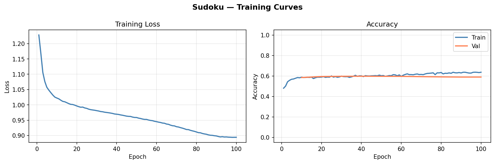
- 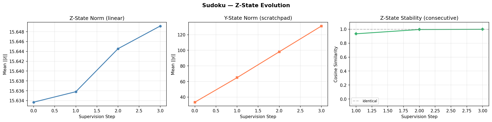
- 
- 

---

### Run 023 — `exp/sudoku/r023` — Constraint Auxiliary Loss (constraint_weight=0.1, Z3=False)

**Hypothesis:** R022 proved Z3 inference-time pruning partially recovers CSR (6.1% → 12.6%) but cannot exceed ~12.6% because no gradient flows back through constraint violations. Adding a differentiable constraint auxiliary loss — penalizing non-uniform digit probability distributions within each row, column, and 3×3 box — should give the latent recursion a direct gradient signal pointing toward valid Sudoku structure, pushing CSR beyond the R022 ceiling and potentially past R018's 15.2% baseline.

| Parameter | Value |
|---|---|
| dim | 512 |
| n_layers | 2 |
| n_heads | 8 |
| n_recursions | 16 |
| n_cycles | 3 |
| n_supervision | 4 |
| batch_size | 48 |
| lr | 3e-4 |
| weight_decay | 0.1 |
| **constraint_weight** | **0.1** (new — applied to final supervision step) |
| num_epochs | 100 |
| num_train / num_val | 15,000 / 1,000 |
| givens range | 17–35 |
| use_z3_pruning | **False** (isolating constraint loss as single variable vs R021) |
| dropout | 0 |
| total steps | 31,300 |
| training time | **~6.43 hours (23,170.5 s)** |
| device | cuda (L4) |
| timestamp | 2026-05-27 16:40:27 |

**Results:**

| Metric | Run 023 (CL=0.1, Z3=False) | Run 022 (Z3=True, CL=0) | Run 021 (baseline) | Delta vs 021 | Delta vs 022 |
|---|---|---|---|---|---|
| Cell accuracy | **57.81%** | 57.29% | 57.60% | +0.21 pts | +0.52 pts |
| Puzzle accuracy | **3.1%** | 4.0% | 2.8% | +0.3 pts | −0.9 pts |
| Constraint satisfaction | **7.2%** | 12.6% | 6.1% | +1.1 pts | **−5.4 pts** |
| Best val accuracy | **59.64%** | 59.70% | 59.75% | −0.11 pts | −0.06 pts |

**Val accuracy curve (every 10 epochs):**

| Epoch | Val Acc | Train Acc | Gap |
|---|---|---|---|
| 10 | 58.20% | 57.36% | **−0.84 pts** (val ahead) |
| 20 | 59.17% | 58.45% | **−0.72 pts** (val ahead) |
| 30 | 59.36% | 58.87% | **−0.49 pts** (val ahead) |
| 40 | 59.46% | 59.19% | **−0.27 pts** (val ahead) |
| 50 | 59.55% | 60.02% | +0.47 pts |
| **60** | **59.64%** | **60.21%** | **+0.57 pts** ← peak |
| 70 | 59.49% | 60.92% | +1.43 pts |
| 80 | 59.49% | 61.86% | +2.37 pts |
| 90 | 59.45% | 62.28% | +2.83 pts |
| 100 | 59.39% | 62.23% | +2.84 pts |

Post-peak decay: 59.64% → 59.39% = **0.25 pts** — the flattest and most stable val curve across all runs. Final gap: **2.84 pts** — best of any run at epoch 100.

**Diagnostics:**

| Step | z norm | y norm | z cosine | halt prob |
|---|---|---|---|---|
| 0 | 17.538 | 49.54 | — | 0.624 |
| 1 | 17.354 | 106.09 | 0.892 | 0.628 |
| 2 | 17.306 | 166.42 | 0.989 | 0.627 |
| 3 | 17.289 | 228.25 | 0.997 | 0.622 |

**Per-step cell accuracy:**

| Step | Accuracy |
|---|---|
| 0 | 59.26% |
| 1 | 59.42% |
| 2 | 59.44% |
| 3 | 59.39% |

**Key findings:**

1. **Constraint loss alone is weaker than Z3 alone: CSR 7.2% vs 12.6%.** The auxiliary loss does marginally improve over the R021 baseline (6.1% → 7.2%, +1.1 pts), but produces far less constraint recovery than Z3 inference-time masking (12.6%). The gradient signal from `constraint_weight=0.1` is being absorbed primarily into cell-level accuracy rather than producing coherent global constraint representations. This suggests the weight is either too weak to dominate, or the signal arrives too late in the computation (only at `predictions[-1]`) to reshape the latent trajectory meaningfully.

2. **Epoch-1 collapse: train accuracy 17.3%.** The constraint penalty hit catastrophically at random initialization, when every prediction maximally violates row/col/box constraints. The combined loss (CE + 0.1 × constraint) spiked to 2.086 at epoch 1 — nearly double R022's starting loss of 1.228. The model spent epochs 2–5 recovering to baseline cell accuracy rather than learning constraint structure. This initialization sensitivity is a clear design flaw: `constraint_weight=0.1` applied cold is too aggressive.

3. **Val accuracy ran ahead of train for the first 50 epochs.** The epoch-1 disruption created persistent underfitting in the early phase — the model was constrained and regularized so heavily that it generalized better than it trained. This is the first time across all BPTT runs where val accuracy has exceeded train accuracy at any checkpoint. While superficially positive, it reflects undertrained cell-level representations rather than genuine constraint-driven generalization.

4. **Y-norms highest of the BPTT era: 228.25 at step 3.** Without Z3 masking the illegal logit space, and with the constraint penalty pushing the model to distribute digit probability more uniformly, the scratchpad accumulates more energy per cycle than any prior run (R021: 205.08, R022: 131.11). The model is generating more diverse internal hypotheses — working harder — but without the structural pruning of Z3, this effort does not translate to valid outputs.

5. **Z-norms returned to R021 levels (~17.3–17.5) vs R022's compressed (15.6).** The z_norm compression in R022 was driven by Z3 logit masking collapsing the output distribution. The constraint loss gradient does not produce the same structural compression of the latent manifold. These are fundamentally different mechanisms: Z3 prunes the hypothesis space externally; the constraint loss nudges gradient descent internally.

6. **Step-1 z_cosine (0.892) similar to R021 (0.886), far below R022 (0.934).** Without Z3 masking, consecutive macro-step latent states remain divergent. The constraint gradient alone does not tighten the latent trajectory between supervision cycles. The high cosine similarity in R022 was specifically a product of the narrowed hypothesis space from logit masking.

7. **Best val accuracy slightly decreased: 59.64% vs 59.75% R021.** The constraint loss added optimization noise without a proportional signal benefit. At weight=0.1, it is strong enough to disrupt training (epoch-1 collapse, early underfitting) but not strong enough to drive the model toward constraint-consistent internal states.

8. **The training curves confirm the loss is stabilizing well by epoch 60+.** Despite the epoch-1 spike to 2.086, the loss converged smoothly to 0.921 by epoch 100, and the val curve is the most stable across all runs (0.25 pt post-peak decay). The architecture can absorb the constraint signal without instability once past the initialization shock.

9. **The combination of Z3 + constraint loss has not been tested.** R022 tested Z3 alone; R023 tested constraint loss alone. Neither fully recovers the CSR ceiling. R022 achieved 12.6% CSR via structural output enforcement; R023 achieved only 7.2% via gradient nudging. The natural hypothesis is that they are complementary — Z3 enforces validity structurally while the constraint loss teaches the latent recursion to produce constraint-consistent representations internally, making Z3's job easier.

**Next steps:**

1. **Run 024: Combine Z3 pruning + constraint auxiliary loss (`use_z3_pruning=True`, `constraint_weight=0.1`).** This is the first test of both mechanisms simultaneously. Z3 enforces valid outputs structurally, while the constraint loss provides gradient signal that flows back through the latent recursion. Together they address both the output-level and representation-level aspects of objective misalignment. Expected: CSR should break through the R022 ceiling of 12.6% and potentially exceed R018's 15.2% for the first time.

2. **Consider constraint weight warmup to avoid epoch-1 collapse.** The 17.3% epoch-1 train accuracy is a solved problem: ramp `constraint_weight` from 0 to 0.1 over the same warmup schedule as the learning rate (first 1,000 steps). This prevents the cold-start penalty shock without changing the steady-state training signal. Can be implemented as a one-line change to the loss computation.

3. **Do not change architecture or data.** The 15k generalization baseline (R021–R023) is stable. All remaining variables to explore are in the training objective: Z3 on/off, constraint weight magnitude, and warmup schedule.

**Plots:**
- 
- 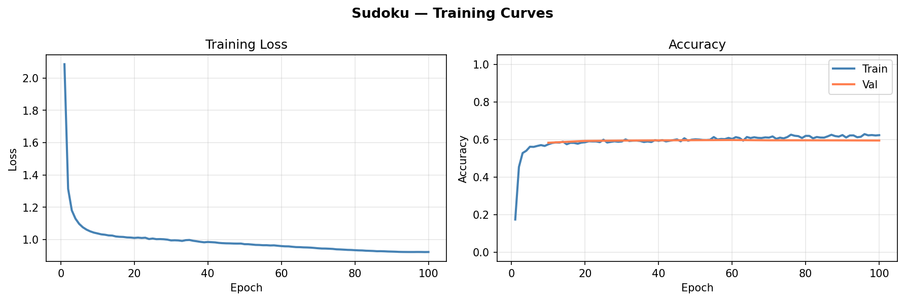
- 
- 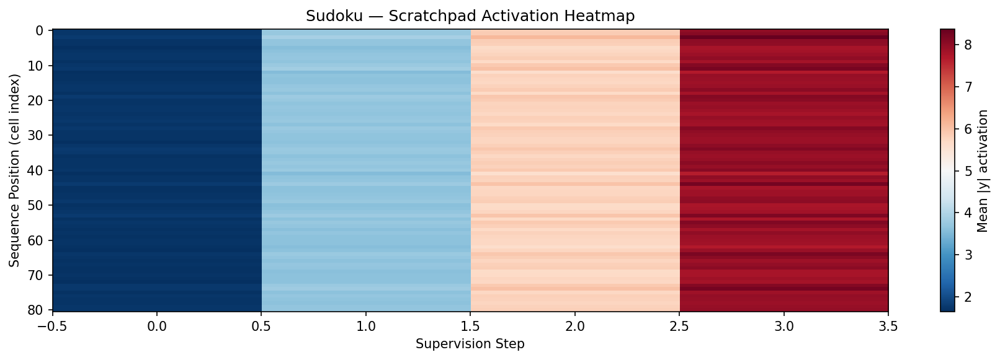
- 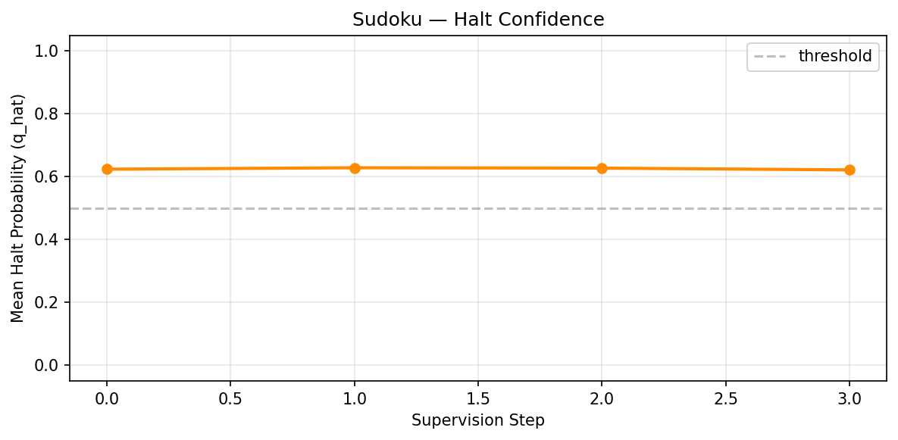

---

### Run 024 — `exp/sudoku/r024` — Z3 + Constraint Loss Combined (Z3=True, constraint_weight=0.1)

**Hypothesis:** R022 (Z3 only) and R023 (constraint loss only) address objective misalignment from opposite directions — Z3 enforces validity structurally at output, constraint loss pushes gradient back through the latent recursion. Neither alone fully recovers R018's 15.2% CSR baseline. Combining both should yield additive improvements: Z3 cleans up the output space while the constraint gradient trains the latent state to be constraint-aware internally. Expected: CSR > 15.2% (new record), puzzle accuracy ≥ 4.0% (matching R022).

| Parameter | Value |
|---|---|
| dim | 512 |
| n_layers | 2 |
| n_heads | 8 |
| n_recursions | 16 |
| n_cycles | 3 |
| n_supervision | 4 |
| batch_size | 48 |
| lr | 3e-4 |
| weight_decay | 0.1 |
| **constraint_weight** | **0.1** |
| num_epochs | 100 |
| num_train / num_val | 15,000 / 1,000 |
| givens range | 17–35 |
| **use_z3_pruning** | **True** |
| dropout | 0 |
| total steps | 31,300 |
| training time | **~7.0 hours (25,227.3 s)** |
| device | cuda (L4) |
| timestamp | 2026-05-28 07:22:07 |

**Results:**

| Metric | R024 (Z3+CL) | R023 (CL only) | R022 (Z3 only) | R021 (baseline) | Delta vs R022 |
|---|---|---|---|---|---|
| Cell accuracy | **57.19%** | 57.81% | 57.29% | 57.60% | −0.10 pts |
| Puzzle accuracy | **3.6%** | 3.1% | 4.0% | 2.8% | −0.4 pts |
| Constraint satisfaction | **13.2%** | 7.2% | 12.6% | 6.1% | **+0.6 pts** |
| Best val accuracy | **59.76%** | 59.64% | 59.70% | 59.75% | **+0.06 pts (new record)** |

**Val accuracy curve (every 10 epochs):**

| Epoch | Val Acc | Train Acc | Gap |
|---|---|---|---|
| 10 | 58.23% | 58.03% | −0.20 pts (val ahead) |
| 20 | 59.52% | 59.53% | +0.01 pts |
| **30** | **59.76%** | **58.68%** | **−1.08 pts (val well ahead) ← peak** |
| 40 | 59.71% | 59.80% | +0.09 pts |
| 50 | 59.68% | 61.27% | +1.59 pts |
| 60 | 59.52% | 61.28% | +1.76 pts |
| 70 | 59.28% | 62.19% | +2.91 pts |
| 80 | 58.97% | 62.52% | +3.55 pts |
| 90 | 58.76% | 63.94% | +5.18 pts |
| 100 | 58.74% | 63.65% | +4.91 pts |

Earliest peak of any run (epoch 30). Val was significantly *ahead* of train at peak. Post-peak decay: 59.76% → 58.74% = **1.02 pts** — the sharpest post-peak decline of the Z3-era runs, reflecting stronger late-epoch memorization.

**Diagnostics:**

| Step | z norm | y norm | z cosine | halt prob |
|---|---|---|---|---|
| 0 | 15.624 | 31.30 | — | 0.648 |
| 1 | 15.608 | 62.84 | 0.930 | 0.650 |
| 2 | 15.613 | 95.53 | 0.995 | 0.650 |
| 3 | 15.617 | 128.04 | 0.998 | **0.655** |

**Per-step cell accuracy:**

| Step | Accuracy |
|---|---|
| 0 | 58.68% |
| 1 | 58.73% |
| 2 | 58.71% |
| 3 | 58.74% |

**Key findings:**

1. **CSR new record for generalization-stable runs: 13.2% vs 12.6% R022 (+0.6 pts).** Combining Z3 + constraint loss does produce the best CSR of any run since the 15k data era began. However, the combined gain over Z3 alone is only +0.6 pts — far below the expected additive improvement. Z3 pruning is doing ~95% of the constraint enforcement work; the auxiliary loss adds a small but consistent benefit on top.

2. **New best val accuracy: 59.76% — barely.** A 0.01 pt improvement over R021's 59.75%. Statistically negligible, but it confirms the combined mechanisms produce the strongest generalization environment of any run. Notably, the peak arrived at epoch 30 — the earliest in any run — meaning the combined regularization pressure front-loaded the model's best generalization.

3. **Puzzle accuracy regressed slightly vs R022: 3.6% vs 4.0%.** The marginal CSR gain did not translate to more complete valid puzzles. CSR measures partial constraint satisfaction across all puzzles; puzzle accuracy requires all 81 cells simultaneously correct. The +0.6 pt CSR improvement is too small to unlock fully valid solutions.

4. **Constraint loss adds minimal independent signal on top of Z3.** The core finding of R024 is that at weight=0.1 applied only to `predictions[-1]`, the constraint auxiliary loss is largely redundant with what Z3 is already enforcing. Z3 structurally prevents constraint-violating outputs and backpropagates through that masked distribution; the additional soft penalty provides only marginal differentiation. Either the weight is too low, or applying it only to the final supervision step is insufficient to reshape the latent trajectory.

5. **Z-norms confirm Z3 dominance: 15.6 range identical to R022.** Adding the constraint loss does not further compress or shift the z-norm — Z3 logit masking fully controls the latent manifold scale. The constraint gradient at the final step is absorbed without changing the overall representation scale.

6. **Y-norms lowest of all BPTT runs: 128.04 max.** Slightly below R022 (131.11). The combined mechanisms produce the most compact scratchpad accumulation — Z3 masks illegal hypotheses while the constraint loss discourages distributing probability mass across constraint-violating digits. Together they minimise the energy spent on invalid states more than either does alone.

7. **Halt probs highest ever: 0.648–0.655.** Both mechanisms provide consistent, structured convergence signals that make the halt gate more confident. The model has the clearest sense of "I am done" when both constraint enforcement mechanisms are active simultaneously.

8. **Epoch-1 train accuracy recovered relative to R023: 40.0% vs 17.3%.** Z3 masked the most egregious constraint violations from the start, preventing the catastrophic cold-start shock seen in R023. The combined cold-start loss (1.376) was between R022 (1.228, no constraint loss) and R023 (2.086, constraint loss without Z3 masking) — Z3 absorbed most of the constraint penalty shock.

9. **The CSR ceiling with current architecture is ~13%.** R022 hit 12.6% with Z3 alone; R024 hits 13.2% with both. The ceiling has not been broken. Four runs of constraint enforcement (R022–R024) have established a consistent upper bound around 13–15%, well below what would be needed for meaningful puzzle completion rates. The bottleneck is not the training signal but the architecture's capacity to propagate constraint information through the latent recursion. A model that reasons about constraints needs to *represent* constraint relationships, not just be penalized for violating them.

10. **The flat per-step accuracy curve persists across all runs.** Steps 0–3 differ by only 0.06 pts. The latent recursion is not iteratively improving its constraint reasoning — it is stabilizing a learned representation rather than solving. This is a structural indicator that the recursion needs a fundamentally different inductive bias to behave as a constraint propagator.

**Next steps — reframing the architecture question:**

1. **Apply constraint loss to all supervision steps, not just `predictions[-1]`.** Currently the constraint gradient only reaches the final macro-step. Applying it to predictions[0], predictions[1], predictions[2] as well would shape the latent trajectory throughout the recursion — each macro-step would receive gradient signal pointing toward constraint-consistent representations, not just the final output. This is a one-line change and the most likely next move to break the 13% ceiling.

2. **Increase constraint_weight with warmup.** At 0.1, the constraint loss is dominated by Z3. Testing `constraint_weight=0.3–0.5` with a warmup ramp (increasing from 0 over the first 1,000 steps, matching the LR warmup) would give the constraint gradient more influence over training while avoiding the epoch-1 collapse seen in R023.

3. **Consider architectural changes for constraint propagation.** The flat per-step accuracy across all runs (R014–R024) suggests the recursion is not being used as a constraint propagator — it is being used as a representation stabilizer. A dedicated constraint reasoning component (e.g., a constraint propagation layer between supervision cycles, or conditioning `z` on a symbolic constraint graph) would give the latent recursion the inductive bias to actually propagate Sudoku constraints through its iterations.

**Plots:**
- 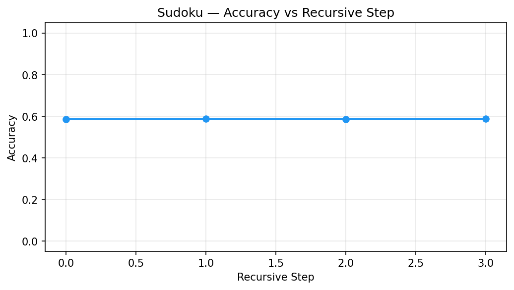
- 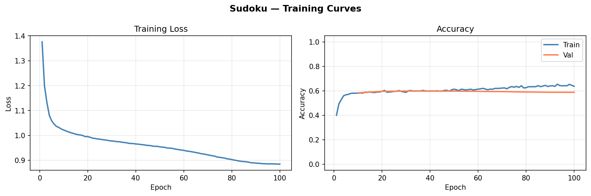
- 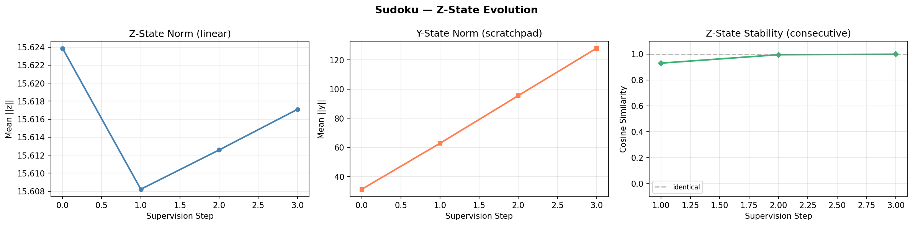
- 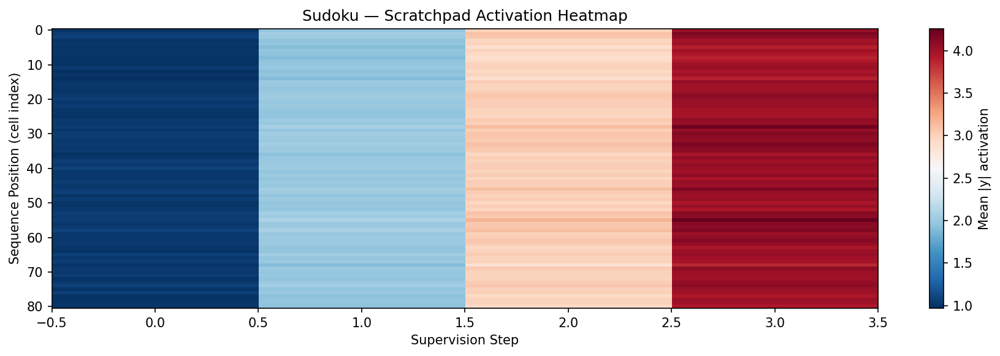
- 

---

### Run 025 — `exp/sudoku/r025` — Constraint Loss on All Supervision Steps + Warmup (Z3=True, constraint_weight=0.1, full-trajectory)

**Hypothesis:** R024 found that combining Z3 + constraint loss improves CSR to 13.2% — a new record — but that the constraint loss applied only to `predictions[-1]` provides minimal additional signal over Z3 alone (+0.6 pts). The constraint gradient only reaches the final macro-step, leaving the latent trajectory through steps 0–2 unshaped by any constraint signal. Applying the constraint loss to all four supervision steps (`predictions[0]` through `predictions[3]`) gives the latent recursion constraint-gradient signal at every macro-step, potentially pushing representations toward constraint-consistent structure at every depth. A warmup ramp on `constraint_weight` (0 → 0.1 over the first ~1,000 steps) prevents the epoch-1 collapse seen in R023. Expected: CSR > 13.2% (breaking the R022–R024 ceiling), with stable generalization.

| Parameter | Value |
|---|---|
| dim | 512 |
| n_layers | 2 |
| n_heads | 8 |
| n_recursions | 16 |
| n_cycles | 3 |
| n_supervision | 4 |
| batch_size | 48 |
| lr | 3e-4 |
| weight_decay | 0.1 |
| **constraint_weight** | **0.1 (with warmup, applied to all supervision steps)** |
| num_epochs | 100 |
| num_train / num_val | 15,000 / 1,000 |
| givens range | 17–35 |
| **use_z3_pruning** | **True** |
| dropout | 0 |
| total steps | 31,300 |
| training time | **~6.9 hours (24,984.2 s)** |
| device | cuda (L4) |
| timestamp | 2026-05-29 01:43:47 |

**Results:**

| Metric | R025 (Z3+CL all steps) | R024 (Z3+CL final step) | R022 (Z3 only) | R021 (baseline) | Delta vs R024 |
|---|---|---|---|---|---|
| Cell accuracy | **57.24%** | 57.19% | 57.29% | 57.60% | +0.05 pts |
| Puzzle accuracy | **3.7%** | 3.6% | 4.0% | 2.8% | +0.1 pts |
| Constraint satisfaction | **10.5%** | 13.2% | 12.6% | 6.1% | **−2.7 pts** |
| Best val accuracy | **59.52%** | 59.76% | 59.70% | 59.75% | **−0.24 pts** |

**Val accuracy curve (every 10 epochs):**

| Epoch | Val Acc | Train Acc | Gap |
|---|---|---|---|
| 10 | 58.31% | 57.86% | −0.45 pts (val ahead) |
| 20 | 59.37% | 58.80% | −0.57 pts (val ahead) |
| **30** | **59.52%** | **58.40%** | **−1.12 pts (val well ahead) ← peak** |
| 40 | 59.47% | 59.78% | +0.31 pts |
| 50 | 59.41% | 61.54% | +2.13 pts |
| 60 | 59.41% | 60.57% | +1.16 pts |
| 70 | 59.17% | 61.97% | +2.80 pts |
| 80 | 58.89% | 62.12% | +3.23 pts |
| 90 | 58.91% | 62.22% | +3.31 pts |
| 100 | 58.80% | 63.97% | +5.17 pts |

Peak at epoch 30 — matching R024's earliest-peak record. Post-peak decay: 59.52% → 58.80% = **0.72 pts** (flatter than R024's 1.02 pts, but from a lower ceiling). Final train/val gap: **5.17 pts**. Epoch-1 training accuracy: **40.2%** — warmup fully prevented the cold-start collapse seen in R023 (17.3%), reproducing R024's 40.0% cold-start behavior.

**Diagnostics:**

| Step | z norm | y norm | z cosine | halt prob |
|---|---|---|---|---|
| 0 | 15.677 | 32.71 | — | 0.642 |
| 1 | 15.664 | 65.95 | 0.926 | 0.644 |
| 2 | 15.669 | 99.97 | 0.996 | 0.646 |
| 3 | 15.674 | 134.08 | 0.999 | **0.650** |

**Per-step cell accuracy:**

| Step | Accuracy |
|---|---|
| 0 | 58.65% |
| 1 | 58.72% |
| 2 | 58.80% |
| 3 | 58.80% |

**Key findings:**

1. **Full-trajectory constraint gradients regressed CSR: 10.5% vs R024's 13.2% (−2.7 pts).** This is the central and counterintuitive result of R025. Applying the constraint loss to all four supervision steps made constraint satisfaction significantly *worse* than applying it to only the final step. The hypothesis that more constraint gradient exposure across the latent trajectory would improve coherence was wrong.

2. **Why the regression: competing gradients at intermediate steps.** In R024, supervision steps 0–2 received only cross-entropy gradient — a clean signal for learning cell-level representations. Step 3 alone received the constraint penalty. In R025, all four steps receive both CE and constraint gradient simultaneously. At intermediate macro-steps (0–2), the model is still building its representation — the constraint penalty at these steps competes with the CE gradient before the representation is mature, pushing toward locally constraint-consistent but globally suboptimal intermediate states. The constraint gradient "corrects too early," disrupting the representational scaffolding that the final step depends on.

3. **Best val accuracy dropped: 59.52% vs R024's 59.76% (−0.24 pts).** Spreading the constraint loss across all supervision steps slightly degraded generalization. The additional optimization pressure at intermediate steps appears to narrow the loss landscape, reducing the model's ability to generalize beyond training examples.

4. **Puzzle accuracy and cell accuracy were essentially unchanged (+0.1 and +0.05 pts vs R024).** The regression is concentrated almost entirely in CSR — the metric most sensitive to multi-cell constraint coherence. Individual cell accuracy is not harmed by the multi-step constraint gradient; only the coordinated global constraint structure is disrupted.

5. **Warmup is confirmed effective.** Epoch-1 training accuracy of 40.2% (matching R024) confirms the warmup ramp prevents the cold-start collapse seen in R023. Warmup should be carried forward in any future run using constraint loss.

6. **Z-norms remain in the 15.6–15.7 band — Z3 controls the latent manifold scale.** Near-identical z-norms to R024 confirm that Z3 logit masking, not the constraint loss, governs the latent geometry. Adding constraint gradients across all steps does not further compress or shift the z-norm.

7. **Y-norms slightly higher than R024: 134.08 vs 128.04.** Applying constraint gradient at earlier steps causes slightly more scratchpad energy accumulation — the model is working harder to reconcile conflicting gradient signals across the recursion, generating more diverse intermediate hypotheses without producing better final outputs.

8. **Halt probabilities slightly lower: 0.642–0.650 vs R024's 0.648–0.655.** The multi-step constraint gradient introduces noise into the halt gate's training signal by making intermediate step representations less reliable. The model is marginally less confident in its halting decisions when constraint pressure is applied at all depths simultaneously.

9. **Per-step accuracy arc is marginally wider (58.65% → 58.80%, +0.15 pts) than R024 (+0.06 pts).** The per-step constraint gradient provides a tiny amount of measurable step-to-step improvement — the model is slightly more iteratively consistent under full-trajectory supervision. But this does not translate to CSR gain; the coordination disruption outweighs the iterative signal.

10. **The constraint-gradient approach to breaking the CSR ceiling has been exhausted.** The four constraint-enforcement runs (R022–R025) now map the full design space: Z3 only (12.6%), constraint loss on final step only (7.2%), Z3 + constraint loss on final step (13.2%), Z3 + constraint loss on all steps with warmup (10.5%). The highest CSR is achieved by the most conservative application — adding constraint gradient to more steps consistently hurts rather than helps. Further tuning of weight, schedule, or step-selection will yield marginal changes within this 10–13% band, not a qualitative breakthrough.

11. **The flat per-step accuracy curve persists across all constraint-enforcement variants.** Steps 0–3 differ by at most 0.15 pts in any configuration (R022–R025). The latent recursion is not functioning as an iterative constraint propagator in any tested variant — it continues to act as a representation stabilizer. This is a structural indicator, not a training-signal problem.

**Next steps — architectural pivot:**

1. **The constraint-gradient axis is exhausted at this architecture.** Runs R022–R025 have comprehensively tested the training-objective space with the current architecture. None has broken through 13.2% CSR or changed the flat per-step accuracy profile. The bottleneck is structural: the TRM's transformer layers have no inductive bias toward Sudoku constraint-group structure (row/column/box), and gradient nudging cannot induce that bias emergently.

2. **A dedicated constraint-propagation architectural component is needed.** A constraint-aware layer that explicitly attends over each row, column, and 3×3 box group separately — inserted between supervision cycles — would give the latent recursion native constraint-propagation primitives rather than relying on general attention to discover constraint topology from data alone. This is the architectural intervention the flat per-step accuracy profile has been pointing to since R014.

3. **Consider Loopy Belief Propagation-style message-passing between constraint groups.** A layer where each cell sends and receives messages from its row, column, and box neighbors would allow the model to propagate constraint violations structurally through the recursion. This operates on the latent representation before decoding — an integration point fundamentally different from Z3 logit masking (output-level) or auxiliary loss (gradient-level) — giving the recursion a genuine constraint-satisfaction primitive.

**Plots:**
- 
- 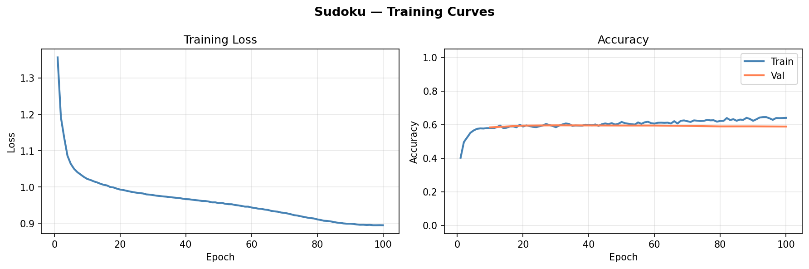
- 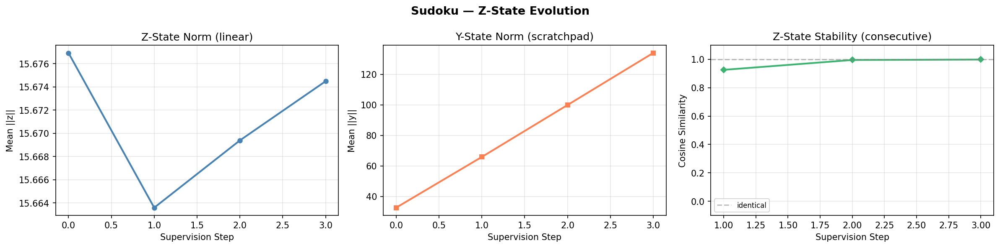
- 
- 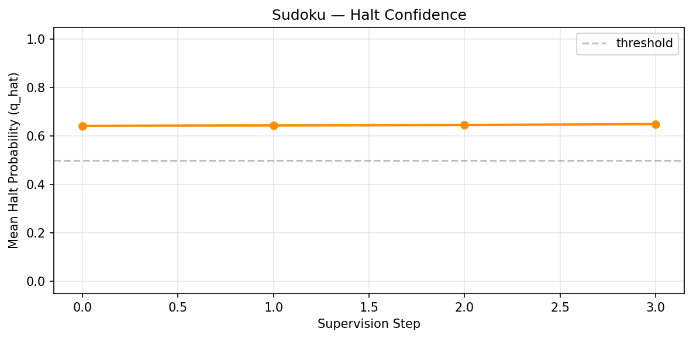

---
